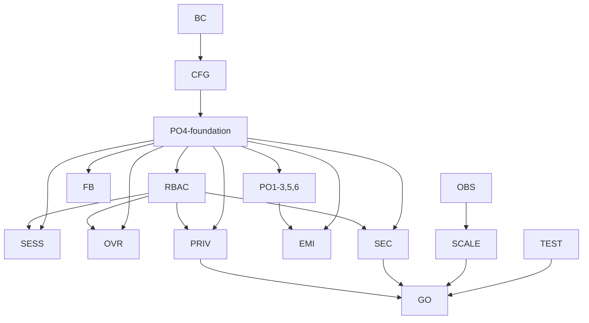

# Beta-Release & Scale Roadmap — LetItRip

> **Companion tracker to `crud-tracker.md`**, not a replacement. Lives at `beta-tracker.md` in repo root once approved. Each task here is **independent** of S13–S43 in `crud-tracker.md` — both trackers progress in parallel sessions.

---

## Context

`crud-tracker.md` is at **142/405 ✅ (35%)**, with S13–S43 still ahead (Bundles, Prize Draws, Raffles, RBAC enforcement, SEO, in-app guides). Alpha (2026-05-10) shipped the public catalogue → cart → checkout → orders golden path.

This roadmap exists because crud-tracker is **scoped to features**, not to the cross-cutting concerns that decide whether the app survives:

- A live beta with **100 paying users** on real Razorpay + Shiprocket
- Code quality robust enough to last **10 years** of evolution / migrations
- Scale path from current **~3–4 lakhs/year** to **3–4 crores/year** without rewrites
- **Production-grade DPDPA** so we cannot be sued for how we handle Indian user data
- Every feature **admin-toggleable** with proper maintenance UX so non-technical operators (the user) can run the platform without touching code
- **Hard-deleted** deprecated/duplicate code so future contributors aren't stepping over rotted scaffolding

Infra stack stays as-is (Firebase Firestore + RTDB + Auth + Storage + Cloud Functions + Vercel + custom logger + in-memory rate-limit). The work is to make code *swap-ready* for Sentry / Upstash / PostHog later, not to introduce them now.

---

## Tier Order (the order you asked for)

| Tier | Name | Sessions | Risk | Why this first |
|------|------|----------|------|----------------|
| **BC** | Codebase Cleanup (hard delete) | BC1–BC8 | Medium | Every later tier touches the same files. Cleanup first = each tier is a thin diff against clean code, not a tax on top of duplication. |
| **CFG** | Site-wide + Per-feature Maintenance + Admin Config | CFG1–CFG6 | Low | Beta operators need to disable a feature when it misbehaves *without a deploy*. Foundation for every other tier's rollout. |
| **PO** | Audit log foundation + admin payout proof flow | PO4-foundation, PO1–PO3, PO5 | Medium | Audit collection underpins every later fallback. Seller payouts are the first concrete consumer. |
| **FB** | Fallbacks for every external dep (payments, shipping, OAuth, SMS, email, storage, Firestore, RTDB, auctions, coupons, bids, panic switch) | FB1–FB16 | High | Beta runs on the real internet. Every upstream WILL fail at some point — admin must keep platform alive with manual paths. |
| **RBAC** | Unify 3 permission systems + enforce everywhere | RBAC1–RBAC7 | High | Before opening to 100 users, every route must have one consistent auth check. Today there are 3 maps. |
| **SESS** | Session lifecycle + concurrent-user caps (admin-tunable) | SESS1–SESS9 | Medium | Beta-control lever: cap concurrent users, cap per-user sessions, sliding inactivity refresh, Firebase Auth desync cleanup. |
| **OVR** | Admin override surface (every manual-control vector) | OVR1–OVR12 | High | Beta operator must be able to fix any stuck state, escalate any limit, force any transition, schedule any action — without a deploy. Generalized override framework + per-domain override panels. |
| **SEC** | Security, anti-abuse & adversarial scenarios | SEC1–SEC18 | High | Hacking, backdoors, fraud, scraping, account takeover, insider threat. Defense-in-depth + Firestore Rules audit + secrets hygiene + bug-bounty path. |
| **EMI** | Buyer EMI / custom payment plans (seller-approved + structured + Razorpay passthrough) | EMI1–EMI11 | High | Buyers can propose flexible payment plans; sellers approve per listing; site mediates installments, grace, default forfeiture with revenue split. |
| **PRIV** | Leveled DPDPA (admin-tunable 0 → 5) | PRIV1–PRIV12 | High | Privacy is a dial admin can turn 0–5. Code supports all six levels; default beta level = 3. |
| **TEST** | Smoke-test harness → load test → chaos drill | TEST1–TEST5 | Medium | Extends existing smoke tests with seed-data req/resp comparison, then scales to load test. The go/no-go gate for opening invites. |
| **OBS** | Observability seams (no provider swap yet) | OBS1–OBS4 | Low | Wrap logger/metrics behind interfaces today; swap to Sentry/PostHog when revenue justifies it. Pure code-quality work. |
| **SCALE** | Scale prep (caching, indexes, rate-limits, ISR) | SCALE1–SCALE6 | Medium | Last because the earlier tiers shake out hotspots. Make scale changes on stable code, not duplicated code. |
| **GO** | Beta launch checklist + go/no-go gate | GO1–GO3 | — | Final blocking checklist before the invite wave. |

**Total: ~155 tasks across 14 tiers.** Sessions are sized to fit the same end-of-session checklist as `crud-tracker.md` (tsc clean, build clean, file inventory, no new deprecations).

---

## North Star Goals — DO NOT FORGET

> Re-read this section at the start of every beta-tracker session. If a proposed change does not move at least one of these forward, push it back into `crud-tracker.md` or kill it.

### G1 — Live beta with 100 paying users on real money

Real Razorpay live keys, real Shiprocket live creds, real INR moving from buyer → escrow → seller. No more test-only paths in critical flow. Concurrent-user cap (SESS8) protects the 100-seat ceiling.

### G2 — 10-year code lifespan

Code written in beta-tracker tier should survive **at least one full Next.js major bump, one Firebase SDK major bump, one provider swap (Razorpay → alt, Shiprocket → alt, Resend → alt) without rewrites**. Achieved by: provider interfaces (OBS1/OBS2/OBS3, FB pattern), config-driven thresholds (every limit in `siteSettings`), no hardcoded provider names in feature code, schema versioning on every collection.

### G3 — Scale path ₹3–4 lakh/yr → ₹3–4 crore/yr without rewrite

A 100× revenue jump implies roughly 10–30× traffic. Today's stack handles it provided: composite indexes cover every list query (SCALE1), heavy reads served from ISR or in-app cache (SCALE3/SCALE5), mutations rate-limited (SCALE2), background jobs idempotent (FB10 outbox), payments idempotent (SEC5). When traffic actually exceeds Firestore comfort: swap to PostHog flags (OBS3), Upstash rate limit (SCALE2), Cloudflare WAF (SEC13) — code already wears the seams.

### G4 — Production-grade DPDPA (India Digital Personal Data Protection Act 2023)

Default beta level = 3 (granular consent + self-serve export + 30-day deletion + retention). Code supports levels 0–5 via `siteSettings.privacy.level` so we can dial up when enforcement intensifies. Tax-mandated retention (orders 7 yrs) supersedes deletion.

### G5 — Plug-and-play admin (non-technical operator runs the platform)

The user is the primary operator and does not want to touch code to keep the site running. Every threshold, fee, flag, content snippet, policy text, EMI rule, privacy level, session limit, security knob lives in `siteSettings`. Every external dependency has a manual fallback (FB tier). Every stuck state has an admin override with audit (OVR tier). Every feature can be hidden behind a branded maintenance card (CFG tier).

### G6 — Hard-deleted dead code

No `@deprecated` lingering, no compat shims, no twin implementations of the same concept (3 permission maps, 176 listing-view variants). Future contributors must see one canonical way to do each thing.

### G7 — Adversarial readiness

Beta is on the public internet. Plan assumes: bid rings, fake reviews, coupon farms, brute-force auth bursts, scraping, image bombs, replayed webhooks, compromised admin tokens, ransomware-style mass deletes. SEC tier defends against each; TEST5 chaos drills exercise each.

### G8 — Future migrations don't bleed

When Firestore → Postgres, or Vercel → Cloudflare Workers, or Razorpay → Stripe, the swap happens behind an interface. No feature code imports `firebase-admin` directly; everything goes through repository + provider interfaces. Schema changes follow the additive + versioned pattern (`schemaVersion` field on every doc).

---

## Glossary — pin domain terms before the team forgets

| Term | Definition |
|------|------------|
| **Listing** | A buyable item — `product` (standard) / `auction` / `preorder` / `bundle` / `prizeDraw` / `raffle` (last three are crud-tracker S19+). |
| **Plan (paymentPlan)** | EMI agreement attached to one order. Modes: `flexible` (mode A), `structured` (mode B), `gateway` (mode C). |
| **Escrow bucket** | A seller-earnings ledger row. Status one of `EARNED_HELD_IN_ESCROW` (order in process) / `EARNED_PAYABLE` (order delivered + plan completed) / `EARNED_NOT_PAYABLE` (forfeit non-refunded share) / `REFUNDED_TO_BUYER`. Only `EARNED_PAYABLE` is picked up by `payoutBatch`. |
| **Override** | Any admin manual action that bypasses an automated rule (force status, edit line items, waive limit). Always audited, always permissioned, always requires reason. |
| **Fallback** | An alternative manual path when an external provider fails or an edge case lands outside the happy path. Admin-toggleable per provider. |
| **Maintenance card** | The branded "feature temporarily unavailable" UI shown when a feature flag is OFF. Site-wide variant blocks all non-admin routes. |
| **Privacy level** | Integer 0–5 in `siteSettings.privacy.level` controlling DPDPA strictness. Higher = stricter. Beta default = 3. |
| **Concurrency cap** | The beta-only ceiling on logged-in users at one time (`siteSettings.sessions.concurrencyCap`). Behaviour: deny / queue / view-only. |
| **Audit event** | Row in `auditEvents` collection — actor, action, entity, before/after, reason, optional proof slug. Source of truth for "who did what when". |
| **Outbox** | Pattern from FB10 — every critical mutation writes to `outbox` first, Cloud Function replays on failure. |
| **Panic switch** | `siteSettings.panic.enabled` — flip to ON and all writes (except admin) 503 immediately. For oh-shit moments. |
| **Two-person rule** | Sensitive admin actions (admin-role grants, EMI dispute splits) require approval from a second admin. Configured per action in `siteSettings.security.twoPersonRule`. |
| **Schema version** | `_schemaVersion: number` on every Firestore doc. Migration jobs key off this; reads tolerate the previous N versions; writes always use latest. |

---

## Cross-Tier Dependency Graph

> Forgetting a dependency causes rework. This is the canonical order. Tiers below depend on tiers above.

```
BC      (cleanup — must precede everything; nothing else can touch the dup code)
 └─ CFG (maintenance + feature flags primitive)
     └─ PO4-foundation (auditEvents collection + write helper)
         ├─ PO1–PO3, PO5, PO6 (payout escrow, proof flow)
         ├─ FB1–FB16 (every fallback writes to auditEvents)
         ├─ RBAC1–RBAC7 (permission deny telemetry writes to auditEvents)
         ├─ SESS9 (admin session console writes to auditEvents)
         ├─ OVR1–OVR12 (every override writes to auditEvents)
         ├─ SEC12 (insider-threat alerts read from auditEvents)
         ├─ EMI9, EMI10 (forfeitures and dispute mediations audited)
         └─ PRIV7 (data-access events at level ≥ 4)

CFG → RBAC: feature flags need a permission to edit
RBAC → SESS: SESS9 admin console needs admin:override:sessions perm
RBAC → OVR: every override perm is a child of admin:override:*
RBAC → PRIV: PRIV12 settings page needs admin:override:privacy
RBAC → SEC12: insider alerts need permission to view security dashboard
SEC → EMI: EMI plan creation rate-limited (SEC5), forfeit split two-person rule (SEC12)
EMI ↔ PO6: both define sellerEarnings / platformEscrow schemas — land together
TEST → GO: TEST1+TEST2 are the entry criteria for GO1
OBS → SCALE: SCALE needs OBS metrics to identify hotspots
SCALE → GO: SCALE6 cold-start hardening must pass TEST4 load test
```

**Mermaid version** (for `docs/dependencies.md` once we add docs/):



---

## Schema Inventory — every new Firestore collection and key shape

> Each new collection has `_schemaVersion: 1` from day one. Migration story documented in `docs/migrations/<collection>.md` when v2 lands.

### `auditEvents` (PO4-foundation)

```ts
{
  id: string;                       // auto
  _schemaVersion: 1;
  actorId: string;                  // user UID (or "system" for cron jobs)
  actorRole: "admin" | "moderator" | "employee" | "seller" | "buyer" | "system";
  action: string;                   // e.g. "order.markPaid", "user.softBan.writeReviews"
  entityType: string;               // "order" | "payout" | "user" | "product" | ...
  entityId: string;
  before?: object;                  // shallow snapshot of changed fields
  after?: object;
  reasonText: string;               // required, min length from siteSettings.overrides.minReasonLength
  proofMediaSlug?: string;
  ipMasked?: string;
  sessionId?: string;
  createdAt: Timestamp;
}
// indexes: (entityType, entityId, createdAt desc), (actorId, createdAt desc), (action, createdAt desc)
```

### `sellerEarnings` (PO6, EMI12) — double-entry ledger

```ts
{
  id: string;
  _schemaVersion: 1;
  sellerId: string;                 // store owner UID
  storeId: string;
  orderId: string;
  paymentPlanId?: string;           // for EMI orders
  amountPaise: number;              // signed; debits negative
  type: "sale" | "refund" | "commission" | "tax" | "emi_fee" | "forfeit_seller_share" | "adjustment";
  status: "EARNED_HELD_IN_ESCROW" | "EARNED_PAYABLE" | "EARNED_NOT_PAYABLE" | "REFUNDED_TO_BUYER" | "PAID";
  payoutId?: string;                // set when picked up by payoutBatch
  reason?: string;                  // for adjustments
  createdAt: Timestamp;
  immutable: true;                  // never updated — corrections write new offsetting row
}
// indexes: (sellerId, status, createdAt asc), (orderId, createdAt asc), (status, createdAt asc)
```

### `platformEscrow` (PO6) — mirror of buyer-paid funds held by platform

```ts
{
  id: string;
  _schemaVersion: 1;
  buyerId: string;
  orderId: string;
  paymentPlanId?: string;
  amountPaise: number;
  source: "razorpay" | "cod" | "manual" | "emi_installment";
  status: "HELD" | "RELEASED_TO_SELLER" | "REFUNDED" | "FORFEITED";
  razorpayPaymentId?: string;
  createdAt: Timestamp;
}
// indexes: (buyerId, createdAt desc), (orderId), (status, createdAt asc)
```

### `paymentPlans` + `installments` + `planProposals` (EMI1)

```ts
// paymentPlans/{planId}
{
  id: string;
  _schemaVersion: 1;
  mode: "flexible" | "structured" | "gateway";
  orderId: string;
  buyerId: string;
  sellerId: string;
  storeId: string;
  totalPaise: number;
  paidPaise: number;
  downPaymentPaise: number;
  downPaymentPercent: number;
  deadlineAt?: Timestamp;            // mode A
  leniencyDays?: number;             // mode A
  cadence?: "daily" | "weekly" | "monthly";  // mode B
  installmentCount?: number;          // mode B
  installmentAmountPaise?: number;    // mode B
  serviceFeePercent: number;
  status: "PROPOSED" | "APPROVED" | "ACTIVE" | "COMPLETED" | "DEFAULTED" | "CANCELLED" | "DISPUTED";
  agreementPdfSlug: string;
  termsSnapshot: { siteVersion: string; emiTermsVersion: string; };
  createdAt: Timestamp;
  approvedAt?: Timestamp;
  completedAt?: Timestamp;
}

// paymentPlans/{planId}/installments/{installmentId}
{
  id: string;
  _schemaVersion: 1;
  type: "down_payment" | "installment" | "late_fee";
  scheduledAt?: Timestamp;            // null for ad-hoc mode A payments
  paidAt?: Timestamp;
  amountPaise: number;
  status: "SCHEDULED" | "PAID" | "MISSED" | "REFUNDED" | "PENDING_VERIFICATION";
  razorpayPaymentId?: string;
}
```

### `consents` (PRIV1)

```ts
{
  id: string;
  _schemaVersion: 1;
  userId: string;
  version: string;                  // matches /legal/privacy version pin
  levelAtGrant: 0|1|2|3|4|5;
  purpose: "marketing" | "analytics" | "personalization" | "sms" | "whatsapp" | "email" | "dataSharing" | "cookiesNonEssential";
  state: "granted" | "withdrawn";
  source: "signup" | "settings_page" | "cookie_banner" | "first_login_prompt";
  ipMasked: string;
  userAgent: string;
  receipt?: string;                 // HMAC signature at level 5
  createdAt: Timestamp;
}
// indexes: (userId, purpose, createdAt desc), (version, createdAt desc)
```

### `sessions` (SESS2) — extension of existing collection

```ts
{
  id: string;
  _schemaVersion: 1;
  userId: string;
  isActive: boolean;
  expiresAt: Timestamp;
  lastActivity: Timestamp;
  firstLoginAt: Timestamp;
  lastRefreshAt: Timestamp;
  refreshCount: number;
  deviceInfo: { browser: string; os: string; device: string; ip: string };  // ip masked at write
  location?: { country: string; city?: string };
  rememberMe: boolean;
  rememberMeExpiresAt?: Timestamp;
  createdAt: Timestamp;
}
// indexes: (userId, isActive, lastActivity desc), (expiresAt asc), (isActive, lastActivity asc)
```

### `featureFlags`, `siteState/concurrencyCounter`, `scheduledActions`, `outbox`, `webhookEvents`, `dataAccessEvents`, `searchOverrides`, `seoOverrides`, `broadcasts`, `notificationOverrides`, `taxEscrow`, `geoOverrides`, `emiPolicies`

Stubs to write up in `docs/schemas/` once we start implementing. Each follows the same template: `_schemaVersion`, `createdAt`, named status enum, indexed query patterns documented at the top of the schema file.

---

## Acceptance-Criteria Pattern

> Every tier task is "done" only when this 8-point checklist passes. Embed in commit message as `Closes BC1` etc.

```
□ CODE        Implemented per spec; no scope creep
□ TYPES       tsc --noEmit clean in both repos
□ TESTS       Smoke scenario added/updated under tests/smoke/; passes
□ SCHEMA      _schemaVersion on every new doc; seed updated; indexes updated
□ CONFIG      Every threshold lives in siteSettings (no hardcoded magic numbers)
□ AUDIT       Every state-changing action writes auditEvents row
□ DOCS        index.md + asciiDiagrams.md + relevant docs/<topic>.md updated
□ ROLLBACK    Rollback path documented (feature flag OFF, schema reversible, no irreversible migration without explicit user approval)
```

Tier-level "done" = all task checklists green + tier-level acceptance criteria (listed inline in each tier section above) + cross-tier integration smoke.

---

## Tier BC — Codebase Cleanup (Hard Delete)

User decision: **no compat shims, no deprecated re-exports**. Each removal happens in a single session with full call-site sweep (Rule #3).

| ID | Task | Files / scope | Notes |
|----|------|---------------|-------|
| **BC1** | Kill all 49 `@deprecated` items in `appkit/` | Shiprocket legacy wrappers `appkit/src/providers/shipping-shiprocket/index.ts:308–492` (12 methods); `useCheckoutApi.ts:40`; carousel aliases; `ListingViewShell` overlays; `AppLayoutShell` props; homepage `background/zone`. | One subagent sweep per group. Replace each call site with the new API in the same diff. |
| **BC2** | Unify 3 permission maps into one source of truth | Merge `appkit/src/features/admin/permission-map.ts`, `appkit/src/features/seller/permission-map.ts`, `appkit/src/features/auth/permissions/constants.ts:440–479 (ROUTE_PERMISSION_MAP)` into a single `appkit/src/features/auth/permissions/route-map.ts`. | All 3 are mostly duplicated. Single map → single enforcement helper. Unblocks RBAC1. |
| **BC3** | Consolidate listing views (products + auctions + pre-orders) behind `SlottedListingView` | 176 `*View.tsx`/`*Listing.tsx` files in `appkit/src/features/`. Target: 1 generic shell + 3 thin wrappers (one per `listingType`). Delete `ProductsView`, `AuctionsView`, `PreOrdersView`, `AuctionsIndexListing`, `ProductsIndexListing`, `ProductsIndexPageView`, `AuctionDetailPageView`, etc. | Highest payoff, highest risk. Memory entry `project_listing_toolbars.md` already maps the regression. Must do FI6 (5 secondary surfaces) in the same tier. |
| **BC4** | Consolidate Admin CRUD scaffolds | 30+ admin editor pages reuse the same shape. Promote `AdminListingScaffold` to a single generic CRUD template parameterised by repository + form schema. | Delete bespoke list/edit pages where the generic template suffices. |
| **BC5** | Consolidate product variant seed files | `appkit/src/seed/products-standard|auctions|preorders.ts` → single `products-seed.ts` parameterised by `listingType`. Stops drift between three near-identical files. |  |
| **BC6** | Consolidate Order Detail views | `OrderDetailView`, `UserOrdersView`, plus seller/admin variants. One view, three shells. |  |
| **BC7** | Sweep `TODO`/`FIXME` — convert to tracker IDs or delete | All `// TODO` in `src/` and `appkit/src/` become beta-tracker IDs or get deleted with the dead code. No floating TODOs. |  |
| **BC8** | Run full `npx tsc --noEmit` + ESLint in both repos; fix or delete every warning | Zero-warning baseline before subsequent tiers. |  |

**Verification**: `git grep -E "(@deprecated\|DEPRECATED\|TODO\|FIXME)"` returns 0 hits in `src/` and `appkit/src/`. `tsc --noEmit` clean. Smoke test (TEST1) still green.

---

## Tier CFG — Configurability & Maintenance UX

**Goal:** Every feature has an admin toggle. When OFF, users see a branded, non-broken page — never a 500 or empty grid. Site-wide maintenance + scheduled windows + per-feature flags.

Add to `siteSettings`:

```ts
maintenance: {
  siteWide: { enabled: boolean; message: string; allowAdmin: true; scheduledStart?: Timestamp; scheduledEnd?: Timestamp; }
  features: { [featureKey: string]: { enabled: boolean; message?: string; scheduledStart?: Timestamp; scheduledEnd?: Timestamp; } }
}
```

| ID | Task | Files |
|----|------|-------|
| **CFG1** | Schema + seed for `maintenance` block | `appkit/src/features/admin/schemas/firestore.ts`, `appkit/src/seed/site-settings-seed-data.ts` |
| **CFG2** | Edge middleware checks `maintenance.siteWide.enabled` | `src/middleware.ts` (or `src/proxy.ts` per memory `project_nextjs16_proxy.md`) → return 503 with branded page for non-admin requests |
| **CFG3** | `<FeatureGate featureKey="...">` component + `useFeatureFlag()` hook | `appkit/src/features/feature-flags/`. Wraps every conditional UI. When OFF, renders `FeatureMaintenanceCard` with admin-configured message. |
| **CFG4** | Server helper `assertFeatureEnabled(key)` for API routes | `appkit/src/features/feature-flags/server.ts`. Returns 503 JSON if disabled. Apply to every feature route. |
| **CFG5** | Admin UI: `/admin/settings/maintenance` | Toggle site-wide, schedule a window, per-feature grid with inline message editor. Live preview. |
| **CFG6** | Scheduled-window Cloud Function | `functions/src/jobs/maintenanceWindow.ts` — flips `enabled` on/off at `scheduledStart`/`scheduledEnd` so non-technical operators can schedule downtime. |

**Critical:** Feature keys aligned with the 14 existing flags in `siteSettings` (chats, smsVerification, translations, wishlists, auctions, reviews, events, blog, coupons, notifications, sellerRegistration, preOrders, seedPanel, announcements) — plus new ones added in later tiers.

---

## Tier PO — Admin Seller Payout Proof Flow

**Scope clarified by user:** This is *admin → seller* payouts when Razorpay automated payout is not used (cash handoff, custom UPI, NEFT screenshot, cheque). Not buyer-facing.

| ID | Task | Files |
|----|------|-------|
| **PO1** | Extend `Payout` schema with `proof: { method: 'razorpay'\|'upi'\|'neft'\|'cash'\|'cheque'\|'other'; referenceId?: string; mediaSlug?: string; notes?: string; verifiedBy: uid; verifiedAt: Timestamp; }` | `appkit/src/features/payments/schemas/index.ts`, repository update, seed update. |
| **PO2** | Media upload context for payout proofs | Extend `appkit/src/utils/id-generators.ts` `generateMediaFilename` with `payout-proof` context → slug `payout-proof-{seller}-{YYYYMMDD}.{ext}` (jpg/png/pdf). Use existing `/api/media/[...slug]` proxy. |
| **PO3** | Admin payout queue + manual-mark-paid panel | `src/app/admin/payouts/page.tsx`: filter pending, per-row "Mark Paid Manually" opens drawer → pick method, upload screenshot/PDF, enter UTR/ref, write note → patches payout → audit log entry. |
| **PO4** | Audit log collection `auditEvents` | New collection. Every manual payout mark writes an event with admin UID, payout ID, before/after status, proof slug. Indexed for forensics. |
| **PO5** | Seller-facing payout history shows proof | Sellers can download their own payout proof PDF/image (read-only). Builds trust. |
| **PO6** | Escrow + earnings ledger (`sellerEarnings`, `platformEscrow`) | Coordinates with EMI12. Every buyer payment writes a `platformEscrow` credit. Order delivery + plan completion writes an offsetting `sellerEarnings` entry flipping `EARNED_HELD_IN_ESCROW → EARNED_PAYABLE`. **Only `EARNED_PAYABLE` entries are eligible for payout creation by `payoutBatch`.** Refunds / returns / cancels reverse the corresponding entries. Statuses are immutable — corrections write new offsetting rows (double-entry style). Seller-facing balance widget shows three buckets. |

**Why this is in tier 3, before RBAC**: payout fraud is the single biggest financial risk before beta. RBAC unification (next tier) protects the admin route that gates this UI.

---

## Tier FB — Fallbacks for every external dependency

User's clarification: the admin-marks-seller-payout-paid flow was just **one example**. Every external dependency must have an admin-controlled fallback so the platform keeps running when the third party is down, the user is in a flaky-network area, or an edge case lands outside the happy path.

Pattern across all FB tasks: **(a)** primary provider stays first-class, **(b)** admin can toggle "force fallback" or "allow manual override" per provider in `siteSettings.fallbacks`, **(c)** every fallback action is audited (PO4 `auditEvents`), **(d)** every fallback writes proof/reference where applicable.

### FB tasks

| ID | Domain | Primary | Fallback(s) | Files |
|----|--------|---------|-------------|-------|
| **FB1** | Buyer payment (cart → order) | Razorpay (online) + COD | a) Admin manually marks buyer order PAID with proof upload (screenshot/PDF/UTR ref) — for B2B bulk, NEFT, cheque, on-account customers. b) Cash-on-pickup (store pickup orders). c) Failed Razorpay verify retry → fallback to "send payment link" (Razorpay payment link API). | `src/app/api/admin/orders/[id]/mark-paid/route.ts` (new) + drawer in admin order detail. |
| **FB2** | Admin → seller payout | Razorpay payout API + bank transfer auto | a) Manual mark-paid with proof (cash / NEFT screenshot / UPI / cheque) — already PO3. b) Hold-and-reschedule (admin marks "on hold" with reason). c) Bulk CSV export for offline disbursement, CSV re-import to reconcile. | Already PO1–PO5; FB2 adds the CSV roundtrip. |
| **FB3** | Buyer → seller refund | Razorpay refund API | a) Admin manual refund with proof. b) Wallet credit (store credit) if Razorpay refund window expired. c) Bank transfer with admin proof upload. | `src/app/api/admin/orders/[id]/refund/route.ts` extends with method enum. |
| **FB4** | Shipping label / fulfilment | Shiprocket auto-create (O5) | a) Manual carrier: seller enters carrier name + tracking number + label PDF upload. b) Local pickup (no shipment — buyer collects from store address). c) Hand-delivery (admin/seller marks delivered with photo proof). d) Re-queue Shiprocket job if 5xx. | Seller order detail: "Method" dropdown. `appkit/src/features/orders/components/ShipmentMethodPicker.tsx`. |
| **FB5** | Address / pincode serviceability | Shiprocket serviceability | a) Local delivery zone allow-list configured by admin (`siteSettings.shipping.localZones[]`). b) "Contact-for-shipping" mode: order placed in QUOTE_PENDING status, seller messages buyer manually. | Checkout shipping selector. |
| **FB6** | OAuth (Google) | Google OAuth via Firebase | a) Email + password (always available). b) Email magic-link sign-in. c) Phone OTP sign-in (if SMS provider enabled). | Login page renders whatever's enabled in `siteSettings.auth.methods[]`. |
| **FB7** | SMS / WhatsApp OTP | Twilio (or current SMS provider) | a) Email OTP as fallback when SMS fails 3x. b) Voice-call OTP (Twilio voice) optional. c) Admin can issue a one-time bypass code from `/admin/users/[id]` for stuck users. | Consent OTP service. |
| **FB8** | Email delivery | Resend (or current) | a) Secondary provider config slot (SendGrid / SES) — primary fails 3x → fail over. b) Admin dashboard widget: failed-email queue with retry. c) For critical mails (order confirmation, password reset), surface a "Show in-app" notification + WhatsApp link as backup. | `appkit/src/providers/email/` + per-provider adapter. |
| **FB9** | Media upload (Firebase Storage) | Storage SDK upload | a) Chunked upload retry (existing tmp/ pattern survives). b) Admin "force re-process" button for stuck `tmp/` files. c) If Storage is down, queue uploads to Firestore as base64 (size-capped) and replay later. | Media uploader hook. |
| **FB10** | Firestore reads/writes | Firestore SDK | a) Read-side: in-memory cache (already exists) extended to survive 1 retry on quota exception. b) Write-side: every critical mutation (order create, payment verify, payout mark-paid) writes to an `outbox` collection first, Cloud Function replays on retry. c) Admin "drain outbox" panel. | New `outbox` pattern in `appkit/src/repositories/base.ts`. |
| **FB11** | RTDB (messages, presence) | RTDB | a) Messages already canonical in Firestore (D5+VC7) — RTDB is ping-only. If RTDB is down, client polls Firestore every 10s. b) Presence falls back to "last seen" from Firestore. | Already partially designed; FB11 tightens the degraded-mode UX. |
| **FB12** | Auctions settlement | Cloud Scheduler `auctionSettlement` (15-min) | a) Admin "settle now" button on auction detail. b) Admin "override winner" with reason + audit. c) Admin "void auction" (refund all bidders' deposits) with reason. | Admin auctions page. |
| **FB13** | Coupon validity | Auto by `validity.endDate` | a) Admin force-expire, force-extend, force-pause. b) Per-user emergency comp coupon (1-time, generated from admin user detail page). | Admin coupons page. |
| **FB14** | Bid placement | Real-time via API | a) Bid queue if Firestore transaction conflicts (retry with exponential backoff). b) Admin can cancel a fraudulent bid (already part of RBAC/scammer flow) — surface via auction detail. | Existing bid route. |
| **FB15** | Feature provider outage (general) | Per-feature flag | When ANY upstream dep this feature relies on is degraded, admin can flip the per-feature maintenance flag (CFG3) and users see a branded "temporarily unavailable" card with ETA. | CFG3 reused. |
| **FB16** | Beta-only "panic switch" | — | Big red `siteSettings.panic.enabled` flag — when ON, all writes (except admin) are 503'd, reads stay up. For oh-shit moments. | New admin button. |

### Cross-cutting fallback rules

- **Every fallback writes an `auditEvents` row** (PO4 audit collection covers all of them — PO4 elevated from PO tier to a tier-zero foundation, must land before FB tier so audit is ready).
- **Every fallback action is visible to the affected user** in their own audit trail (orders, payouts, refunds) so they can see why state changed.
- **Every fallback has a smoke + chaos drill** (TEST1 scenario + TEST5 chaos injection that forces fallback path).
- **Every fallback is admin-configurable** under `/admin/settings/fallbacks` with per-provider toggles, retry counts, timeout thresholds.
- **Code shape:** every external call wrapped by `withFallback(primary, [secondary, manual])` helper that respects the config dial. Centralises retry/timeout/audit logic.

### Foundation reorder

Because PO4 (audit log collection) is now used by every FB task, **move PO4 to land before FB tier**:
- **PO4-foundation**: ship `auditEvents` schema + write helper + admin read UI as the first PO task.
- Then PO1–PO3, PO5.
- Then FB tier.

---

## Tier RBAC — Unify and Enforce

After BC2 there is one permission map. RBAC tier puts every route behind it.

| ID | Task | Files |
|----|------|-------|
| **RBAC1** | Single `withAuth({ permission })` route wrapper | `appkit/src/features/auth/route-wrapper.ts`. All 126+ admin API routes + all `/store/*`, `/user/*` routes adopt it. Bypass logic for `role:admin` lives only here. |
| **RBAC2** | Page-level RouteGuard at App Router layout | One `<RouteGuard permission="...">` per protected layout. Reads from the unified permission map. |
| **RBAC3** | Implement soft-ban enforcement | The 8 soft-ban actions (write_reviews, write_blog_comments, join_events, place_bids, create_listings, send_messages, create_support_tickets, report_scammers) checked at the route wrapper + at form submission UI (button disabled with tooltip). |
| **RBAC4** | Hard-ban cascade | When `user.disabled = true`: sessions revoked, active auctions paused, active listings hidden, refunds triggered. Background function. |
| **RBAC5** | Store capability gates | 16 store capability flags enforced at API + UI (`host_auctions`, `host_preorders`, `extended_return_window`, etc.). Today they're declared but not enforced. |
| **RBAC6** | Employee permission-set UI | Admin assigns one of 17 employee groups → permissions[] auto-populates. |
| **RBAC7** | Permission denial telemetry | Every denied request logs `{permission, route, userId, role}` so we can spot misconfigured groups before they bite a real customer. |

Coordinates with crud-tracker S31–S37 but does **not** wait for them.

---

## Tier SESS — Session Lifecycle & Concurrency Control

User's clarification: beta-environment control needs hard handles on **who is logged in and for how long**. Every threshold is admin-configurable; code keeps Firestore session docs and Firebase Auth tokens in sync; expired Firebase Auth → session doc is deleted automatically.

### Config shape (`siteSettings.sessions`)

```ts
sessions: {
  inactivityTimeoutMinutes: number;            // default 60 — no activity → inactive
  refreshIntervalMinutes: number;              // default 240 (4h) — bump session doc on this cadence while active
  slidingExtensionHours: number | "never";     // default 4 — how far each refresh pushes expiresAt; "never" = no expiry
  maxRefreshChainHours: number | "unlimited";  // default 24 — total wall-clock from first login; "unlimited" allows perpetual
  maxSessionsPerUser: number;                  // default 3 — older sessions evicted on new login
  perRoleOverrides: { admin?: { ... }, seller?: { ... }, employee?: { ... } };
  concurrencyCap: {
    enabled: boolean;                          // beta gate
    maxConcurrentUsers: number;                // default 100 for beta
    countWindow: "active5min" | "session";     // how "concurrent" is measured
    behaviorAtCap: "queue" | "deny" | "viewOnly"; // queue = waiting room, deny = error, viewOnly = read-only access
    allowlist: string[];                       // user IDs / roles that bypass the cap
  };
  rememberMe: { enabled: boolean; maxDays: number }; // separate long-lived cookie
}
```

### SESS tasks

| ID | Task | Files / notes |
|----|------|---------------|
| **SESS1** | Schema + seed for `sessions` config block | `appkit/src/features/admin/schemas/firestore.ts`, `appkit/src/seed/site-settings-seed-data.ts`. |
| **SESS2** | Session document shape audit | Confirm `sessions/{id}` has `{userId, isActive, expiresAt, lastActivity, firstLoginAt, refreshCount, deviceInfo, ip (masked)}`. Add missing fields. Indexes on `(userId, isActive)` + `(expiresAt asc)` for sweeper. |
| **SESS3** | Activity heartbeat | Client hook `useSessionHeartbeat()` posts to `POST /api/auth/session/heartbeat` on user input throttled at 1/min. Route updates `lastActivity`. **Does not** extend `expiresAt` (that's SESS4's job — separating cheap pings from expensive refreshes). |
| **SESS4** | Refresh tick | When `lastActivity` advances and `(now - lastRefreshAt) ≥ refreshIntervalMinutes` AND `firstLoginAt + (refreshCount + 1) * slidingExtensionHours ≤ maxRefreshChainHours`, bump `expiresAt += slidingExtensionHours` and increment `refreshCount`. If `slidingExtensionHours = "never"` or `maxRefreshChainHours = "unlimited"`, refresh forever. Logged out cleanly when `maxRefreshChainHours` reached. |
| **SESS5** | Inactivity sweeper | Server-side check on every protected request: if `now - lastActivity > inactivityTimeoutMinutes`, mark `isActive = false`, revoke session cookie (HMAC-signed → server rejects), and force the next page load to redirect to `/login?reason=inactive`. Background Cloud Function `sessionSweeper` (every 5 min) flips stale sessions in bulk. |
| **SESS6** | Firebase Auth ↔ Firestore desync handling | On every request, if Firebase Admin `verifySessionCookie()` or token verify throws (token revoked / expired / user deleted / disabled), the route handler also **deletes the matching `sessions/{id}` doc** in the same response. Centralised in the `withAuth` wrapper from RBAC1. No orphan Firestore session docs. |
| **SESS7** | Per-user session cap (`maxSessionsPerUser`) | On login, query active sessions for user; if count ≥ cap, evict oldest (`expiresAt asc`). Show "You were signed out from another device" toast on next request from the evicted session. |
| **SESS8** | Concurrent-user cap (beta gate) | Lightweight counter in Firestore (`siteState/concurrencyCounter`) maintained by login + heartbeat + sweeper. When `concurrencyCap.enabled` and counter ≥ max: <ul><li>`deny` → login returns 503 with branded "Beta is full, try again soon" page.</li><li>`queue` → user lands on `/waiting-room` page polling counter every 15s; promoted to login when a slot frees.</li><li>`viewOnly` → user logs in but all mutation routes return 423 Locked with "Read-only beta capacity reached".</li></ul> Allowlist bypasses unconditionally (admin/employee). |
| **SESS9** | Admin session console | `/admin/users/[id]/sessions`: list active sessions, force-revoke one or all, "sign out everywhere" button. `/admin/settings/sessions`: edit every config above with effect preview ("Reducing to 50 concurrent will sign out 17 current users — choose immediate vs grace 5min"). Real-time counter widget on admin dashboard. |

**Smoke coverage:** TEST1 adds session scenarios per actor — login, idle 61 min → forced re-login, active for 5+ hours hitting refresh chain, login on 4th device → first device evicted, beta-cap denial/queue/view-only paths, Firebase Auth token revoke from admin → next request 401 + session doc removed.

**Chaos drill (TEST5):** Firebase Auth outage — sessions still validate from Firestore cookie for grace period (configurable); when both fail, redirect to login with "service degraded" banner. Concurrency counter drift simulation — sweeper reconciles drift back to actual active count every 5 min.

---

## Tier OVR — Admin Override Surface

User's directive: enumerate every place admin needs a **manual override / escalation / forcing knob** beyond what's already in CFG/FB/SESS/PO. The principle: any state an automated rule can produce, an admin can override with reason + audit trail.

**Foundation pattern (reused across every OVR task):**
- Every override writes an `auditEvents` row (PO4 audit log) with `{ actorId, actorRole, action, entityType, entityId, before, after, reasonText, proofMediaSlug?, createdAt }`.
- Every override has a 'reason' required field — UI enforces non-empty, validates against `siteSettings.overrides.minReasonLength`.
- Every override surfaces a notice to the affected user(s) ("Your order status was changed by support — view audit trail").
- Every override is gated by a specific permission (`admin:override:<domain>`) added to the unified permission map (BC2).
- Every override is exposed in a dedicated admin drawer/page — never a hidden API.
- All thresholds/limits used by overrides live under `siteSettings.overrides.{...}` so non-code config bumps work.

### OVR tasks

| ID | Domain | Override capabilities | Files / notes |
|----|--------|-----------------------|---------------|
| **OVR1** | **Order lifecycle** | Force-change order to any status (skip state machine), force-cancel after ship, mark delivered without carrier confirmation, edit line items post-checkout (add/remove/qty with delta refund/charge), change shipping address post-shipment (re-route or void label), split one order into N (per item/per seller), merge orders for a single buyer at same store. | `/admin/orders/[id]` extended drawer. |
| **OVR2** | **Inventory & price** | Per-product manual stock adjust with reason (delta or absolute), freeze stock-write for a product (no purchases decrement until thawed), per-order price override (line-item discount/markup), per-order commission override (waive or change platform cut), per-order tax override. | Product detail + order detail. |
| **OVR3** | **Auction overrides** | Extend end time, modify reserve price mid-auction (with bidder notice), cancel a specific bid (with refund of deposit), cancel auction entirely (void all bids with reason), force-declare winner from non-highest bidder (with reason), waive bid deposit for VIP bidders. | `/admin/auctions/[id]`. |
| **OVR4** | **User overrides** | Force-verify email/phone (skip OTP), force-reset password (admin generates one-time link), grant a single capability one-off (e.g. host_auctions for one listing), one-time soft-ban exception (e.g. write_reviews while soft-banned for one specific order), increase per-user limits (wishlist cap, history cap, cart cap, ticket-per-day cap, bid-per-day cap), **impersonate user** (read-only or full-write, with permanent audit; full-write session badged with red banner in UI). | `/admin/users/[id]`. |
| **OVR5** | **Store overrides** | Pause store entirely (hide listings, block new orders, allow fulfilment of existing), force-publish/unpublish any product, force-feature/de-feature, raise per-store product cap, raise per-store storage quota, per-store commission override (lower rate for partners). | `/admin/stores/[id]`. |
| **OVR6** | **Content & search** | Pin (boost) / demote / hide a product, blog, FAQ, event, or section in search and/or in default listings, with optional time window. Per-page SEO meta override, per-product canonical URL override, robots.txt content override. | New `searchOverrides` + `seoOverrides` collections. |
| **OVR7** | **Featured-slot & section overrides** | Force-place an item in any homepage section (skip selection rules), pin item to a section for a date range, override section ordering globally or per-segment, hide a section for a time window, override carousel slide order. | Homepage admin extended. |
| **OVR8** | **Notifications & broadcasts** | Force-send a notification to any user / role / segment, broadcast banner to all logged-in users (top of every page) with start/end window, mute notifications for a specific user (do-not-disturb override), override per-template content (welcome email, order confirmation) with version pin. | New `broadcasts` + `notificationOverrides`. |
| **OVR9** | **Refund / payment overrides** | Bypass refund window (refund delivered orders past 7/30 day cap), arbitrary partial refund amount (not tied to line items), refund to store credit / wallet instead of original method, re-fire a Razorpay or Shiprocket webhook manually for a specific order (replays the original event), force-reconcile a stuck payment to PAID with proof + reason. | Extends FB1/FB3. |
| **OVR10** | **Geo / time / region** | Per-country or per-pincode allow-deny list, business-hours-only mode (orders placed outside hours go to `QUEUED_HOURS` and release at open), per-region currency display override (display only; INR stays canonical), per-region pricing markup/markdown for a time window. | `siteSettings.geoOverrides`. |
| **OVR11** | **Bulk operations & scheduled actions** | CSV import/export for users (apply ban / role change to N at once), products (status change, price update, category move), orders (status change with cascade), coupons (issue N to a segment). **Generalised scheduled-action framework**: any override can be scheduled (publish at 9am, expire at 5pm, send banner Mon-Fri) via `scheduledActions` collection processed by `functions/src/jobs/scheduledActions.ts`. | New collection + Cloud Function. |
| **OVR12** | **Feature beta whitelist + per-user flag overrides** | Per-user feature-flag override map: VIP gets early access to features still flagged off, beta-cohort whitelist gets new bundle/raffle feature before everyone else, problem user gets a feature flagged off only for them. Stored on user doc as `featureOverrides: { [key]: boolean }`. `useFeatureFlag()` (CFG3) checks per-user overrides first, then per-role, then global. | User doc schema. |

### Cross-cutting

- **One generic Override Drawer component** drives most of these (entity selector → action enum → reason field → optional proof upload → preview → confirm). `appkit/src/features/admin/components/OverrideDrawer.tsx`.
- **Override-aware UI:** any list/detail view that shows state changed by override surfaces a small "i (manually overridden — view reason)" affordance.
- **Override-history page per entity:** every audited entity (order, payout, user, product, auction, store) gets an "Audit History" tab that reads filtered `auditEvents`.
- **Permission grouping:** add 12 new permissions (`admin:override:orders`, `admin:override:auctions`, ...) and bundle them into a new employee preset `super_support` for senior staff. Junior support agents get only `admin:override:orders` and `admin:override:users` (limited subset).

### Smoke + chaos coverage

- TEST1 adds at least one OVR scenario per task (force order delivered, edit order items, override price, impersonate user, force-publish product, broadcast banner, schedule a future action, per-user feature flag).
- TEST5 chaos: scheduled-action job fails mid-batch → resumable; impersonation session abandoned mid-flow → exits cleanly with audit row marked `terminated_idle`.

---

## Tier SEC — Security, Anti-Abuse & Adversarial Scenarios

User's directive: plan for hacking, backdoors, and "other situations". Marketplace + Indian-payments threat model: account takeover, payment fraud, scraping, bid rings, fake reviews, insider abuse, ransomware, DDoS.

### Threat-model checklist (kept in `docs/threat-model.md`)

OWASP Top 10 (web) + OWASP API Top 10 + marketplace-specific:

- Auth & session: brute force, credential stuffing, session fixation, JWT confusion, cookie theft (XSS), token replay, OAuth-state CSRF, recovery-flow takeover.
- Authorization: IDOR (any `/api/.../[id]` without owner check), horizontal privilege escalation (buyer reading seller order), vertical (employee using admin route via direct URL), permission tampering via client-edited JWT.
- Injection: NoSQL/Firestore query injection (filter param sent as object), template injection (custom blog content), SSRF in fetch-from-URL (YouTube oEmbed, image proxy), command injection (none expected but verify).
- Data: PII leak via list endpoints, leak via error messages, leak via admin search returning too many fields, leak via Firestore rules.
- Files: malicious upload (PHP/JS in image), polyglot files, image bomb, EXIF location leak, content-type spoofing.
- Payments: replay of webhook, signature bypass, race-condition double-charge, double-refund, COD abuse (place 100 orders never accept).
- Auctions: bid ring (shill bidding), last-second sniper bots, bid retraction abuse.
- Reviews: review bombing, fake reviews from new accounts, reviews tied to non-purchase.
- Account creation: throwaway accounts, multi-account abuse (one human, many accounts for coupon farming), bot signup.
- Admin & insider: rogue employee abuses overrides, abandoned admin session hijacked, admin password reuse.
- Backdoors / dev artifacts: `/demo/seed` reachable in prod, debug endpoints (`__test`, `__dev`) shipped, NEXT_PUBLIC env containing secret, source maps leaking server code.
- Infra: ransomware on Firestore (mass deletes), unauthorized GCP project access, leaked service account JSON, leaked CI secret.

### SEC tasks

| ID | Domain | Task |
|----|--------|------|
| **SEC1** | **Firestore Rules audit** | Every collection has explicit rules. No `allow read, write: if true;` anywhere. Buyers read only own orders. Sellers read only own store's orders. Admin/employee paths server-side only (rules deny client direct access — admin SDK bypasses). Storage rules mirror: tmp/ writable only by uploader, public/ read-only, payout-proof/ readable only by admin + the seller. Add `firestore-security.test.ts` running `@firebase/rules-unit-testing`. |
| **SEC2** | **IDOR sweep** | Audit every `[id]` route. For each: confirm handler verifies `requestUser.uid === resource.ownerId` (or admin permission). Add `assertOwnership(resource, user)` helper used uniformly. Smoke test (TEST1) gets a positive + negative case per route. |
| **SEC3** | **Auth hardening** | a) Brute-force: tighten existing RateLimitPresets.AUTH (5/60s after 3 fails, 1h IP cooldown after 10 fails). b) Credential stuffing: reject passwords against haveibeenpwned k-anonymity API at signup + reset. c) Suspicious-login detection: geo / device-fingerprint diff from last session → email "new sign-in" notice + force MFA challenge if MFA enabled. d) MFA (TOTP) — admin, employee mandatory; buyers/sellers optional under `siteSettings.security.mfaPolicy`. e) Recovery flow rate-limit + invalidation of all sessions on password reset. f) OAuth state cookie binding + nonce. |
| **SEC4** | **Bot & abuse** | a) hCaptcha / Cloudflare Turnstile on signup, password reset, contact-seller, review submit, bid placement (configurable threshold). b) Honeypot fields on all public forms. c) Multi-account heuristics: same IP + same device fingerprint + same payment method = flag for review. d) Bid-snipe protection: extend auction by N seconds (config) when bid placed in last N seconds. e) Shill-bid detector job: bidder + seller graph proximity (same store, same payout, same address) → flag. |
| **SEC5** | **Payment fraud hardening** | a) Webhook idempotency keys (event ID + signature dedupe in `webhookEvents` collection). b) Razorpay signature verify in constant-time. c) COD abuse: per-user pending-COD cap (`siteSettings.security.maxPendingCodOrders`), auto-block COD for users with > X cancelled-on-delivery rate. d) Chargeback monitor: webhook events → ledger entries → admin alert. e) Coupon abuse: same-card/same-device rate limit, total-redeems cap on per-user coupons enforced atomically. |
| **SEC6** | **Webhook + integration security** | a) Razorpay + Shiprocket webhooks signature-verified, replay-protected, source-IP-pinned (configurable allowlist). b) "Replay this webhook" admin action (OVR9) requires reason + audit. c) Outbound webhooks (future): HMAC-signed with rotating secret. |
| **SEC7** | **Input validation + injection prevention** | a) Every API route uses zod schema validation at boundary; reject unknown fields. b) Firestore filter params validated as scalar strings only (no object injection through query). c) Rich-text content (blog, FAQ, product description) sanitised via DOMPurify on server (not client) — strict allowlist of tags. d) URL fields (oEmbed, image proxy) validated against allowlist of hosts. e) SSRF guard on any `fetch()` that takes user-supplied URL: deny private CIDRs, localhost, link-local. |
| **SEC8** | **File upload safety** | a) MIME validation server-side (magic-byte sniff, not just header). b) Max dimension + max size enforced. c) EXIF strip on user-uploaded photos (privacy + geotag removal). d) Image bomb defense (sharp processing with timeout + max-pixel guard). e) Virus scan hook (`siteSettings.security.virusScan.enabled` — provider-agnostic via interface; no-op adapter today, ClamAV/Cloud DLP swap-in later). f) Disallowed content types per upload context. |
| **SEC9** | **CSRF + XSS + headers** | a) SameSite=Strict on auth cookie, Lax on session cookie, secure + httpOnly everywhere. b) Origin/Referer check on every state-changing route in addition to auth cookie. c) Strict CSP: `default-src 'self'; script-src 'self' <razorpay>; img-src 'self' data: https:; frame-src <razorpay> <youtube>; ...` configured in `next.config.js`. d) HSTS, X-Content-Type-Options, X-Frame-Options=DENY (except Razorpay embed), Permissions-Policy. e) Trusted Types where supported. |
| **SEC10** | **Secrets hygiene** | a) `.env.example` is the only env doc; no live secrets committed. b) Repo scan with `trufflehog` + `gitleaks` in CI on every PR; CI blocks on findings. c) NEXT_PUBLIC_* allow-list enforced by lint rule (no `*KEY*` / `*SECRET*` may be public-prefixed except Razorpay key ID + Firebase web config). d) Key rotation runbook: PII_ENCRYPTION_KEY, SETTINGS_ENCRYPTION_KEY, HMAC_SECRET, RAZORPAY_KEY_SECRET, Shiprocket creds — quarterly rotation with documented re-encrypt jobs. e) Service-account JSON access audit (who in Firebase console). |
| **SEC11** | **Backdoor & dev-artifact prevention** | a) Single env-gated `assertNonProd()` helper. b) Every dev/demo route (`/api/demo/seed`, `/api/dev/mock-shiprocket`, `siteSettings.featureFlags.seedPanel`, any `__test`/`__dev`) checks `assertNonProd()` → 404 in production unless admin AND `siteSettings.security.allowDevRoutesInProd === true` (off by default). c) Source maps disabled for production builds (or uploaded to error reporter only). d) Production build strips `console.log` from app code (keep server-logger). e) Audit run on every release: `git grep -E "(TODO[: ]REMOVE\|XXX\|debugger\|console\.log)"` in src + appkit must be empty. |
| **SEC12** | **Insider threat & admin abuse** | a) Every admin action audited (PO4) including reads of sensitive data (PRIV7 at level ≥ 4). b) Admin impersonation (OVR4) writes red-banner audit + emails the affected user. c) Permission changes require two-person rule for admin → admin role grants (`siteSettings.security.twoPersonRule.adminGrant = true`). d) Daily digest to a "security@" email of all override-tier actions taken. e) Anomaly alerts: more than N overrides by same admin in 1h, mass user delete attempt, mass payout state change → page on-call. |
| **SEC13** | **Anti-scraping & DDoS** | a) Global per-IP rate limit on listing endpoints (RateLimitPresets.LISTING — looser than mutations but still capped). b) Cloudflare (or Vercel WAF) in front of `/api/*` configurable later — keep stack now per user direction, just write code so adapter swap is trivial. c) Bot-traffic heuristics + blocklist in `siteSettings.security.ipBlocklist`. d) Per-resource scrape pattern detection (e.g., 1000 product detail hits from one IP in 5 min) → temp soft-block. |
| **SEC14** | **Bug bounty / responsible disclosure** | a) `/.well-known/security.txt` published. b) `/legal/security` page with contact + scope + safe-harbor. c) Internal triage process documented in `docs/security-triage.md`. d) CVE-style internal IDs for findings in a private collection. |
| **SEC15** | **Backup & ransomware recovery** | a) Daily Firestore export to a separate GCP project (cross-project IAM, write-only from prod). b) Retention 30 days rolling + 12 monthly snapshots. c) Restore drill: monthly `restore-drill.sh` reads a snapshot into a sandbox project and validates a known doc shape. d) Storage bucket versioning enabled with 30-day retention. e) Documented runbook for "Firestore wiped" scenario in `docs/runbook.md`. |
| **SEC16** | **Penetration test gate** | Pre-beta external pentest scoped to: auth flows, payment flows, IDOR sweep, Firestore rules, admin overrides, scraping resistance, file uploads. Findings tracked as SEC-PT-* tasks; high/critical block GO1. |
| **SEC17** | **Encryption at rest review** | a) Confirm PII fields encrypted (email, phone via HMAC blind indices + AES; addresses; payout bankAccount; sensitive support attachments). b) Key derivation + envelope encryption pattern documented. c) Encrypted-fields list in `docs/encryption.md`. d) `BaseRepository.createWithId` override audit (memory `project_bugs_appkit.md` HF86-3) — every PII repo must override or risk un-encrypted writes. |
| **SEC18** | **Per-feature anti-abuse playbook** | One short doc per high-risk feature (auctions, reviews, coupons, messages, signup, support) listing: known abuse patterns, detection signal, automated response, manual escalation path. Lives in `docs/abuse-playbooks/`. Linked from each feature's admin page. |

### Cross-cutting

- Each SEC task includes at minimum one **chaos / adversarial smoke** scenario in TEST5: signature mismatch, replayed webhook, IDOR attempt, brute-force burst, scraping burst, image bomb upload, dev-route prod request, ransomware sim (mass delete attempt by compromised admin token).
- Security findings get their own permission-gated dashboard `/admin/security` showing live counters (failed logins/h, rate-limit hits/h, override count/h, suspected fraud orders, scraping IPs).
- `siteSettings.security` config block exposes every threshold so beta operator can tighten/loosen without redeploy.

### Foundation reorder reminder

PO4 (audit log) is a hard dependency for SEC12, OVR, FB, PRIV4+. Land PO4-foundation immediately after CFG and before any other tier touches it.

---

## Tier EMI — Custom Payment Plans & Installments

User's spec: three coexisting EMI modes. Site-mediated, seller-approved, with forfeiture rules and revenue split when buyer defaults.

### Three modes

**Mode A — Flexible plan (buyer-proposed, seller-approved)**
- Buyer proposes: total = full item price, deadline date, leniency days (grace), down-payment %.
- Down payment: default 10–20%, configurable per listing by seller, hard floor `siteSettings.emi.flexible.minDownPaymentPercent`.
- Within the window, buyer pays any amount on any date — no fixed schedule.
- Order shipping is gated by `siteSettings.emi.flexible.shipUnpaid` (default: ship only after 100% paid; seller can override per plan).
- If deadline + leniency passes without 100% paid → **default**. Buyer forfeits item AND down payment. Down payment split: **50% seller / 25% platform / 25% taxes + EMI service fee**.
- Minimum order value for flexible EMI: `siteSettings.emi.flexible.minOrderValueINR` (default ₹2000).

**Mode B — Structured plan (fixed schedule: daily / weekly / monthly)**
- Pre-set installment count + cadence + %. Buyer agrees at checkout, no per-plan negotiation.
- Miss installment grace: `siteSettings.emi.structured.installmentGraceDays` (default 3).
- On default: buyer forfeits item. Of total **paid so far**, **50% refunded to buyer**, **rest split seller / platform / taxes & fees** at `siteSettings.emi.structured.defaultSplit = { seller: 35, platform: 10, taxesFees: 5 }` (summing to 50 = the non-refunded half). All percentages admin-configurable.

**Mode C — Gateway EMI passthrough (Razorpay / future gateways)**
- Standard Razorpay EMI (no-cost / standard, card-issuer driven). Platform does not hold installment risk.
- Available alongside A and B as a third option at checkout when listing allows EMI.

### EMI tasks

| ID | Task | Files / notes |
|----|------|---------------|
| **EMI1** | Schemas + collections | `paymentPlans/{planId}` (one per order, mode A/B/C), `installments/{installmentId}` (subcollection — each scheduled or actual payment), `planProposals/{proposalId}` (mode A pre-approval lifecycle), `emiPolicies/{policyId}` (per-listing EMI policy: which modes accepted, min down %, max deadline days, structured cadences offered). Indexes: planId+status+dueDate, sellerId+status, buyerId+status. |
| **EMI2** | `siteSettings.emi` config block | Per-mode toggles, min order values, default splits, fees, max plan duration cap, default leniency days. Plus per-mode platform service fee %. All admin-tunable. |
| **EMI3** | Listing-level EMI policy editor | In product/auction/preorder editor, seller picks: "EMI: none / Razorpay only / Razorpay + Flexible / Razorpay + Structured / All". Picks structured cadences offered. Sets min down %, max deadline, leniency. Defaults from `siteSettings.emi`. |
| **EMI4** | Buyer flow — mode A proposal | Product detail page: "Pay with custom plan" button (if seller enabled). Form: total auto-filled, deadline date picker, leniency days, down payment % (within seller-set range), reason note. Submits → creates `planProposals` doc → seller notified. |
| **EMI5** | Seller approval queue | `/store/emi/requests`: pending proposals with full proposal detail + counter-offer button (modify any field, send back). On approve → checkout link emailed to buyer that pays down payment via Razorpay, creates `paymentPlans` doc on success. |
| **EMI6** | Buyer flow — mode B at checkout | If listing supports structured EMI, "Pay in installments" appears at checkout next to COD/Razorpay. Cadence picker shows seller-allowed options; preview shows full schedule with dates + amounts including service fee. Down payment charged on confirm; subsequent installments via Razorpay subscription or manual user-initiated payment. |
| **EMI7** | Installment ledger + reconciliation | Every payment writes an `installments` entry (`type: down_payment | installment | late_fee`). Plan `status` machine: `PROPOSED → APPROVED → ACTIVE → COMPLETED | DEFAULTED | CANCELLED | DISPUTED`. Reconciler Cloud Function (`functions/src/jobs/emiReconciler.ts`, every hour) flags overdue, sends reminders, executes default at grace expiry, executes revenue split. |
| **EMI8** | Reminder + late-fee engine | T-3, T-1, T0, T+1 reminders via in-app + email + (if enabled) WhatsApp. Optional late fee `siteSettings.emi.lateFeePercent` capped per Indian regulations; documented in EMI agreement page. |
| **EMI9** | Default forfeiture + revenue split | At grace expiry: order moves to `CANCELLED_DEFAULT`, item released back to stock, audit row, partial-refund to buyer (mode B only — 50% of paid), notification to all parties. Seller share + platform share + tax-escrow recorded as **ledger entries on `sellerEarnings/{sellerId}`** with status `EARNED_NOT_PAYABLE` (default forfeiture) or `EARNED_PAYABLE` (only when an order completes). **No Razorpay payout is created here** — payouts are governed by the order lifecycle (see EMI12). |
| **EMI10** | Admin EMI dashboard + overrides | `/admin/emi`: live plan counts by status, default rate, average plan duration, revenue from EMI fees, top defaulters. Override actions (gated by `admin:override:emi`, audited via PO4): extend deadline / grace, waive default, refund-and-cancel, dispute mediation (split funds non-default percentages with reason). |
| **EMI11** | Buyer "My Plans" + pay-now page | `/user/emi`: active plans with ledger + remaining + next due + "Pay any amount now" CTA (mode A) or "Pay next installment" (mode B), download agreement PDF (signed terms snapshot at plan creation — required by RBI fair-practice norms). |
| **EMI12** | Payout eligibility rule (system-wide) | **No payout is created for any order until `order.status === DELIVERED` AND `paymentPlan.status === COMPLETED` (if a plan exists).** Buyer-paid funds for in-process and EMI-active orders sit in the platform escrow ledger (`platformEscrow`) and the seller's `sellerEarnings` shows status `EARNED_HELD_IN_ESCROW` until delivery confirmation. On `DELIVERED + COMPLETED` → flip to `EARNED_PAYABLE`; `payoutBatch` Cloud Function only picks up `EARNED_PAYABLE` entries. On `CANCELLED` / `REFUNDED` / `RETURN_APPROVED`: pending earnings reversed, escrow refunded to buyer. On `CANCELLED_DEFAULT` (EMI): pending split moves to `EARNED_PAYABLE` per EMI9 rules. Tax escrow drained at quarter-end as today. **Updates PO/Payouts tier:** payout queue UI shows three earnings buckets per seller — escrowed (in process), payable (ready), paid (history). |

### Cross-cutting

- **Smoke (TEST1):** end-to-end per mode — proposal → approval → partial payments → completion (happy path) and → default at grace expiry (sad path) with revenue-split assertion. Refund split numbers asserted exactly.
- **Chaos (TEST5):** Razorpay verify fails mid-installment → installment marked `PENDING_VERIFICATION`, reconciler retries 3x then escalates to admin; plan does not move to default while in retry window.
- **Security (SEC5/SEC12):** EMI plan creation rate-limited per buyer + per (buyer, seller) pair to prevent abuse; admin override of forfeiture audited with two-person rule if revenue-split changes (`siteSettings.security.twoPersonRule.emiDispute`).
- **Legal (PRIV11 / SEC14):** EMI agreement PDF is the binding contract — versioned, snapshot at plan creation, downloadable by both parties, retained per DPDPA retention rules. `/legal/emi-terms` page maintained.
- **Fallbacks (FB):** if Razorpay autopay subscription fails, mode B can fall back to user-initiated manual payments before declaring default; admin can swap a stuck Razorpay autopay plan to manual mode without restarting (OVR9).

### Currency + tax

All amounts in **INR paise** like the rest of the system. Tax escrow goes to a platform-internal ledger collection (`taxEscrow`) drained at quarter-end. EMI service fee is GST-applicable; configurable per `siteSettings.fees.emiServiceGst`.

---

## Tier PRIV — Leveled DPDPA (Admin-tunable 0 → 5)

User's clarification: privacy posture is a **dial admin can turn**, not a fixed implementation. Code + config must support **all six levels** so the operator can upgrade or downgrade without a deploy. Higher levels are strict supersets of lower levels.

Stored in `siteSettings.privacy.level: 0|1|2|3|4|5` plus per-feature overrides for surgical control. Every privacy-sensitive code path reads the level and branches.

### Level definitions

| Level | Name | What it requires | Use case |
|-------|------|------------------|----------|
| **0** | Off | No consent capture. Only legal-pages-acceptance checkbox at signup. No tracking restrictions. | Internal staging only — never permitted in prod. Gate behind `process.env.NODE_ENV !== "production"`. |
| **1** | Basic | Single "I accept Privacy + Terms" at signup, versioned. Cookie banner with Accept/Reject (binary). Manual data-export on email request. | Earliest dev/demo. |
| **2** | Compliant | Single consent + cookie banner with **granular categories** (essential / analytics / marketing). Self-serve data-export endpoint. Manual deletion via admin. | Soft launch. |
| **3** | Granular | Per-purpose consent at signup AND withdrawable any time (marketing / analytics / personalization / sms / whatsapp / email / dataSharing). Consent versioning + re-prompt on version bump. Self-serve data-export + deletion request with 30-day grace. | Public beta. |
| **4** | Audited | Level 3 + full `dataAccessEvents` log (every PII read by admin/employee), child-data flag (under-18 auto-disables marketing/personalization), retention-policy enforcement (auto-purge after declared period). | Post-beta production. |
| **5** | Maximum | Level 4 + cryptographic consent receipts signed with server key (non-repudiable), per-region data residency hooks, right-to-portability machine-readable export (JSON+CSV), DPO contact workflow surfaced in account UI, automated quarterly consent-refresh prompts. | Enterprise / future when DPDPA enforcement bites. |

### Implementation tasks (each is level-aware)

| ID | Task | Files |
|----|------|-------|
| **PRIV1** | Schema: `siteSettings.privacy = { level, perFeature: { dataExport, deletionRequest, granularConsent, auditLog, retentionDays, ... } }` + `consents` collection (`{ userId, version, purpose, grantedAt, withdrawnAt?, source, ipMasked, levelAtGrant }`) | `appkit/src/features/admin/schemas/firestore.ts`, `appkit/src/seed/site-settings-seed-data.ts` |
| **PRIV2** | Single helper `privacyLevel()` + `requiresConsent(purpose)` + `auditAccess(...)` that every PII-touching path calls. Behavior is a switch on the current level. | `appkit/src/features/privacy/level.ts` |
| **PRIV3** | Consent capture UI is **dynamic**: renders binary toggle at level 1–2, granular toggles at level 3+. Same component, different shape. | `appkit/src/features/privacy/components/ConsentForm.tsx` |
| **PRIV4** | Withdrawal UI gated by level ≥ 3. At level < 3 shows "Contact support to withdraw consent" with mailto. | `/user/settings/privacy` page. |
| **PRIV5** | Data-export endpoint gated by `perFeature.dataExport` — manual flow at level 1–2, self-serve ZIP at level 3+, signed JSON+CSV at level 5. | `POST /api/user/data-export` |
| **PRIV6** | Deletion-request workflow gated by level. Admin-queue at level 2, self-serve with 30-day grace at level 3+, automated anonymization at level 4+. | `POST /api/user/delete-request` |
| **PRIV7** | `dataAccessEvents` audit log written only at level ≥ 4. At lower levels the call site no-ops via `auditAccess()` helper. | Helper + collection. |
| **PRIV8** | Child-data flag enforced at level ≥ 4: under-18 self-declared age locks marketing/personalization consents to off. | Signup form + consent UI. |
| **PRIV9** | Retention-policy job: at level ≥ 4, purges declared collections after `perFeature.retentionDays`. Configurable per collection. | `functions/src/jobs/retentionPurge.ts` |
| **PRIV10** | Cryptographic consent receipts at level 5: HMAC-signed consent records, downloadable by user. | `appkit/src/features/privacy/receipts.ts` |
| **PRIV11** | Legal pages versioned + level-aware copy: privacy page text auto-reflects active level (granular vs single-consent language). | `src/app/(legal)/legal/{privacy,terms,refund,dpdpa-notice}/page.tsx` |
| **PRIV12** | Admin UI: `/admin/settings/privacy` — slider 0–5 with effect-preview ("Switching to level 3 will trigger re-consent for 1,247 users"), per-feature override grid. | New admin page. |

**Default for beta:** Level 3. Plan ships with code paths for all 6.

**Smoke-test coverage:** TEST1 includes a scenario per level that toggles the dial and asserts the right UI + endpoints respond correctly. Six full passes through the privacy surface.

---

## Tier TEST — Smoke → Load → Chaos

User's instruction: extend existing smoke tests with seed-data req/resp comparison, then scale with randomization and concurrency for load testing. **Coverage must include every actor (guest, buyer, seller, employee, admin) on every interactive surface (homepage, listings, categories, brands, stores, auctions, pre-orders, events, blog, FAQs, messages, support).** Tests live in `tests/smoke/` and assert request + response shape against snapshot JSON files.

### TEST1 — Smoke harness rewrite (seed-anchored, snapshot-asserted)

Single deterministic suite. Each scenario: (a) reset state via `/api/demo/seed delete+load`, (b) drive the flow as a real HTTP/browser client, (c) diff every API request body + response body + final UI tree against snapshots in `tests/smoke/snapshots/`.

**Coverage matrix — every scenario must have a snapshot file:**

**Guest (unauthenticated)**
- Homepage renders with all enabled sections (carousel, stats, featured products, featured auctions, featured pre-orders, featured stores, featured categories, featured brands, featured events, featured blog posts, FAQs section, announcement bar).
- Listings: `/products`, `/auctions`, `/preorders`, `/categories`, `/brands`, `/stores`, `/events`, `/blog`, `/faqs` — each with default sort, filter, paginate, search.
- Category browse: tier-1 → tier-2 → tier-3 navigation; leaf category product list.
- Brand browse: brand page → brand product list.
- Store browse: store detail → store product list → store policies.
- Product/auction/pre-order detail: image gallery, reviews tab, related-products, share, add-to-wishlist gated (login prompt), add-to-cart.
- Guest cart: add/update/remove items, apply coupon (admin-scope), checkout login gate.
- Auth flows: signup (email+password), email OTP verify, password reset request, Google OAuth callback (mocked), logout.
- Public events: event detail, public leaderboard for ended event.
- Blog detail, FAQ detail (with helpful vote — gated by login).

**Buyer (authenticated)**
- Login + session persist + signed cookie verify.
- Cart from guest → merge on login (no duplicates, prices preserved).
- Apply admin coupon, apply seller coupon, stacked coupons within rules, expired coupon → error, first-time-user-only coupon paths.
- Checkout: address create/select/edit/delete, COD path, Razorpay (test key) path, consent OTP request + verify, multi-seller cart split into multiple orders, stock atomicity (concurrent checkout same item).
- Post-order: view order detail, track shipment, download invoice, contact seller (messages), request return, cancel before shipped, refund flow.
- Wishlist: add/remove, 20-cap WISHLIST_FULL 409 toast, idempotent re-add.
- History: visit products, FIFO eviction at 50, guest-merge on login.
- Reviews: write review on delivered order, upload image+video, edit within window, seller response visible.
- Auctions: place bid (active/outbid/won), auto-bid (if implemented), watch list, bid history, winning notification, post-auction checkout.
- Pre-orders: place pre-order with deposit, conversion to order on release, cancellation window.
- Events: register/join, waitlist, cancel registration, submit entry, view own leaderboard position.
- Bundles / Prize Draws / Raffles (gated by feature flag — assert maintenance card when OFF, full flow when ON).
- Messages: open conversation, send text, send with attachment, mark read, unread count syncs (RTDB ping → Firestore refetch).
- Support tickets: create ticket within soft-ban + per-day limit; attach media; reply; close.
- Account: profile edit (avatar via media uploader), address book CRUD, notifications mark-read, sessions list + revoke other, consent withdraw (PRIV3), data export request (PRIV4), deletion request (PRIV5).
- All 8 soft-ban states: each blocked action returns 403 with named reason; UI button disabled with tooltip.

**Seller (store owner)**
- Apply for store, admin approves, store onboarding wizard (logo, banner, slug, shipping config, payout details with PII encryption verified).
- Product CRUD: standard, auction, pre-order, sublistings, custom fields, custom sections, media uploads (tmp/ + finalize), YouTube embed, schema-driven validation, draft → published.
- Order pipeline: PENDING → PROCESSING → SHIPPED (Shiprocket auto-create per O5 + manual fallback) → DELIVERED. Cancel, refund, return-approve.
- Coupons: create seller-scope coupon, restrictions (products, categories, first-time, perUser, total), preview math against test cart.
- Reviews: seller response, request removal (admin queue).
- Analytics dashboard: sales, traffic, top products, cohort (capability-gated).
- Payouts: list payouts, see proof attached by admin (PO5), download proof.
- Store customization: storefront branding, announcement, WhatsApp Business contact, FAQs scoped to store.
- Capabilities: each of 16 capability flags exercised — ON path succeeds, OFF path 403.
- Offers: buyer-offer inbox, accept/counter/reject.

**Employee (one scenario per preset)**
- Login → employee landing → permission-scoped nav.
- Each of 17 employee presets runs one representative action that the preset permits and one that it must deny.

**Admin**
- Dashboard widgets render with live counts.
- Users: list/filter, view detail, soft-ban toggle (each of 8 actions), hard-ban with cascade (RBAC4), role change, employee permission group assign, team CRUD.
- Catalog: products / brands / categories / sublistings CRUD (every generic AdminListingScaffold instance — BC4 reduces this to one template, so one canonical scenario covers many surfaces).
- Orders: list, filter, view, refund, force-status, mark-paid-manually (PO3 flow), attach payout proof.
- Returns: review queue, approve/reject with reason.
- Content: blog CRUD + publish, FAQ CRUD + showOnHomepage toggle, carousel CRUD with max-5-active enforcement, sections CRUD across all 21 section types + reorder + enable/disable, navigation CRUD, ads CRUD.
- Promotions: admin coupons CRUD, deals, featured placement.
- Finance: payout queue, manual mark-paid with proof (PO3), commission overrides.
- Settings: every group in `siteSettings` round-trip (branding, appearance, announcementBanner, seoDefaults, contactSocial, watermark, fees, integrations, shipping, auctionConfig, platformLimits, legalPages, maintenance).
- Maintenance: toggle site-wide ON → all non-admin routes 503; toggle each per-feature flag OFF → that feature's pages render maintenance card and its APIs return 503; schedule a window → Cloud Function flips on/off at boundaries (CFG6).
- Support: ticket queue, claim, reply, close, escalate.
- Safety: scammer registry CRUD + verify, suspicious bid review, suspicious review review.
- Events: tournament CRUD, entry approve/waitlist, leaderboard publish, winner image upload.
- Feature flags: each of the 14 + new flags toggles ON/OFF — verify both server gate (assertFeatureEnabled returns 503) and UI gate (FeatureGate renders maintenance card).
- Seed panel: GET counts, POST load partial, POST delete partial, dry-run path.
- Audit log (PO4): every sensitive admin action produces an `auditEvents` row; admin can read the log filtered by actor/route/entity.

**Cross-cutting interactive surfaces (run for each applicable actor)**
- Search: text query, scoped resource (`SearchResourceType`), no-results state, special chars, very long query.
- Compare overlay (BK3): add 2–4 items, switch resource type clears, mobile swipe + desktop table.
- Share buttons, copy-link, deep-link into modals via URL panel state (AX2/AX3 usePanelUrlSync).
- Theme toggle (light/dark), locale (if multi-locale lands).
- Accessibility smoke: every interactive page passes axe-core with no critical violations (subset of TEST1 assertions).
- Responsive smoke: each page rendered at 360 / 768 / 1280 / 1920 — no overflow, sticky offsets respect `--header-height`.

### TEST2 — Variation matrix

Each TEST1 scenario fans out across the orthogonal axes:
- Auth: guest / buyer / seller / employee × 17 / admin.
- Currency/locale: INR (only target for beta; reserve hook for future).
- Payment: COD / Razorpay test key / manual-marked.
- Coupon: none / admin-scope / seller-scope / stacked / expired / first-time-only.
- Cart shape: empty / single-item / multi-seller / contains-auction-won / contains-preorder.
- Soft-ban: each of 8 states active.
- Feature flag: each of 14+ flags OFF in isolation.
- Hard-ban: user.disabled true.
- Viewport: 360 / 768 / 1280.

Snapshots are partitioned by axis combo. A failing diff is the gate.

### TEST3 — Randomization layer

Same harness, randomized inputs from the seed pool (random buyer, random product within filter, random address, random coupon). Seeded RNG so a failure is reproducible by re-running with the same seed. Catches order-dependent and data-shape bugs that fixed snapshots miss.

### TEST4 — Load test

Promote the randomized harness to N concurrent virtual users via k6 (or whatever's lightest given user's "current stack" constraint — likely a tiny Node concurrency runner driving the same harness functions).
- Targets: home, listing pages, product detail, search, cart add, checkout (Razorpay test), bid placement, message send.
- Levels: 10 → 50 → 100 (beta target) → 250 → 500 → 1000.
- Metrics: p50 / p95 / p99 latency, error rate, Firestore reads/writes per request, Cloud Function cold-start P95.
- Pass gate: p95 < 2s at 100 concurrent, error rate < 0.5%, no Firestore quota exceptions.

### TEST5 — Chaos drills

Scripted failure injection at the provider layer:
- Firestore: simulated quota throttle, transaction conflict storm, listener disconnect.
- Shiprocket: 500, 401 token expiry, slow response (10s).
- Razorpay: verify 500, webhook duplicate, signature mismatch.
- RTDB: disconnect mid-conversation; messages must reconcile from Firestore on reconnect.
- Email/SMS provider: 500 on consent OTP send.

For each: UI must render a recoverable error (toast + retry button), no 500 page, no orphan order state. Snapshots capture the degraded-UX rendering.

The harness is the **go/no-go gate** for tier GO. CI runs TEST1+TEST2 on every PR; TEST3 nightly; TEST4+TEST5 weekly + pre-launch.

---

## Tier OBS — Observability Seams (no provider swap yet)

Keep current stack. Add seams so the day we want Sentry / PostHog / Better Stack, it's a 1-day swap not a 1-month migration.

| ID | Task | Files |
|----|------|-------|
| **OBS1** | `ErrorReporter` interface + current-stack adapter | `appkit/src/monitoring/error-reporter.ts`. Methods: `captureError(err, ctx)`, `captureMessage(msg, level, ctx)`, `setUser(user)`, `startTransaction(name)`. Current adapter writes to `server-logger.ts`. Swap-ready for Sentry. |
| **OBS2** | `AnalyticsClient` interface | Same pattern. Methods: `track(event, props)`, `identify(userId, traits)`, `page(path)`. Current adapter is a no-op + Firestore audit row. Swap-ready for PostHog. |
| **OBS3** | `FeatureFlagClient` interface | Today reads from `siteSettings.featureFlags` + Firestore listener. Behind interface so PostHog flag client can replace it without UI changes. |
| **OBS4** | Structured logging discipline | Every API route logs `{ requestId, userId?, route, status, durationMs }`. Custom logger today, log-drain-ready tomorrow. |

---

## Tier SCALE — Scale Prep

Done **after** TEST identifies real hotspots. Don't optimize blind.

| ID | Task | Files / scope |
|----|------|---------------|
| **SCALE1** | Firestore indexes audit + add missing | Add `orders.paymentStatus`, audit every list view's compound index. Source in `appkit/firebase/base/firestore.indexes.json` only. |
| **SCALE2** | Rate-limit critical mutation routes | Apply `RateLimitPresets.API` + a stricter preset on `/api/checkout`, `/api/payment/*`, `/api/auth/*`, `/api/user/conversations/*/messages`. Today only `/api/auth` uses it consistently. |
| **SCALE3** | `/api/media/[...slug]` watermark cache headers | Add `Cache-Control: public, max-age=86400, stale-while-revalidate=604800` + ETag. Today every request re-watermarks → CPU + cost. |
| **SCALE4** | `next/image` adoption sweep | Every `` in components replaced by `next/image` with explicit width/height. Tailwind safelist audit. WebP/AVIF on by default. |
| **SCALE5** | ISR for listing pages | Public listing pages (`/products`, `/auctions`, `/preorders`, `/category/[slug]`, `/brand/[slug]`, `/store/[slug]`) → `revalidate: 60` with `revalidateTag` hooks fired from product/order mutation routes. |
| **SCALE6** | Cloud Function cold-start hardening | Keep listingProcessor (S13) and payoutBatch warm via low-frequency scheduler ping; track cold-start P95 in OBS4. |

---

## Tier GO — Beta Launch Checklist

| ID | Task |
|----|------|
| **GO1** | Production go/no-go checklist file `docs/beta-launch-checklist.md`: every tier signed off, all smoke + load + chaos tests green, all legal pages live, all admin toggles audited, Razorpay live keys swapped in, Shiprocket live creds in, payout dry-run with one real seller payout (₹100 test). |
| **GO2** | Invite wave plan: 10 friends-and-family → 7-day soak with daily eyeball on dashboards + error logger → batch of 30 → final batch to 100. |
| **GO3** | Post-launch SLO commitments and rollback plan in `docs/runbook.md`. |

---

## Critical files / single source of truth

- **Tracker:** `beta-tracker.md` (new) — mirror of `crud-tracker.md` format.
- **Permission map (after BC2):** `appkit/src/features/auth/permissions/route-map.ts`.
- **Site settings schema:** `appkit/src/features/admin/schemas/firestore.ts`.
- **Seed singleton:** `appkit/src/seed/site-settings-seed-data.ts`.
- **Feature gate primitives:** `appkit/src/features/feature-flags/` (new).
- **Monitoring seams:** `appkit/src/monitoring/error-reporter.ts`, `analytics-client.ts`.
- **Smoke harness:** `tests/smoke/` (rewritten).
- **Legal pages:** `src/app/(legal)/legal/{privacy,terms,refund,dpdpa-notice}/page.tsx`.

## Reuse — do not rewrite

- Existing rate-limit primitive: `appkit/src/security/rate-limit.ts` (extend, don't replace).
- Existing cache metric: `appkit/src/monitoring/cache-metrics.ts` (feed OBS4).
- Existing media proxy: `src/app/api/media/[...slug]/route.ts` (add headers in SCALE3, don't rewrite).
- Existing consent OTP: `appkit/src/features/auth/consent-otp.ts` (reuse for high-risk actions — PO3 manual-mark-paid, RBAC4 hard-ban).
- Existing background-jobs framework: `functions/src/jobs/*` (add to it, don't introduce a new scheduler).
- Existing PII encryption (BaseRepository override pattern, memory `project_bugs_appkit.md`): apply to PO1 payout proof, PRIV1 consents, PRIV7 data-access events.
- Existing audit pattern: scammer registry. Generalize to `auditEvents` collection in PO4.

## Cross-references to `crud-tracker.md`

- BC3 (consolidate listing views) supersedes the FI6 deferred item in `newchange.md`.
- RBAC1–RBAC7 supersedes crud-tracker S31–S37. Delete S31–S37 from crud-tracker once RBAC tier ships.
- CFG3 `FeatureGate` is the home for the existing 14 flags currently scattered across components.
- PRIV8 legal pages overlap with S40–S43 guide pages in crud-tracker — coordinate copy.

## Verification (end-to-end)

After **each tier**:

1. `npx tsc --noEmit` clean in both `letitrip.in/` and `appkit/`.
2. `npm run build` clean (Vercel parity — Turbopack rules from CLAUDE.md).
3. Smoke harness (TEST1+) green on full snapshot diff.
4. `git grep` confirms no new `@deprecated`, `TODO`, `FIXME` introduced.
5. Tier-specific:
   - BC: file-count diff in PR description shows actual deletions, not renames.
   - CFG: manually toggle each feature flag in admin; confirm gated page renders maintenance card and API returns 503.
   - PO: dry-run payout → admin marks paid with PDF proof → seller sees proof in history → audit event logged.
   - RBAC: every route hits the unified wrapper (grep `withAuth` count = route count).
   - PRIV: run data-export + delete-request flows end-to-end on a seeded user; verify retention table.
   - TEST: load test at 100 concurrent passes p95 < 2s; chaos drills produce graceful UI, no 500s.
   - SCALE: Lighthouse perf score ≥ 85 on listing pages; cached `/api/media/` returns 304.

After **all tiers**: GO1 checklist signed off → invite wave per GO2.

---

## Open questions to revisit before BC1

- ~~Does `beta-tracker.md` live in repo root or under `docs/`?~~ → repo root (decided 2026-05-12).
- Should BC3 (listing-view consolidation) be split across 2 sessions given its blast radius?
- DPDPA: do we treat existing seeded users as having "legacy consent" (re-prompt on first login) or wipe their consent and force re-grant?
- Two-person rule (SEC12) — do we need it for beta or can we add it post-beta?
- Concurrent-user counter (SESS8) — exact drift tolerance and whether we ever auto-disable cap if counter desyncs?

---

## ASCII Diagrams

> Mirror of `asciiDiagrams.md` style. These pin the mental model so future sessions don't reinvent the architecture.

### D-1 — Order → Payment → Escrow → Payout (full lifecycle)

```
                         ┌─────────────────────────────┐
                         │       BUYER places order    │
                         └──────────────┬──────────────┘
                                        │
                  ┌─────────────────────┼──────────────────────┐
                  ▼                     ▼                      ▼
            ┌──────────┐         ┌────────────┐         ┌────────────┐
            │ Razorpay │         │     COD    │         │  EMI plan  │
            └────┬─────┘         └─────┬──────┘         └─────┬──────┘
                 │                     │                      │
                 │  pays full          │  COD deposit %       │  down payment
                 ▼                     ▼                      ▼
       ┌─────────────────────────────────────────────────────────────┐
       │            platformEscrow.HELD (buyer funds in escrow)      │
       │            sellerEarnings.EARNED_HELD_IN_ESCROW             │
       └──────────────────────────┬──────────────────────────────────┘
                                  │
                  order moves: PENDING → PROCESSING → SHIPPED
                                  │
                                  ▼
                          DELIVERED (and, if EMI, plan.COMPLETED)
                                  │
                                  ▼
                  ┌──────────────────────────────────┐
                  │   platformEscrow → RELEASED      │
                  │   sellerEarnings → EARNED_PAYABLE │
                  └────────────────┬─────────────────┘
                                   │
                                   ▼
              ┌───────────────────────────────────────────┐
              │  payoutBatch Cloud Function (daily 06:00) │
              │     picks up EARNED_PAYABLE rows          │
              └────────────────┬──────────────────────────┘
                               │
                ┌──────────────┴───────────────┐
                ▼                              ▼
       ┌────────────────┐            ┌────────────────────┐
       │ Razorpay payout│            │ Manual admin payout│
       │  (auto)        │            │   (PO3, with proof)│
       └────────┬───────┘            └─────────┬──────────┘
                │                              │
                └──────────────┬───────────────┘
                               ▼
                  sellerEarnings → PAID
                  auditEvents row written
                  seller sees proof in /store/payouts

  Sad paths (each becomes a sellerEarnings offsetting row + auditEvents):
    CANCELLED → escrow REFUNDED to buyer
    REFUNDED → escrow REFUNDED, earnings reversed
    RETURN_APPROVED → escrow REFUNDED, earnings reversed
    EMI DEFAULT (mode A) → forfeit, escrow split 50/25/25 to seller/platform/tax
    EMI DEFAULT (mode B) → forfeit, 50% buyer refund + 35/10/5 seller/platform/tax of paid
```

### D-2 — EMI Plan Lifecycle (three modes)

```
         ┌─────────────────────────────────┐
         │  Buyer on product detail page   │
         └────────────────┬────────────────┘
                          │
       seller's emiPolicy decides what's offered
                          │
       ┌──────────────────┼──────────────────────────┐
       │                  │                          │
       ▼                  ▼                          ▼
 ┌──────────┐      ┌─────────────┐         ┌─────────────────┐
 │ Razorpay │      │  Structured │         │   Flexible      │
 │  EMI (C) │      │  EMI (B)    │         │   plan (A)      │
 └────┬─────┘      └──────┬──────┘         └────────┬────────┘
      │                   │                         │
      │ check at          │ pick cadence            │ propose deadline
      │ Razorpay          │ at checkout             │ + leniency + down %
      │ (no platform      │                         │
      │  risk)            │ pay down at checkout    │ planProposals.PROPOSED
      │                   │ paymentPlans.ACTIVE     │           │
      │ order PAID        │                         │           ▼
      │                   │                         │   seller approves /
      ▼                   │                         │   counter-offers
   normal flow            │                         │           │
                          │                         │           ▼
                          │                         │   buyer pays down →
                          │                         │   plan APPROVED → ACTIVE
                          │                         │
                          ▼                         ▼
              ┌──────────────────────────────────────────┐
              │  installments scheduled or ad-hoc        │
              │  reminders T-3 / T-1 / T0 / T+1          │
              │  each payment → installments[paid]       │
              └────────────────────┬─────────────────────┘
                                   │
                ┌──────────────────┴──────────────────┐
                ▼                                      ▼
        all paid in time                       grace expires unpaid
                │                                      │
                ▼                                      ▼
        plan.COMPLETED                          plan.DEFAULTED
        item ships                              item returns to stock
        order.DELIVERED                         escrow split per mode
        escrow released                         auditEvents row written
```

### D-3 — Audit pipeline (PO4 → everything)

```
    every mutation
         │
         ▼
  ┌──────────────────────────────────────────┐
  │  Repository.write()                      │
  │    ├── transactionally writes:           │
  │    │   • the target document             │
  │    │   • auditEvents row (PO4 helper)    │
  │    └── returns                            │
  └──────────────────────────────────────────┘
         │
         ▼
   ┌──────────────────────────────┐
   │ auditEvents collection       │
   │ indexed (entityType,entityId)│
   │         (actorId)            │
   │         (action)             │
   └──────────────┬───────────────┘
                  │
       ┌──────────┼──────────────────┬─────────────────────┐
       ▼          ▼                  ▼                     ▼
 entity Audit  /admin/audit    SEC12 insider-       Override-history
 History tab   global console  threat anomaly       tab per entity
 (per order,                   detector
  user, etc.)                  (>N overrides/h
                               same admin → page)
```

### D-4 — Fallback decision tree (for any external dep)

```
            ┌───────────────────────────────────────┐
            │   incoming request needs external dep │
            └───────────────────┬───────────────────┘
                                │
                                ▼
                ┌────────────────────────────┐
                │ siteSettings.fallbacks     │
                │   .forceManual === true?   │
                └─────┬──────────────────────┘
              yes     │     no
                 ┌────┘     │
                 ▼          ▼
          go to       try primary
          manual           │
                ┌──────────┴────────────┐
                ▼                       ▼
              success            failure (5xx / timeout)
                │                       │
                ▼                       ▼
             return            retry N times w/ backoff
                                        │
                                ┌───────┴────────┐
                                ▼                ▼
                          success           still failing
                                │                │
                                ▼                ▼
                            return       try fallback chain
                                         (secondary provider →
                                          admin manual queue)
                                                │
                                                ▼
                                       UI shows graceful
                                       degraded message
                                       admin alerted
                                       auditEvents row
```

### D-5 — Privacy level matrix (PRIV)

```
          ┌──────────────────────────────────────────────┐
          │ siteSettings.privacy.level (admin-tuned 0–5) │
          └────────────────────┬─────────────────────────┘
                               │
         every PII-touching code path calls
              privacyLevel() / requiresConsent(p)
                               │
   ┌───────────────────────────┼───────────────────────────┐
   │ Lvl 0│ Lvl 1│ Lvl 2│  Lvl 3   │  Lvl 4   │   Lvl 5   │
   │ off  │ basic│compli│ granular │ audited  │  maximum  │
   ├──────┼──────┼──────┼──────────┼──────────┼───────────┤
   │ legal│ +T&C │+cookie│per-purpose│+access  │ +signed   │
   │ pages│ at   │ banner│ consent  │ audit   │ receipts  │
   │ only │ sign │ cat-  │ + revoke │ + child │ + region  │
   │      │ up   │ egor- │ + export │   flag  │   resid-  │
   │      │      │  ies  │ + delete │ + reten │   ency    │
   │      │      │       │   30d    │  policy │ + DPO     │
   │      │      │       │  grace   │         │  workflow │
   └──────┴──────┴──────┴──────────┴──────────┴───────────┘
                               │
                  beta DEFAULT = 3
                  upgrade as enforcement intensifies
```

### D-6 — Session lifecycle (SESS)

```
   login ─────► sessions/{id} created
                  isActive: true
                  firstLoginAt = now
                  lastActivity = now
                  expiresAt = now + slidingExtensionHours
                  ▼
   user activity ──► throttled heartbeat (1/min)
                     bumps lastActivity only
                     (cheap write)
                  ▼
   refresh tick? (lastRefreshAt + refreshIntervalMinutes ago AND
                   firstLoginAt + maxRefreshChainHours not exceeded)
                  ▼
              yes → expiresAt += slidingExtensionHours
                    refreshCount++
                    lastRefreshAt = now
                  ▼
   idle > inactivityTimeoutMinutes?
                  ▼
              yes → mark isActive=false, cookie invalid, redirect /login
                  ▼
   Firebase Auth token expired/revoked?
                  ▼
              yes → withAuth wrapper deletes sessions/{id} doc
                    (no orphans)
                  ▼
   sessionSweeper cron (every 5 min) cleans stale rows globally
```

### D-7 — Concurrent-user gate (SESS8)

```
   POST /api/auth/login                      siteSettings.sessions.concurrencyCap
       │                                              │
       ▼                                              │
   ┌────────────────────────┐                         │
   │ read siteState/        │ ◄───────────────────────┘
   │  concurrencyCounter    │
   └──────────┬─────────────┘
              │
   counter ≥ max ?
   ┌──────────┴─────────────┐
   yes                      no
    │                        │
    ▼                        ▼
  behaviorAtCap          increment counter
    │                    issue session
    ├── "deny"           return cookie
    │    └── 503 "beta full"
    ├── "queue"
    │    └── /waiting-room
    │         poll every 15s
    │         promote when slot frees
    └── "viewOnly"
         └── login OK but mutations 423

   allowlist (admin/employee/UID): bypasses unconditionally
   sweeper reconciles counter to true active count every 5 min
```

### D-8 — Override drawer (OVR generic)

```
   admin opens /admin/<entity>/<id>
       │
       ▼
   "Override" button → OverrideDrawer mounts
       │
       ▼
   ┌────────────────────────────────────────┐
   │ Field 1: Action selector               │
   │ Field 2: Target field(s) (entity-spec) │
   │ Field 3: New value preview             │
   │ Field 4: Reason (required, min length) │
   │ Field 5: Proof upload (optional)       │
   │ Field 6: Confirm (red button)          │
   └──────────────┬─────────────────────────┘
                  │
                  ▼
    POST /api/admin/<entity>/<id>/override
           ├── permission check (admin:override:<domain>)
           ├── two-person rule? if yes → ApprovalRequest
           ├── transaction:
           │    • mutate entity
           │    • write auditEvents row
           │    • emit notification to affected user
           └── return new entity state
                  │
                  ▼
       UI shows "i (manually overridden)" affordance
       affected user gets in-app + email notice
```

### D-9 — Feature gate render tree (CFG3)

```
   <FeatureGate featureKey="auctions">
              │
              ▼
   useFeatureFlag("auctions") reads:
     1. user.featureOverrides["auctions"]    (OVR12 — per-user)
     2. role override                         (per-role)
     3. siteSettings.maintenance.features[k]  (global)
              │
              ▼
       enabled?
   ┌──────────┴──────────┐
   yes                   no
    │                     │
    ▼                     ▼
  children          <FeatureMaintenanceCard
                      message={...}
                      scheduledEnd={...} />
```

### D-10 — Beta concurrency + maintenance + panic in one picture

```
   PUBLIC INTERNET
        │
        ▼
   ┌─────────────────────────────────────────────────────────────┐
   │                  Edge middleware (proxy.ts)                 │
   │   1. siteSettings.panic.enabled?  → 503 (admin allowlist)   │
   │   2. siteSettings.maintenance.siteWide.enabled? → branded   │
   │      503 + Retry-After (admin still passes)                 │
   │   3. concurrencyCap.behaviorAtCap = deny? counter check     │
   └──────────────────────────────┬──────────────────────────────┘
                                  │
                                  ▼
                       Route handler (withAuth)
                                  │
                                  ▼
                       assertFeatureEnabled(key)?
                                  │
                                  ▼
                       Repository → Firestore
```

---

## Impact-Ordered Execution Sequence

> The dependency graph above shows what **must** come first. This section shows what **should** come first to maximize value the moment we start.

Each row scores tasks on three axes 1–5: **Impact** (how much beta-survivability improves), **Effort** (estimated session size), **Unblocks** (count of downstream tiers waiting). Rank = Impact + Unblocks − Effort.

| Rank | Task | Tier | Impact | Effort | Unblocks | Why first |
|-----:|------|------|-------:|-------:|---------:|-----------|
| 1 | **PO4-foundation** (auditEvents schema + write helper + admin read) | PO | 5 | 1 | 7 | Every later tier writes to this. Day-1 unblock. |
| 2 | **BC2** (unify 3 permission maps) | BC | 4 | 2 | 4 | RBAC, SESS9, OVR, SEC, PRIV12 all need one map. |
| 3 | **CFG1+CFG2+CFG3+CFG4** (maintenance schema + edge gate + FeatureGate + assertFeatureEnabled) | CFG | 5 | 2 | 6 | Operator gets a kill-switch by end of one session. |
| 4 | **CFG5** (admin /settings/maintenance UI) | CFG | 4 | 1 | 0 | Operator-facing companion to CFG1–4. Together = "admin can turn anything off without code". |
| 5 | **SESS1+SESS2+SESS5+SESS6** (sessions config + sweeper + Firebase desync handling) | SESS | 4 | 2 | 1 | Stops orphan sessions and gives the inactivity rule the user explicitly asked for. |
| 6 | **SESS8** (concurrency cap with deny/queue/view-only) | SESS | 5 | 2 | 0 | Direct realization of the 100-user beta lever. |
| 7 | **SEC1** (Firestore Rules audit + tests) | SEC | 5 | 2 | 0 | Today rules are loose; one weekend of audit closes the biggest data-leak surface. |
| 8 | **SEC2** (IDOR sweep with assertOwnership helper) | SEC | 5 | 2 | 0 | Pairs with SEC1; both prevent the #1 beta-leak class. |
| 9 | **SEC10** (secrets scan in CI + key rotation runbook) | SEC | 4 | 1 | 0 | One-day hygiene gain. |
| 10 | **PO6** (sellerEarnings + platformEscrow ledger) | PO | 5 | 3 | 2 | All buyer-paid money must land somewhere correct from day 1 — even before EMI. EMI12 layers on top. |
| 11 | **PO1+PO2+PO3+PO5** (payout proof flow) | PO | 4 | 2 | 0 | Sellers trust platform; failed Razorpay payouts have manual escape hatch. |
| 12 | **RBAC1** (single withAuth wrapper across all routes) | RBAC | 5 | 3 | 5 | Closes the "some routes are unprotected" risk. |
| 13 | **RBAC2** (page-level RouteGuard) | RBAC | 4 | 1 | 0 | UI-side counterpart to RBAC1. |
| 14 | **TEST1 + TEST2** (smoke harness with snapshots + variation matrix) | TEST | 5 | 4 | 0 | Without this we can't safely do BC3 (consolidate listing views) or any later refactor. |
| 15 | **BC1** (kill 49 @deprecated items) | BC | 3 | 2 | 0 | Low-risk warm-up; mostly mechanical. Done in parallel with TEST1 ramp-up. |
| 16 | **BC3** (consolidate 176 listing views) | BC | 5 | 5 | 2 | Single biggest code-quality win. Must come after TEST1+2 or risk silent regression. |
| 17 | **FB1+FB2+FB3** (buyer payment / payout / refund manual paths) | FB | 5 | 3 | 0 | Real money fallbacks before going live. |
| 18 | **FB4+FB5** (manual shipping carrier + serviceability fallback) | FB | 4 | 2 | 0 | Shiprocket outages otherwise stop fulfilment platform-wide. |
| 19 | **SEC3** (auth hardening + MFA for admin/employee) | SEC | 5 | 3 | 0 | Pre-launch must-have. MFA for buyers stays optional. |
| 20 | **SEC5** (payment fraud hardening: idempotency, COD cap, coupon abuse) | SEC | 5 | 3 | 0 | Closes the most-exploited beta surface. |
| 21 | **SEC11** (backdoor / dev-artifact gate — assertNonProd helper) | SEC | 5 | 1 | 0 | One day. Closes "/demo/seed reachable in prod" class. |
| 22 | **SEC15** (backup + restore drill) | SEC | 4 | 2 | 0 | If we lose the DB before this, beta is dead. |
| 23 | **OVR1+OVR4+OVR5** (order, user, store overrides) | OVR | 5 | 4 | 0 | Most common support tickets in week 1. |
| 24 | **OVR8** (broadcasts + force-send notifications) | OVR | 4 | 2 | 0 | Comms channel to all beta users for incidents. |
| 25 | **OVR11** (scheduled actions framework) | OVR | 3 | 3 | 0 | Generalises CFG6 + EMI reminders + future automation. |
| 26 | **PRIV1+PRIV2+PRIV3+PRIV11** (level 3 minimum: granular consent + withdrawal + legal pages) | PRIV | 5 | 4 | 0 | Cannot launch public beta without it. |
| 27 | **PRIV5+PRIV6** (export + deletion self-serve) | PRIV | 4 | 3 | 0 | Required for DPDPA L3. |
| 28 | **EMI1+EMI2+EMI3+EMI12** (schema + config + listing policy + payout-eligibility rule) | EMI | 4 | 4 | 0 | Schema first; flows can roll out per mode in subsequent sessions. |
| 29 | **EMI6+EMI7** (mode-B structured + reconciler) | EMI | 4 | 3 | 0 | The lower-risk EMI mode; ship before mode A. |
| 30 | **EMI4+EMI5** (mode-A flexible proposal + seller approval) | EMI | 3 | 3 | 0 | Higher-risk negotiation flow; ship after B is stable. |
| 31 | **EMI9+EMI10+EMI11** (forfeiture engine + admin dashboard + buyer my-plans) | EMI | 3 | 3 | 0 | Completes EMI tier. |
| 32 | **FB6–FB16** (remaining fallbacks: OAuth, SMS, email, storage, RTDB, auctions, coupons, bids, panic) | FB | 4 | 4 | 0 | Each is a small chunk; bundle 2-3 per session. |
| 33 | **RBAC3–RBAC7** (soft-ban enforcement, hard-ban cascade, capabilities, employee presets, telemetry) | RBAC | 4 | 4 | 0 | RBAC depth once basics land. |
| 34 | **SESS3+SESS4+SESS7+SESS9** (heartbeat, refresh tick, per-user cap, admin console) | SESS | 3 | 3 | 0 | UX polish on the foundation. |
| 35 | **SEC4** (bot/abuse: captcha, honeypot, bid-snipe, shill detector) | SEC | 4 | 3 | 0 | Once beta is live, abuse will arrive in week 2. |
| 36 | **SEC6–SEC9** (webhook security, input validation, file safety, headers/CSP) | SEC | 4 | 3 | 0 | Hardening sweep. |
| 37 | **SEC12+SEC14+SEC16+SEC17+SEC18** (insider, bug-bounty, pentest, encryption review, playbooks) | SEC | 4 | 3 | 0 | Pre-launch security polish. |
| 38 | **OVR2+OVR3+OVR6+OVR7+OVR9+OVR10+OVR12** (remaining overrides) | OVR | 3 | 4 | 0 | Operator power-tools, can ship in waves. |
| 39 | **PRIV4+PRIV7+PRIV8+PRIV9+PRIV10+PRIV12** (level-4/5 upgrades + audit + retention + receipts + UI) | PRIV | 3 | 3 | 0 | Move beta to L4 post-launch; L5 is reserved for enterprise need. |
| 40 | **BC4–BC8** (admin scaffolds, seed merge, order detail, TODO sweep, zero-warning) | BC | 2 | 3 | 0 | Polish; do between heavier tiers. |
| 41 | **OBS1–OBS4** (provider seams) | OBS | 2 | 2 | 0 | Pure code quality. Schedule whenever there's a slow week. |
| 42 | **TEST3** (randomization layer) | TEST | 3 | 2 | 0 | After main flows stabilize. |
| 43 | **TEST4** (load test) | TEST | 4 | 3 | 0 | Pre-GO gate. |
| 44 | **TEST5** (chaos drills) | TEST | 4 | 3 | 0 | Pre-GO gate. |
| 45 | **SCALE1–SCALE6** (indexes audit, rate limit, media cache, next/image, ISR, cold start) | SCALE | 4 | 4 | 0 | Post-TEST4 — fix what TEST4 found. |
| 46 | **GO1+GO2+GO3** (final checklist, invite waves, runbook) | GO | 5 | 1 | 0 | The launch itself. |

### Reading the table

- **Top 10 = first month** of beta-tracker sessions. Each one removes a class of risk.
- **Rows 11–30 = second + third months**. EMI, deep RBAC, and DPDPA depth.
- **Rows 31–46 = final hardening + launch**. Mostly small.

### One-line slogan for sequencing

> *Audit log → kill-switch → permissions → escrow ledger → tests → cleanup → fallbacks → security → privacy → EMI → polish → launch.*

If you ever lose this tracker and have to reconstruct from memory, ship in that order.

---

## Decision Log

| Date | Decision | Why |
|------|----------|-----|
| 2026-05-12 | Beta tracker lives at repo root, not under docs/ | Consistency with crud-tracker.md / newchange.md / prompt.md. |
| 2026-05-12 | Hard-delete (no compat shims) for BC tier | User directive — codebase quality > backward-compat for unstable internal APIs. |
| 2026-05-12 | PRIV is leveled 0–5, admin-tunable | User wanted a dial, not a fixed implementation. |
| 2026-05-12 | Privacy default for beta = level 3 | Granular consent + self-serve export/delete satisfies DPDPA without over-engineering. |
| 2026-05-12 | Payouts gated on order DELIVERED + plan COMPLETED | User explicit instruction. In-process orders' funds remain in escrow. |
| 2026-05-12 | EMI mode-A default forfeit split = 50/25/25 (seller/platform/tax) | User-specified. |
| 2026-05-12 | EMI mode-B default refund = 50% of paid to buyer, remainder split 35/10/5 | User-specified. |
| 2026-05-12 | EMI flexible-mode minimum order value ₹2000 | User-specified. |
| 2026-05-12 | Beta concurrent-user cap default = 100 | User explicit beta-size. |
| 2026-05-12 | Session inactivity default = 60 min, refresh tick = 4 h, sliding extension = 4 h, max chain = 24 h | User-specified, all admin-tunable. |
| 2026-05-12 | Infra stack stays current (Firebase + Vercel + custom logger) | User direction — defer Sentry/Upstash/PostHog; write swap-ready code. |
| 2026-05-12 | beta-tracker.md is planning-only; implementation waits until crud-tracker.md = 100% ✅ | User explicit. |

---

## Rollback Doctrine (per tier)

| Tier | Rollback path |
|------|--------------|
| BC | Feature branches per BC# task; revert single commit on regression. Smoke harness must pass each commit. |
| CFG | Maintenance flag default = OFF; admin toggle is reversible; no data migration required. |
| PO | `auditEvents` writes are append-only and don't block app — rolling back is removing the helper call sites, leaving collection in place. Payout proof flow guarded by `siteSettings.payouts.allowManual` — toggle off. |
| FB | Each fallback guarded by `siteSettings.fallbacks.<provider>.allowManual`. Toggle off = revert to primary-only. |
| RBAC | New permissions are additive; admin role bypasses all → no rollback risk for admin paths. For non-admin paths, every route's permission can be temporarily set to a soft check via config. |
| SESS | New config has lenient defaults (cap disabled). Tightening is a config change, not a deploy. |
| OVR | Each override permission can be removed from the role's permissions[] to disable instantly. |
| SEC | Most SEC tasks are additive (header sets, rate limits, validations). Toggles in `siteSettings.security.*` revert behaviour. |
| EMI | `siteSettings.emi.*.enabled = false` disables a mode site-wide. In-flight plans complete on previous logic. |
| PRIV | Level dial down (e.g. 4 → 3) does not break consents (forward-only schema). Level up triggers re-consent prompt. |
| TEST | Test infra changes affect CI only, not runtime. |
| OBS | All adapters default to no-op. |
| SCALE | Each SCALE# task is opt-in via config (e.g. `siteSettings.cache.mediaCacheSeconds`). |
| GO | Launch checklist is procedural; rollback = stop invites, keep platform up, support existing beta users. |

### Irreversible operations (require explicit user approval each time)

- Firestore `delete` on any user-owned collection.
- Firebase Auth user delete.
- npm publish appkit.
- `vercel --prod`.
- Schema migration that drops a field.
- Index removal.
- Force-push to main.

---

## Future-port readiness checklist

> A separate doc `docs/ports.md` will track this once started. Bullet-form summary here so we don't forget the design intent.

- **Firestore → Postgres (or any RDBMS)** — repositories already abstract; no feature code imports `firebase-admin` directly. Migration cost: re-implement 30 repository files. Acceptance: same smoke harness must pass against the new backend.
- **Vercel → Cloudflare Workers / self-host** — `next.config.js` keeps edge-friendly choices; no Vercel-only APIs in app code. ISR strategy abstracted via `revalidateTag`.
- **Razorpay → Stripe / Cashfree / PhonePe** — `PaymentProvider` interface in `appkit/src/providers/payment-*/`. Adapters are swap-ready. Webhook signature + idempotency are provider-agnostic at the route layer (SEC6).
- **Shiprocket → Delhivery / Bluedart / Pickrr** — `ShippingProvider` interface in `appkit/src/providers/shipping-*/`. Already used by Shiprocket; pattern proven.
- **Resend → SendGrid / SES** — `EmailProvider` interface added by FB8.
- **Custom logger → Sentry / Datadog** — `ErrorReporter` interface from OBS1.
- **Firestore feature flags → PostHog** — `FeatureFlagClient` interface from OBS3.
- **In-memory rate limit → Upstash Redis** — already supported as an option in `appkit/src/security/rate-limit.ts`.

---

## How to use this tracker (future-session quickstart)

1. **Open this file first** — re-read North Star Goals + Glossary + Cross-Tier Dependency Graph (top of file).
2. **Find the next ⏳ task** in the Impact-Ordered table (rows 1–46).
3. **Verify the dependency** — confirm all listed predecessors in the dependency graph are ✅.
4. **Re-read the source files** for the tier — never code from this tracker description alone (Rule #4).
5. **Follow the per-task loop** from `prompt.md` (PLAN → CODE → TSC → VERIFY → COMMIT → TRACKER → NEWCHANGE → PROMPT).
6. **Mark ✅** in this file's tier table only after the 8-point acceptance pattern passes.
7. **Update Decision Log** at the bottom if any new judgment call was made.

> If `crud-tracker.md` is not yet at 100% ✅: STOP. Beta tracker waits.

Capture answers in `newchange.md` DEFERRED before starting.
