# 🗺️ Application Routes & Navigation Diagram

**Last Updated:** November 4, 2025  
**Purpose:** Visual representation of all application routes and their relationships

---

## 📊 Interactive Route Maps

### 🏠 Public Routes (Home Page)

```mermaid
graph TD
    HOME[🏠 Home Page<br/>Route: /<br/>Public Access<br/>━━━━━━━━━━<br/>Uses: Hero banners, Featured products<br/>API: getProducts, getCategoryTree]

    HOME --> PRODUCTS[📦 Products Page<br/>Route: /products<br/>Public Access<br/>━━━━━━━━━━<br/>Uses: Product grid, Filters, Search<br/>API: getProducts, searchProducts]

    HOME --> CATEGORIES[📑 Categories Page<br/>Route: /categories<br/>Public Access<br/>━━━━━━━━━━<br/>Uses: Category tree, Grid view<br/>API: getCategoryTree]

    HOME --> CATEGORY_DETAIL[📂 Category Detail<br/>Route: /categories/[slug]<br/>Public Access<br/>━━━━━━━━━━<br/>Uses: Subcategories, Products<br/>API: getCategory, getSubcategories]

    HOME --> PRODUCT_DETAIL[🎁 Product Detail<br/>Route: /products/[slug]<br/>Public Access<br/>━━━━━━━━━━<br/>Uses: Gallery, Variants, Reviews<br/>API: getProduct, getRelatedProducts]

    HOME --> CART[🛒 Cart<br/>Route: /cart<br/>Public Access<br/>━━━━━━━━━━<br/>Uses: Cart items, Totals<br/>Context: CartContext]

    HOME --> WISHLIST[❤️ Wishlist<br/>Route: /wishlist<br/>Requires: Auth<br/>━━━━━━━━━━<br/>Uses: Wishlist items<br/>Context: WishlistContext]

    HOME --> SEARCH[🔍 Search Results<br/>Route: /search?q=query<br/>Public Access<br/>━━━━━━━━━━<br/>Uses: Search results<br/>API: searchProducts]

    PRODUCTS --> PRODUCT_DETAIL
    CATEGORIES --> CATEGORY_DETAIL
    CATEGORY_DETAIL --> PRODUCT_DETAIL
    PRODUCT_DETAIL --> CART
    PRODUCT_DETAIL --> WISHLIST
    CART --> CHECKOUT[💳 Checkout<br/>Route: /checkout<br/>Requires: Auth<br/>━━━━━━━━━━<br/>Uses: Address, Payment<br/>API: createOrder]

    CHECKOUT --> ORDER_SUCCESS[✅ Order Success<br/>Route: /orders/success<br/>Requires: Auth<br/>━━━━━━━━━━<br/>Uses: Order confirmation<br/>API: getOrder]
```

---

### 👤 User Profile Routes

```mermaid
graph TD
    PROFILE[👤 Profile Dashboard<br/>Route: /profile<br/>Requires: Auth<br/>━━━━━━━━━━<br/>Uses: User info, Stats<br/>API: getProfile, getUserStats]

    PROFILE --> PROFILE_EDIT[✏️ Edit Profile<br/>Route: /profile/edit<br/>Requires: Auth<br/>━━━━━━━━━━<br/>Uses: Avatar upload, Name/Phone<br/>API: updateProfile, uploadAvatar]

    PROFILE --> PROFILE_SETTINGS[⚙️ Settings<br/>Route: /profile/settings<br/>Requires: Auth<br/>━━━━━━━━━━<br/>Uses: Preferences, Notifications<br/>API: updateProfile]

    PROFILE --> ORDERS_LIST[📋 Orders List<br/>Route: /profile/orders<br/>Requires: Auth<br/>━━━━━━━━━━<br/>Uses: Order history, Status<br/>API: getOrders]

    PROFILE --> ADDRESSES[📍 Addresses<br/>Route: /profile/addresses<br/>Requires: Auth<br/>━━━━━━━━━━<br/>Uses: Address list, CRUD<br/>API: getAddresses, addAddress]

    PROFILE --> WISHLIST_PAGE[❤️ My Wishlist<br/>Route: /profile/wishlist<br/>Requires: Auth<br/>━━━━━━━━━━<br/>Uses: Saved products<br/>API: getWishlist]

    PROFILE --> REVIEWS_PAGE[⭐ My Reviews<br/>Route: /profile/reviews<br/>Requires: Auth<br/>━━━━━━━━━━<br/>Uses: User reviews<br/>API: getUserReviews]

    ORDERS_LIST --> ORDER_DETAIL[📦 Order Detail<br/>Route: /orders/[id]<br/>Requires: Auth<br/>━━━━━━━━━━<br/>Uses: Order items, Tracking<br/>API: getOrder, trackOrder]

    ORDER_DETAIL --> ORDER_INVOICE[🧾 Invoice<br/>Route: /orders/[id]/invoice<br/>Requires: Auth<br/>━━━━━━━━━━<br/>Uses: Invoice PDF<br/>API: downloadInvoice]

    ORDER_DETAIL --> ORDER_TRACKING[📍 Tracking<br/>Route: /orders/[id]/tracking<br/>Requires: Auth<br/>━━━━━━━━━━<br/>Uses: Shipment tracking<br/>API: trackOrder]

    ADDRESSES --> ADDRESS_ADD[➕ Add Address<br/>Route: /profile/addresses/add<br/>Requires: Auth<br/>━━━━━━━━━━<br/>Uses: Address form<br/>API: addAddress]

    ADDRESSES --> ADDRESS_EDIT[✏️ Edit Address<br/>Route: /profile/addresses/[id]<br/>Requires: Auth<br/>━━━━━━━━━━<br/>Uses: Address form<br/>API: updateAddress]
```

---

### 🛍️ Seller Panel Routes

```mermaid
graph TD
    SELLER_DASHBOARD[🛍️ Seller Dashboard<br/>Route: /seller/dashboard<br/>Requires: Seller Role<br/>━━━━━━━━━━<br/>Uses: Sales stats, Recent orders<br/>API: getSellerStats]

    SELLER_DASHBOARD --> SELLER_PRODUCTS[📦 My Products<br/>Route: /seller/products<br/>Requires: Seller Role<br/>━━━━━━━━━━<br/>Uses: Product list, Status<br/>API: getSellerProducts]

    SELLER_DASHBOARD --> SELLER_ORDERS[📋 Orders<br/>Route: /seller/orders<br/>Requires: Seller Role<br/>━━━━━━━━━━<br/>Uses: Order management<br/>API: getSellerOrders]

    SELLER_DASHBOARD --> SELLER_ANALYTICS[📊 Analytics<br/>Route: /seller/analytics<br/>Requires: Seller Role<br/>━━━━━━━━━━<br/>Uses: Sales charts, Reports<br/>API: getSellerAnalytics]

    SELLER_DASHBOARD --> SELLER_PROFILE[👤 Store Profile<br/>Route: /seller/profile<br/>Requires: Seller Role<br/>━━━━━━━━━━<br/>Uses: Store info, Settings<br/>API: getSellerProfile]

    SELLER_PRODUCTS --> PRODUCT_ADD[➕ Add Product<br/>Route: /seller/products/add<br/>Requires: Seller Role<br/>━━━━━━━━━━<br/>Uses: Product form, Images<br/>API: createProduct]

    SELLER_PRODUCTS --> PRODUCT_EDIT[✏️ Edit Product<br/>Route: /seller/products/[id]/edit<br/>Requires: Seller Role<br/>━━━━━━━━━━<br/>Uses: Product form, Images<br/>API: updateProduct]

    SELLER_PRODUCTS --> PRODUCT_INVENTORY[📊 Inventory<br/>Route: /seller/products/[id]/inventory<br/>Requires: Seller Role<br/>━━━━━━━━━━<br/>Uses: Stock management<br/>API: updateInventory]

    SELLER_ORDERS --> ORDER_MANAGE[📦 Manage Order<br/>Route: /seller/orders/[id]<br/>Requires: Seller Role<br/>━━━━━━━━━━<br/>Uses: Order details, Actions<br/>API: updateOrderStatus]

    SELLER_PROFILE --> STORE_SETTINGS[⚙️ Store Settings<br/>Route: /seller/settings<br/>Requires: Seller Role<br/>━━━━━━━━━━<br/>Uses: Store config, Policies<br/>API: updateStoreSettings]

    SELLER_DASHBOARD --> SELLER_COUPONS[🎫 Coupons<br/>Route: /seller/coupons<br/>Requires: Seller Role<br/>━━━━━━━━━━<br/>Uses: Discount management<br/>API: getCoupons, createCoupon]

    SELLER_DASHBOARD --> SELLER_REVIEWS[⭐ Reviews<br/>Route: /seller/reviews<br/>Requires: Seller Role<br/>━━━━━━━━━━<br/>Uses: Product reviews<br/>API: getProductReviews]
```

---

### 🔐 Admin Panel Routes

```mermaid
graph TD
    ADMIN_DASHBOARD[🔐 Admin Dashboard<br/>Route: /admin/dashboard<br/>Requires: Admin Role<br/>━━━━━━━━━━<br/>Uses: System stats, Overview<br/>API: getAdminStats]

    ADMIN_DASHBOARD --> ADMIN_USERS[👥 Users Management<br/>Route: /admin/users<br/>Requires: Admin Role<br/>━━━━━━━━━━<br/>Uses: User list, Roles<br/>API: getUsers, updateUserRole]

    ADMIN_DASHBOARD --> ADMIN_PRODUCTS[📦 Products Management<br/>Route: /admin/products<br/>Requires: Admin Role<br/>━━━━━━━━━━<br/>Uses: All products, Approval<br/>API: getAllProducts]

    ADMIN_DASHBOARD --> ADMIN_ORDERS[📋 Orders Management<br/>Route: /admin/orders<br/>Requires: Admin Role<br/>━━━━━━━━━━<br/>Uses: All orders, Status<br/>API: getAllOrders]

    ADMIN_DASHBOARD --> ADMIN_CATEGORIES[📑 Categories Management<br/>Route: /admin/categories<br/>Requires: Admin Role<br/>━━━━━━━━━━<br/>Uses: Category CRUD, Tree<br/>API: getCategories, updateCategory]

    ADMIN_DASHBOARD --> ADMIN_SELLERS[🛍️ Sellers Management<br/>Route: /admin/sellers<br/>Requires: Admin Role<br/>━━━━━━━━━━<br/>Uses: Seller list, Approval<br/>API: getSellers, approveSeller]

    ADMIN_DASHBOARD --> ADMIN_ANALYTICS[📊 Analytics<br/>Route: /admin/analytics<br/>Requires: Admin Role<br/>━━━━━━━━━━<br/>Uses: Platform analytics<br/>API: getPlatformAnalytics]

    ADMIN_DASHBOARD --> ADMIN_SETTINGS[⚙️ System Settings<br/>Route: /admin/settings<br/>Requires: Admin Role<br/>━━━━━━━━━━<br/>Uses: Platform config<br/>API: getSettings, updateSettings]

    ADMIN_USERS --> USER_DETAIL[👤 User Detail<br/>Route: /admin/users/[id]<br/>Requires: Admin Role<br/>━━━━━━━━━━<br/>Uses: User info, Orders<br/>API: getUser, getUserOrders]

    ADMIN_PRODUCTS --> PRODUCT_APPROVE[✅ Approve Product<br/>Route: /admin/products/[id]/approve<br/>Requires: Admin Role<br/>━━━━━━━━━━<br/>Uses: Product review<br/>API: approveProduct]

    ADMIN_CATEGORIES --> CATEGORY_ADD[➕ Add Category<br/>Route: /admin/categories/add<br/>Requires: Admin Role<br/>━━━━━━━━━━<br/>Uses: Category form<br/>API: createCategory]

    ADMIN_CATEGORIES --> CATEGORY_EDIT[✏️ Edit Category<br/>Route: /admin/categories/[id]/edit<br/>Requires: Admin Role<br/>━━━━━━━━━━<br/>Uses: Category form<br/>API: updateCategory]

    ADMIN_DASHBOARD --> ADMIN_BEYBLADE[⚡ Beyblade Management<br/>Route: /admin/beyblade<br/>Requires: Admin Role<br/>━━━━━━━━━━<br/>Uses: Game products<br/>API: getBeybladeProducts]

    ADMIN_BEYBLADE --> BEYBLADE_ARENA[🏟️ Arena Management<br/>Route: /admin/beyblade/arenas<br/>Requires: Admin Role<br/>━━━━━━━━━━<br/>Uses: Arena config<br/>API: getArenas]

    ADMIN_BEYBLADE --> BEYBLADE_STATS[📊 Game Stats<br/>Route: /admin/beyblade/stats<br/>Requires: Admin Role<br/>━━━━━━━━━━<br/>Uses: Player stats<br/>API: getGameStats]
```

---

### 🔒 Authentication Routes


---

## 📋 Detailed Route Information

### Public Routes Table

| Route                | Component       | Auth Required | API Calls                          | Key Features                                   |
| -------------------- | --------------- | ------------- | ---------------------------------- | ---------------------------------------------- |
| `/`                  | Home Page       | No            | `getProducts`, `getCategoryTree`   | Hero banners, Featured products, Category grid |
| `/products`          | Products List   | No            | `getProducts`, `searchProducts`    | Filters, Sort, Pagination, Search              |
| `/products/[slug]`   | Product Detail  | No            | `getProduct`, `getRelatedProducts` | Gallery, Variants, Add to cart, Reviews        |
| `/categories`        | Categories List | No            | `getCategoryTree`                  | Category grid, Product counts                  |
| `/categories/[slug]` | Category Detail | No            | `getCategory`, `getSubcategories`  | Breadcrumbs, Filters, Products                 |
| `/search`            | Search Results  | No            | `searchProducts`                   | Search results, Filters                        |
| `/cart`              | Shopping Cart   | No            | Cart Context                       | Item list, Totals, Update quantities           |
| `/wishlist`          | Wishlist        | Yes           | Wishlist Context                   | Saved items, Remove, Add to cart               |
| `/checkout`          | Checkout        | Yes           | `createOrder`                      | Address, Payment, Coupon                       |

---

### Profile Routes Table

| Route                | Component         | Auth Required | API Calls                       | Key Features                          |
| -------------------- | ----------------- | ------------- | ------------------------------- | ------------------------------------- |
| `/profile`           | Profile Dashboard | Yes           | `getProfile`, `getUserStats`    | User info, Stats cards, Quick actions |
| `/profile/edit`      | Edit Profile      | Yes           | `updateProfile`, `uploadAvatar` | Avatar upload, Name/Phone edit        |
| `/profile/settings`  | Settings          | Yes           | `updateProfile`                 | Preferences, Notifications            |
| `/profile/orders`    | Orders List       | Yes           | `getOrders`                     | Order history, Status filters         |
| `/profile/addresses` | Addresses         | Yes           | `getAddresses`                  | Address list, Add/Edit/Delete         |
| `/profile/wishlist`  | My Wishlist       | Yes           | `getWishlist`                   | Saved products                        |
| `/profile/reviews`   | My Reviews        | Yes           | `getUserReviews`                | Reviews written by user               |
| `/orders/[id]`       | Order Detail      | Yes           | `getOrder`, `trackOrder`        | Order info, Tracking, Invoice         |

---

### Seller Routes Table

| Route                        | Component        | Auth Required | API Calls                    | Key Features               |
| ---------------------------- | ---------------- | ------------- | ---------------------------- | -------------------------- |
| `/seller/dashboard`          | Seller Dashboard | Seller        | `getSellerStats`             | Sales stats, Recent orders |
| `/seller/products`           | My Products      | Seller        | `getSellerProducts`          | Product list, Status       |
| `/seller/products/add`       | Add Product      | Seller        | `createProduct`              | Product form, Images       |
| `/seller/products/[id]/edit` | Edit Product     | Seller        | `updateProduct`              | Edit form, Images          |
| `/seller/orders`             | Orders           | Seller        | `getSellerOrders`            | Order management           |
| `/seller/orders/[id]`        | Manage Order     | Seller        | `updateOrderStatus`          | Update status, Tracking    |
| `/seller/analytics`          | Analytics        | Seller        | `getSellerAnalytics`         | Sales charts, Reports      |
| `/seller/coupons`            | Coupons          | Seller        | `getCoupons`, `createCoupon` | Discount codes             |
| `/seller/reviews`            | Reviews          | Seller        | `getProductReviews`          | Product reviews            |
| `/seller/profile`            | Store Profile    | Seller        | `getSellerProfile`           | Store info, Settings       |

---

### Admin Routes Table

| Route                    | Component             | Auth Required | API Calls                     | Key Features               |
| ------------------------ | --------------------- | ------------- | ----------------------------- | -------------------------- |
| `/admin/dashboard`       | Admin Dashboard       | Admin         | `getAdminStats`               | System overview, Stats     |
| `/admin/users`           | Users Management      | Admin         | `getUsers`, `updateUserRole`  | User list, Role management |
| `/admin/products`        | Products Management   | Admin         | `getAllProducts`              | All products, Approval     |
| `/admin/orders`          | Orders Management     | Admin         | `getAllOrders`                | All orders, Status         |
| `/admin/categories`      | Categories Management | Admin         | `getCategories`               | Category CRUD, Tree view   |
| `/admin/sellers`         | Sellers Management    | Admin         | `getSellers`, `approveSeller` | Seller approval            |
| `/admin/analytics`       | Analytics             | Admin         | `getPlatformAnalytics`        | Platform metrics           |
| `/admin/settings`        | System Settings       | Admin         | `getSettings`                 | Platform config            |
| `/admin/beyblade`        | Beyblade Management   | Admin         | `getBeybladeProducts`         | Game products              |
| `/admin/beyblade/arenas` | Arena Management      | Admin         | `getArenas`                   | Arena config               |

---

## 🔄 User Flow Diagrams

### Customer Purchase Flow


---

### Seller Product Management Flow


---

### Admin Management Flow


---

## 🎯 Route Access Control

### Access Level Matrix

| Route Type      | Public | Authenticated | Seller | Admin |
| --------------- | ------ | ------------- | ------ | ----- |
| Home & Products | ✅     | ✅            | ✅     | ✅    |
| Categories      | ✅     | ✅            | ✅     | ✅    |
| Search          | ✅     | ✅            | ✅     | ✅    |
| Cart            | ✅     | ✅            | ✅     | ✅    |
| Wishlist        | ❌     | ✅            | ✅     | ✅    |
| Profile         | ❌     | ✅            | ✅     | ✅    |
| Checkout        | ❌     | ✅            | ✅     | ✅    |
| Orders          | ❌     | ✅            | ✅     | ✅    |
| Seller Panel    | ❌     | ❌            | ✅     | ✅    |
| Admin Panel     | ❌     | ❌            | ❌     | ✅    |

---

## 📦 Component Dependencies

### Shared Components Used Across Routes

```mermaid
graph LR
    NAVBAR[🧭 Navbar]
    FOOTER[🦶 Footer]
    SIDEBAR[📂 Sidebar]
    SEARCH_BAR[🔍 Search Bar]
    CART_ICON[🛒 Cart Icon]
    USER_MENU[👤 User Menu]

    NAVBAR --> SEARCH_BAR
    NAVBAR --> CART_ICON
    NAVBAR --> USER_MENU

    HOME[Home] --> NAVBAR
    HOME --> FOOTER

    PRODUCTS[Products] --> NAVBAR
    PRODUCTS --> FOOTER
    PRODUCTS --> SIDEBAR

    ADMIN[Admin Panel] --> NAVBAR
    ADMIN --> SIDEBAR

    SELLER[Seller Panel] --> NAVBAR
    SELLER --> SIDEBAR
```



---

## 🔌 API Integration Summary

### API Services by Route Type

#### Public Routes

- **Products API**: `getProducts`, `getProduct`, `searchProducts`, `getRelatedProducts`
- **Categories API**: `getCategoryTree`, `getCategory`, `getSubcategories`

#### User Routes

- **User API**: `getProfile`, `updateProfile`, `uploadAvatar`, `getUserStats`
- **Orders API**: `getOrders`, `getOrder`, `createOrder`, `trackOrder`
- **Addresses API**: `getAddresses`, `addAddress`, `updateAddress`, `deleteAddress`
- **Wishlist API**: `getWishlist`, `addItem`, `removeItem`
- **Reviews API**: `getUserReviews`, `createReview`, `updateReview`

#### Seller Routes

- **Seller API**: `getSellerStats`, `getSellerProducts`, `getSellerOrders`
- **Products API**: `createProduct`, `updateProduct`, `deleteProduct`
- **Analytics API**: `getSellerAnalytics`
- **Coupons API**: `getCoupons`, `createCoupon`, `updateCoupon`

#### Admin Routes

- **Admin API**: `getAdminStats`, `getPlatformAnalytics`
- **Users API**: `getUsers`, `updateUserRole`, `deleteUser`
- **Products API**: `getAllProducts`, `approveProduct`
- **Orders API**: `getAllOrders`, `updateOrderStatus`
- **Categories API**: `getCategories`, `createCategory`, `updateCategory`
- **Sellers API**: `getSellers`, `approveSeller`

---

## 🎨 UI Components by Route

### Common UI Patterns

| Pattern          | Used In                    | Components                       |
| ---------------- | -------------------------- | -------------------------------- |
| **Data Table**   | Admin, Seller, Orders      | DataTable, Pagination, Filters   |
| **Product Card** | Home, Products, Categories | ProductCard, PriceTag, AddToCart |
| **Form**         | Profile, Checkout, Admin   | Input, Select, Textarea, Button  |
| **Modal**        | All routes                 | Modal, Dialog, Drawer            |
| **Stats Card**   | Dashboard (all)            | StatsCard, Chart, Metric         |
| **Navigation**   | All routes                 | Navbar, Sidebar, Breadcrumbs     |

---

## 📱 Responsive Behavior

### Mobile Navigation

```mermaid
graph TD
    MOBILE_NAV[📱 Mobile Menu]
    MOBILE_NAV --> HOME[Home]
    MOBILE_NAV --> PRODUCTS[Products]
    MOBILE_NAV --> CATEGORIES[Categories]
    MOBILE_NAV --> CART[Cart]
    MOBILE_NAV --> PROFILE[Profile]
    MOBILE_NAV --> SEARCH[Search]
```



### Desktop Navigation

```mermaid
graph LR
    DESKTOP_NAV[🖥️ Desktop Navbar]
    DESKTOP_NAV --> HOME[Home]
    DESKTOP_NAV --> PRODUCTS[Products]
    DESKTOP_NAV --> CATEGORIES[Categories]
    DESKTOP_NAV --> SEARCH[Search Bar]
    DESKTOP_NAV --> CART[Cart Icon]
    DESKTOP_NAV --> USER[User Menu]
```



---

## 🚀 Performance Optimization

### Route-Level Code Splitting

- ✅ Each route is lazy-loaded
- ✅ Shared components are in separate chunks
- ✅ API services are tree-shaken
- ✅ Images are lazy-loaded with Next.js Image

### Caching Strategy

| Route Type   | Cache Duration | Strategy                      |
| ------------ | -------------- | ----------------------------- |
| Products     | 5 minutes      | SWR with revalidation         |
| Categories   | 10 minutes     | Static with ISR               |
| User Profile | On-demand      | No cache, always fresh        |
| Orders       | 1 minute       | SWR with background update    |
| Admin Data   | 30 seconds     | Short cache, frequent updates |

---

## 📊 Route Performance Metrics

### Page Load Times (Target)

| Route          | Target Load Time | Priority |
| -------------- | ---------------- | -------- |
| Home           | < 1.5s           | High     |
| Products       | < 2s             | High     |
| Product Detail | < 1.5s           | High     |
| Checkout       | < 2s             | Critical |
| Profile        | < 1s             | Medium   |
| Admin Panel    | < 2.5s           | Low      |
| Seller Panel   | < 2s             | Medium   |

---

## 🔗 Related Documentation

- **[UI Files Documentation](UI_FILES_DOCUMENTATION.md)** - Detailed component docs
- **[API Services Guide](API_SERVICES_COMPLETE_GUIDE.md)** - API reference
- **[Migration Guide](../QUICK_MIGRATION_GUIDE.md)** - How to migrate routes
- **[Documentation Index](../DOCUMENTATION_INDEX.md)** - All documentation

---

**Last Updated:** November 4, 2025  
**Maintained by:** Development Team  
**Diagram Format:** Mermaid (GitHub/VS Code compatible)

---

## 📝 How to Use This Diagram

1. **View in VS Code:** Install "Markdown Preview Mermaid Support" extension
2. **View in GitHub:** Mermaid diagrams render automatically
3. **Export:** Use mermaid.live to export as PNG/SVG
4. **Edit:** Modify mermaid code blocks to update diagrams

**Need help?** Refer to [Mermaid Documentation](https://mermaid.js.org/)
