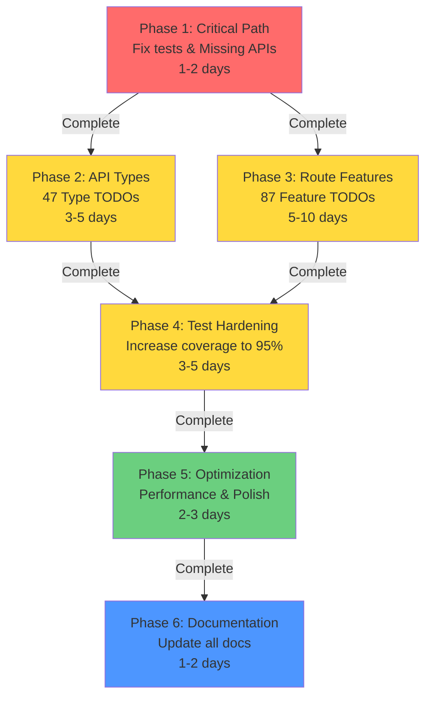

# 📊 LetItRip.in Implementation Tracker - Executive Summary

**Created**: February 12, 2026  
**Project**: LetItRip.in Multi-Seller E-commerce Platform  
**Status**: 🟡 ACTIVE - Phase 1 Ready to Start  
**Last Updated**: February 12, 2026

---

## 🎯 Vision & Scope

This document coordinates all pending development work across 6 phases:

1. **Phase 1** - Critical Path (PRIORITY: 🔴 START NOW)
2. **Phase 2** - API Type Definitions
3. **Phase 3** - Feature Implementation
4. **Phase 4** - Test Hardening
5. **Phase 5** - Optimization & Polish
6. **Phase 6** - Documentation

**Total Estimated Timeline**: 3-4 weeks  
**Total Estimated Effort**: 150-200 hours  
**Team**: 1-2 developers

---

## 📈 Current Project Health

```
✅ 2149 Tests Passing (94.8%)      - Excellent foundation
❌ 119 Tests Failing (5.2%)        - Critical blocker
✅ TypeScript: 0 Errors             - Clean codebase
✅ Type Safety: 100%                - Full coverage
✅ Compliance: 18/18 Rules          - Passed audit
❌ Missing APIs: 4 routes           - Feature gap
🟡 Phase 2 TODOs: 47 types         - Future work
🟡 Feature TODOs: 87 routes        - Feature backlog
🟡 Schema TODOs: 23 schemas        - Validation work
```

---

## 🚦 Phase Status Dashboard

| Phase | Name           | Status     | Timeline  | Effort | Priority    |
| ----- | -------------- | ---------- | --------- | ------ | ----------- |
| 1     | Critical Path  | 🔴 READY   | 1-2 days  | High   | 🔴 CRITICAL |
| 2     | API Types      | 🟡 BLOCKED | 3-5 days  | Medium | 🟡 HIGH     |
| 3     | Route Features | 🟡 BLOCKED | 5-10 days | Large  | 🟡 MEDIUM   |
| 4     | Test Hardening | 🟡 BLOCKED | 3-5 days  | Medium | 🟡 HIGH     |
| 5     | Optimization   | 🟡 BLOCKED | 2-3 days  | Small  | 🔵 MEDIUM   |
| 6     | Documentation  | 🟡 BLOCKED | 1-2 days  | Small  | 🔵 LOW      |

---

## 🎯 Phase 1: Critical Path (START NOW)

### What's Included

| Item                 | Count | Status           | Impact            |
| -------------------- | ----- | ---------------- | ----------------- |
| Failing Tests        | 119   | 🔴 Need fixing   | Blocks production |
| Missing API Routes   | 4     | 🔴 Need creating | Blocks features   |
| Type Errors          | 0     | ✅ Clean         | -                 |
| API Constants Issues | ~5    | 🟡 Need cleanup  | Non-blocking      |

### Phase 1 Breakdown

**1.1 Test Diagnostics** (1 hour)

- Identify failing test patterns
- Document root causes
- Create failure matrix

**1.2 Fix SessionUser Type** (30 minutes)

- Add `metadata` field to `SessionUser` interface
- Import `AvatarMetadata` from schema
- Update test mocks

**1.3 Fix Admin Test Mocks** (4 hours)

- Fix circular dependency patterns in 8 admin component tests
- Properly mock `React.use()` hook
- Remove problematic `jest.requireActual()` calls

**1.4 Create Phone Routes** (2 hours)

- `POST /api/profile/add-phone` - Send verification code
- `POST /api/profile/verify-phone` - Verify and update user
- Add tests for both routes
- Add needed constants to messages.ts

**1.5 Clean API Constants** (1 hour)

- Remove duplicate endpoint definitions
- Document missing routes
- Consolidate address endpoints
- Update JSDoc status for all endpoints

### Phase 1 Success Criteria

- ✅ Test pass rate ≥ 95% (≥ 2150 passing)
- ✅ 0 TypeScript errors
- ✅ 4 missing API routes implemented
- ✅ API constants cleaned up
- ✅ `npm test` executes successfully

### Phase 1 Estimated Timeline

**Total**: 8-10 hours (1 day)

```
├─ 1.1 Diagnostics: 1h      🔴 CRITICAL
├─ 1.2 SessionUser fix: 0.5h 🔴 CRITICAL
├─ 1.3 Admin tests fix: 4h   🔴 CRITICAL
├─ 1.4 Phone routes: 2h      🔴 CRITICAL
├─ 1.5 API constants: 1h     🟡 IMPORTANT
└─ Verification: 0.5h        🟢 ASSURANCE
```

### Files to Modify in Phase 1

```
MUST MODIFY (blocking):
├─ src/contexts/SessionContext.tsx (add metadata field)
├─ src/types/auth.ts (import AvatarMetadata)
├─ src/app/admin/*/page.test.tsx (8 files - fix mocks)
├─ src/app/api/profile/add-phone/route.ts (CREATE)
├─ src/app/api/profile/verify-phone/route.ts (CREATE)
├─ src/constants/messages.ts (add PHONE messages)
└─ src/constants/api-endpoints.ts (cleanup duplicates)

SHOULD MODIFY (supportive):
├─ src/app/api/profile/add-phone/__tests__/route.test.ts (CREATE)
└─ src/app/api/profile/verify-phone/__tests__/route.test.ts (CREATE)
```

### How to Start Phase 1

```bash
# Clone the instructions
# File: docs/PHASE1_ACTION_PLAN.md

# Follow this sequence:
# 1. Read Phase 1 action plan
# 2. Run test diagnostics
# 3. Fix SessionUser type
# 4. Fix admin test mocks
# 5. Create phone routes
# 6. Clean API constants
# 7. Run verification
```

---

## 🔄 Phase 2: API Type Definitions

### What's Included

| Category                        | Count  | Effort     |
| ------------------------------- | ------ | ---------- |
| Response metadata types         | 3      | Small      |
| Pagination types (cursor-based) | 2      | Small      |
| Advanced filtering              | 5      | Medium     |
| Product management              | 9      | Medium     |
| Category management             | 4      | Small      |
| Review system                   | 7      | Medium     |
| Carousel & sections             | 6      | Small      |
| **Validation schemas**          | **23** | **Medium** |
| **TOTAL**                       | **47** | **~40h**   |

### Key Features

- ✅ Complete type safety for all API operations
- ✅ HATEOAS links for navigation
- ✅ Cursor-based pagination
- ✅ Complex filtering (AND/OR conditions)
- ✅ Advanced validation schemas with business rules

### Timeline & Effort

**Duration**: 3-5 days  
**Effort**: 40-50 hours  
**Can start**: After Phase 1 complete  
**Can run in parallel**: With Phase 3

---

## 🚀 Phase 3: Feature Implementation (87 Feature TODOs)

### Route File Breakdown

| Routes         | Count  | Effort   | Priority |
| -------------- | ------ | -------- | -------- |
| Auth routes    | 8      | Medium   | HIGH     |
| User routes    | 12     | Medium   | HIGH     |
| Product routes | 15     | Large    | MEDIUM   |
| Order routes   | 10     | Large    | MEDIUM   |
| Review routes  | 8      | Medium   | MEDIUM   |
| Admin routes   | 18     | Large    | MEDIUM   |
| Other routes   | 16     | Varies   | LOW      |
| **TOTAL**      | **87** | **~80h** | -        |

### Key Features to Implement

**Auth**: MFA, OAuth providers, token refresh, password reset  
**Users**: Profile management, addresses, sessions, analytics  
**Products**: Search, filtering, bulk ops, inventory  
**Orders**: Processing, shipping, returns, refunds  
**Reviews**: Moderation, helpful votes, analytics  
**Admin**: Bulk operations, analytics, audit logs

### Timeline & Effort

**Duration**: 5-10 days  
**Effort**: 70-90 hours  
**Can start**: Parallel with Phase 2 (after Phase 1)  
**Dependencies**: Phase 1 must complete first

---

## 🧪 Phase 4: Test Hardening

### Coverage Goals

| Area        | Current  | Target   | Gap      |
| ----------- | -------- | -------- | -------- |
| API Routes  | 64%      | 100%     | +36%     |
| Components  | 50%      | 90%      | +40%     |
| Hooks       | 33%      | 85%      | +52%     |
| Utils       | 50%      | 100%     | +50%     |
| **Overall** | **~85%** | **≥95%** | **+10%** |

### Test Files Needed

- [ ] 4 missing API route test files
- [ ] 20 missing component test files
- [ ] 10 missing hook test files
- [ ] 10 missing util test files

### Timeline & Effort

**Duration**: 3-5 days  
**Effort**: 40-50 hours  
**Can start**: After Phase 1 (can run in parallel with Phase 2-3)

---

## 🎨 Phase 5: Optimization & Polish

### Areas

1. **Performance** - React memoization, code splitting, bundle optimization
2. **Code Quality** - Dead code removal, ESLint fixes, refactoring
3. **Media Processing** - Image/video optimization with sharp & ffmpeg
4. **Database** - Query optimization, index verification

### Timeline & Effort

**Duration**: 2-3 days  
**Effort**: 20-30 hours

---

## 📚 Phase 6: Documentation

### Documents to Update

- [ ] `docs/GUIDE.md` - Add all new functions
- [ ] `docs/CHANGELOG.md` - Document all changes
- [ ] `docs/API/` - Complete API reference
- [ ] `README.md` - Update features & status
- [ ] Create implementation templates & guides

### Timeline & Effort

**Duration**: 1-2 days  
**Effort**: 8-12 hours

---

## 📋 Implementation Roadmap



---

## 📊 Metrics & KPIs

### Quality Metrics

| Metric            | Current | Target | Timeline   |
| ----------------- | ------- | ------ | ---------- |
| Test Pass Rate    | 94.8%   | ≥ 95%  | Phase 1    |
| Code Coverage     | ~85%    | ≥ 95%  | Phase 4    |
| TypeScript Errors | 0       | 0      | All phases |
| Lint Violations   | Low     | 0      | Phase 5    |
| Missing APIs      | 4       | 0      | Phase 1    |
| Dead Code         | Low     | None   | Phase 5    |

### Velocity Metrics

| Phase     | TODOs          | Effort       | Days           |
| --------- | -------------- | ------------ | -------------- |
| 1         | ~5 items       | 8-10h        | 1              |
| 2         | 47 types       | 40-50h       | 3-5            |
| 3         | 87 features    | 70-90h       | 5-10           |
| 4         | Coverage       | 40-50h       | 3-5            |
| 5         | Polish         | 20-30h       | 2-3            |
| 6         | Docs           | 8-12h        | 1-2            |
| **TOTAL** | **~150 items** | **186-242h** | **15-26 days** |

---

## 🎯 Daily Standup Template

Use this for tracking progress:

```
Date: February [X], 2026

✅ Completed Today:
- [Item 1]
- [Item 2]

🔄 In Progress:
- [Item 1] - [% done]
- [Item 2] - [% done]

🚧 Blockers:
- [Blocker 1] (impact: [HIGH/MEDIUM/LOW])
- [Blocker 2] (impact: [HIGH/MEDIUM/LOW])

📈 Metrics:
- Test pass rate: X% (was Y% yesterday)
- Code coverage: X% (was Y% yesterday)
- TODOs remaining: X (was Y yesterday)

⏭️ Tomorrow's Focus:
- [Task 1]
- [Task 2]
```

---

## 📂 File Structure & Links

**Main Documentation Files**:

- 📄 [IMPLEMENTATION_TRACKER.md](./IMPLEMENTATION_TRACKER.md) - Overview & phase guide
- 📄 [PHASE1_ACTION_PLAN.md](./docs/PHASE1_ACTION_PLAN.md) - Detailed Phase 1 steps
- 📄 [PHASE2_API_TYPES.md](./docs/PHASE2_API_TYPES.md) - Type definitions guide
- 📄 [PHASE3_ROUTE_TODOS.md](./docs/PHASE3_ROUTE_TODOS.md) - Feature implementation guide
- 📄 [PHASE4_TEST_HARDENING.md](./docs/PHASE4_TEST_HARDENING.md) - Testing strategy
- 📄 [PHASE5_OPTIMIZATION.md](./docs/PHASE5_OPTIMIZATION.md) - Performance tuning
- 📄 [PHASE6_DOCUMENTATION.md](./docs/PHASE6_DOCUMENTATION.md) - Docs update guide

**Supporting Documentation**:

- 📄 [TECH_DEBT.md](./docs/TECH_DEBT.md) - Complete TODO inventory
- 📄 [API_AUDIT_REPORT.md](./API_AUDIT_REPORT.md) - API endpoint audit
- 📄 [CHANGELOG.md](./docs/CHANGELOG.md) - Version history
- 📄 [GUIDE.md](./docs/GUIDE.md) - Complete reference

---

## 🚀 How to Use This System

### For Developers

1. **Start Work**:
   - Read relevant phase document
   - Update todo status to "in-progress"
   - Work through subtasks sequentially

2. **Daily Progress**:
   - Run tests: `npm test`
   - Check types: `npx tsc --noEmit`
   - Update tracker with completed items

3. **Move to Next Phase**:
   - Verify all success criteria met
   - Run full test suite
   - Update IMPLEMENTATION_TRACKER.md status
   - Proceed to next phase

### For Project Managers

1. **Track Progress**:
   - Check status badges in IMPLEMENTATION_TRACKER.md
   - Review daily standup notes
   - Monitor KPI metrics

2. **Identify Blockers**:
   - Review "Blockers" section in phase documents
   - Escalate critical path issues
   - Unblock dependencies

3. **Adjust Timeline**:
   - Monitor actual vs. estimated effort
   - Adjust team allocation if needed
   - Re-estimate remaining work

---

## 💡 Quick Wins (if short on time)

If you need to reduce scope, these are less critical:

- [ ] Phase 5 (Performance) - Can defer to v1.1
- [ ] Phase 6 (Docs) - Can defer to v1.1
- [ ] Phase 3 (Routes) - Can implement incrementally

**Do NOT skip**:

- ❌ Phase 1 (Critical path)
- ❌ Phase 2 (Type safety)
- ❌ Phase 4 (Test coverage)

---

## ⚠️ Critical Risks

| Risk                           | Impact             | Mitigation                            |
| ------------------------------ | ------------------ | ------------------------------------- |
| Tests keep failing after fixes | Blocks launch      | Allocate extra time, debug thoroughly |
| Missing route dependencies     | Cascading failures | Implement in dependency order         |
| Type/schema misalignment       | Data corruption    | Use repositories consistently         |
| Test coverage gaps             | Production bugs    | Automated coverage checks in CI       |

---

## 🎓 Learning Resources

- **TypeScript**: `docs/GUIDE.md` section on types
- **Testing**: `docs/COMPREHENSIVE_TESTS_SUMMARY.md`
- **Copilot Rules**: `.github/copilot-instructions.md`
- **API Patterns**: `docs/API/` directory
- **Firebase**: `docs/guides/FIREBASE_COMPLETE_STACK.md`

---

## 📞 Need Help?

1. **Test failures?** → See [PHASE1_ACTION_PLAN.md](./docs/PHASE1_ACTION_PLAN.md) "If You Get Stuck" section
2. **Type errors?** → Check [GUIDE.md](./docs/GUIDE.md) for correct patterns
3. **API question?** → Review [API_AUDIT_REPORT.md](./API_AUDIT_REPORT.md)
4. **Blocked?** → Update IMPLEMENTATION_TRACKER.md with blocker details

---

## ✅ Completion Checklist

Mark each item complete as you finish:

- [ ] Phase 1 ✅ COMPLETE
  - [ ] Tests pass ≥ 95%
  - [ ] 4 missing APIs created
  - [ ] API constants cleaned
- [ ] Phase 2 ✅ COMPLETE
  - [ ] 47 types implemented
  - [ ] 23 schemas enhanced
  - [ ] All tests passing
- [ ] Phase 3 ✅ COMPLETE
  - [ ] 87 TODOs implemented
  - [ ] All routes tested
  - [ ] Integration tests pass
- [ ] Phase 4 ✅ COMPLETE
  - [ ] 95%+ code coverage
  - [ ] All components tested
  - [ ] All hooks tested
- [ ] Phase 5 ✅ COMPLETE
  - [ ] Performance optimized
  - [ ] Bundle size < 500KB
  - [ ] ESLint clean
- [ ] Phase 6 ✅ COMPLETE
  - [ ] Docs updated
  - [ ] Changelog updated
  - [ ] Templates created

---

## 📝 Notes

- This tracker is living document - update as you progress
- All phase documents are in `docs/` directory
- Reference `.github/copilot-instructions.md` for coding rules
- Prioritize Phase 1 - it unblocks everything else

---

**Generated**: February 12, 2026  
**Next Action**: Start [Phase 1 Action Plan](./docs/PHASE1_ACTION_PLAN.md)  
**Estimated Completion**: Early March 2026
