# 🏗️ Application Architecture & Data Flow Diagram

**Last Updated:** November 4, 2025  
**Purpose:** Technical architecture visualization for justforview.in

---

## 🎯 System Architecture Overview

```mermaid
graph TB
    subgraph Client["🌐 Client Layer"]
        BROWSER[Web Browser]
        MOBILE[Mobile Browser]
    end

    subgraph NextJS["⚡ Next.js 14 App Router"]
        PAGES[📄 Pages/Routes]
        COMPONENTS[🧩 Components]
        CONTEXTS[🔄 Context Providers]
        API_CLIENT[📡 API Client]
    end

    subgraph Services["🛠️ Service Layer"]
        PRODUCT_SERVICE[📦 Product Service]
        USER_SERVICE[👤 User Service]
        ORDER_SERVICE[📋 Order Service]
        CATEGORY_SERVICE[📑 Category Service]
        REVIEW_SERVICE[⭐ Review Service]
        CART_SERVICE[🛒 Cart Service]
        WISHLIST_SERVICE[❤️ Wishlist Service]
    end

    subgraph APIRoutes["🔌 API Routes"]
        PRODUCTS_API[/api/products]
        USERS_API[/api/user]
        ORDERS_API[/api/orders]
        CATEGORIES_API[/api/categories]
        REVIEWS_API[/api/reviews]
        CART_API[/api/cart]
    end

    subgraph Backend["💾 Backend Services"]
        FIREBASE_AUTH[🔐 Firebase Auth]
        FIRESTORE[🗄️ Firestore DB]
        STORAGE[📁 Firebase Storage]
        CACHE[⚡ Cache Layer]
    end

    subgraph External["🌍 External Services"]
        RAZORPAY[💳 Razorpay Payment]
        PAYPAL[💵 PayPal]
        EMAIL[📧 Email Service]
        SMS[📱 SMS Service]
    end

    BROWSER --> PAGES
    MOBILE --> PAGES

    PAGES --> COMPONENTS
    PAGES --> CONTEXTS

    COMPONENTS --> API_CLIENT
    CONTEXTS --> API_CLIENT

    API_CLIENT --> PRODUCT_SERVICE
    API_CLIENT --> USER_SERVICE
    API_CLIENT --> ORDER_SERVICE
    API_CLIENT --> CATEGORY_SERVICE
    API_CLIENT --> REVIEW_SERVICE
    API_CLIENT --> CART_SERVICE
    API_CLIENT --> WISHLIST_SERVICE

    PRODUCT_SERVICE --> PRODUCTS_API
    USER_SERVICE --> USERS_API
    ORDER_SERVICE --> ORDERS_API
    CATEGORY_SERVICE --> CATEGORIES_API
    REVIEW_SERVICE --> REVIEWS_API
    CART_SERVICE --> CART_API

    PRODUCTS_API --> FIRESTORE
    USERS_API --> FIRESTORE
    ORDERS_API --> FIRESTORE
    CATEGORIES_API --> FIRESTORE
    REVIEWS_API --> FIRESTORE
    CART_API --> FIRESTORE

    USERS_API --> FIREBASE_AUTH
    PRODUCTS_API --> STORAGE

    PRODUCTS_API --> CACHE
    CATEGORIES_API --> CACHE

    ORDERS_API --> RAZORPAY
    ORDERS_API --> PAYPAL
    ORDERS_API --> EMAIL
    ORDERS_API --> SMS
```

---

## 🔄 Data Flow by Feature

### 1. Product Browsing Flow

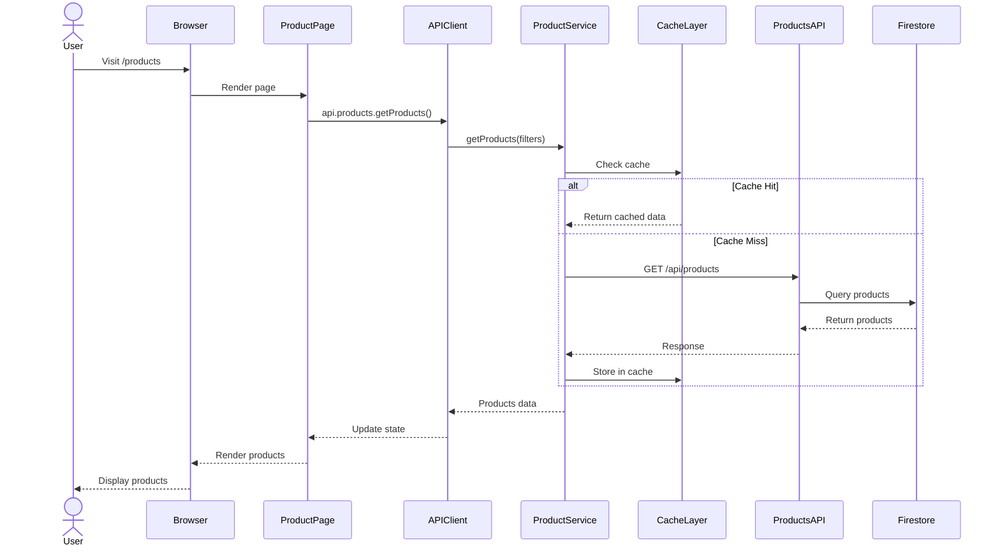

---

### 2. Add to Cart Flow

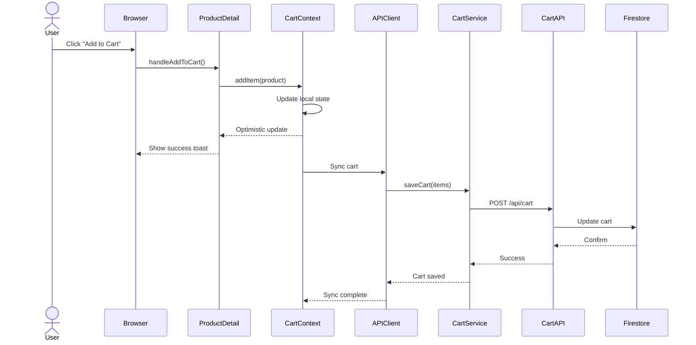

---

### 3. User Authentication Flow

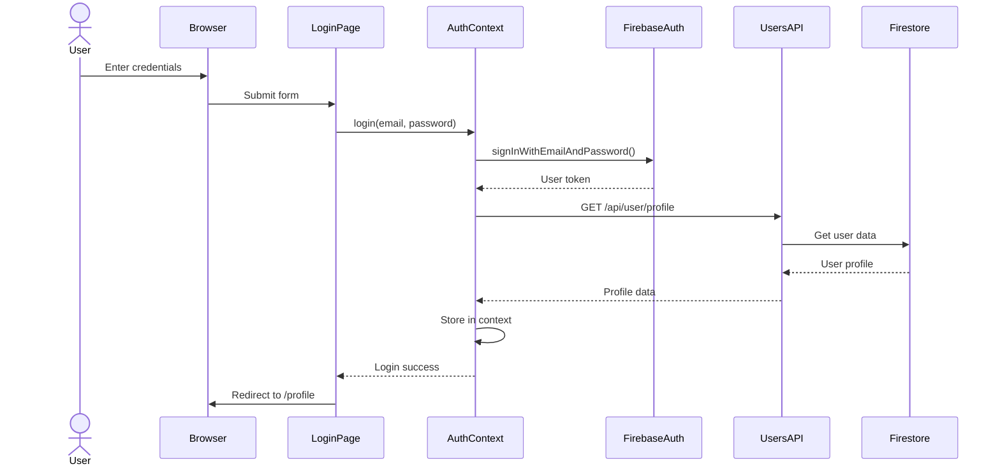

---

### 4. Order Creation Flow

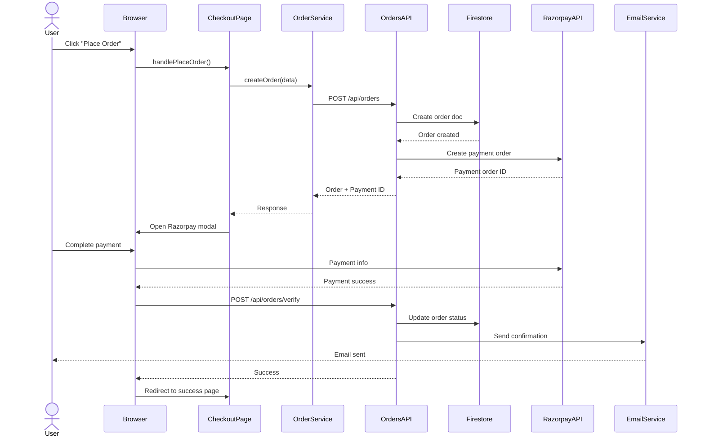

---

### 5. Seller Product Management Flow

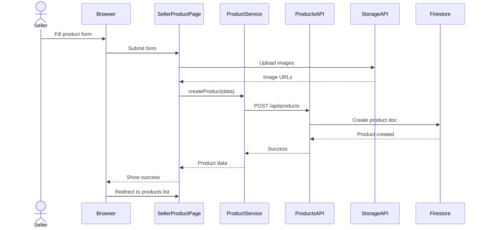

---

## 🗄️ Database Schema Relationships

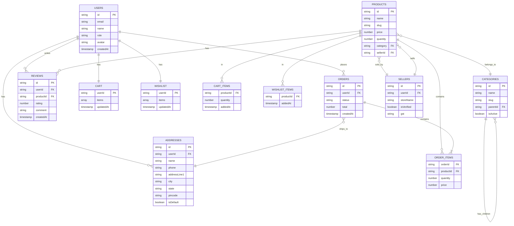

---

## 🔐 Authentication & Authorization Flow

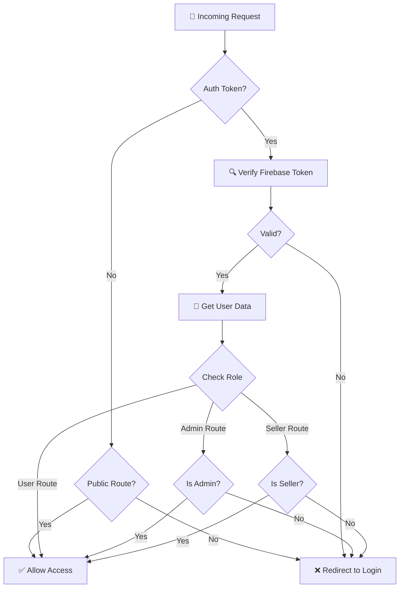

---

## 🎯 API Client Architecture

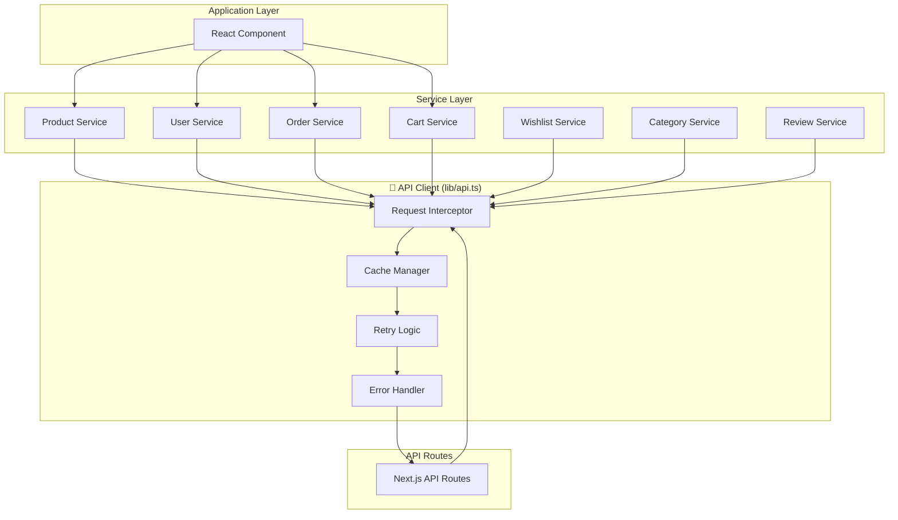

---

## 🔄 State Management Architecture

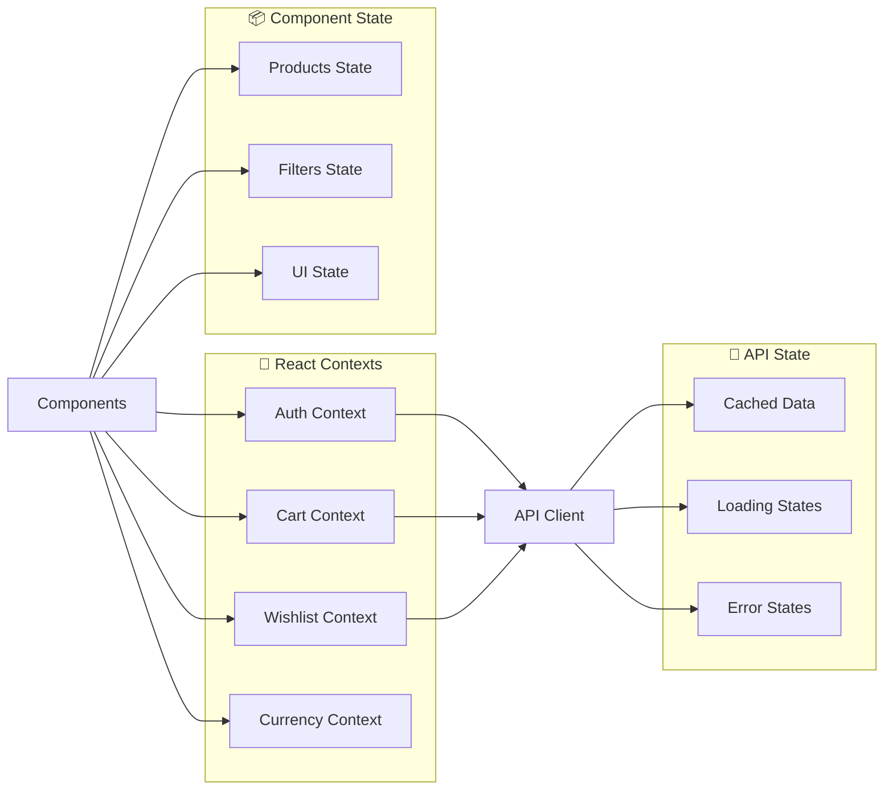

---

## 🚀 Performance Optimization Layers

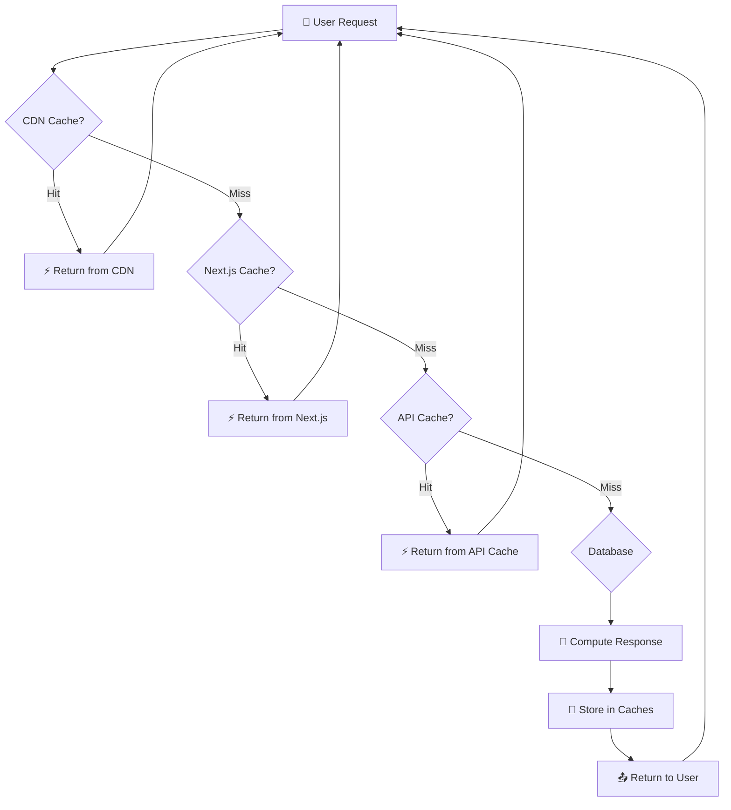

---

## 📊 Caching Strategy by Layer

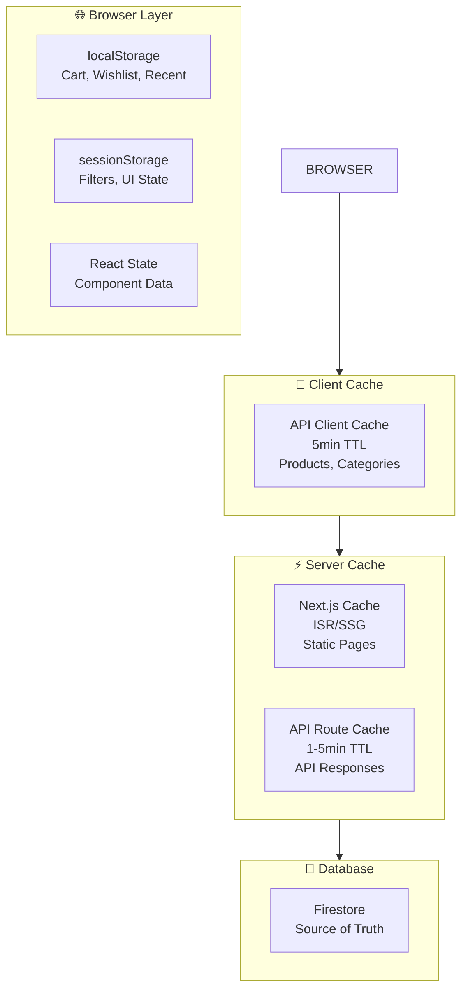

---

## 🔌 Third-Party Integrations

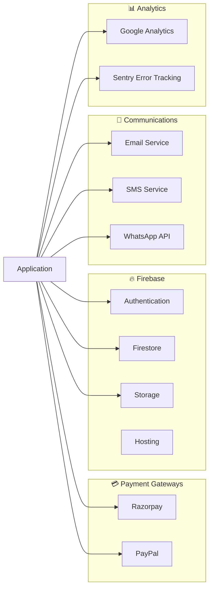

---

## 🛡️ Security Architecture

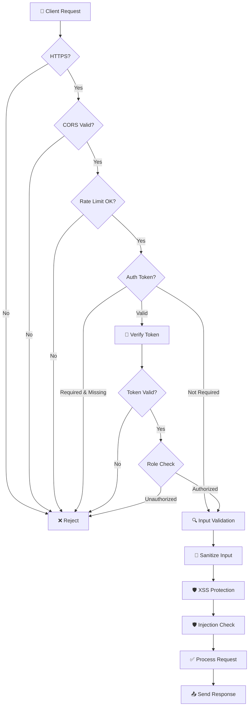

---

## 📱 Mobile Responsive Architecture

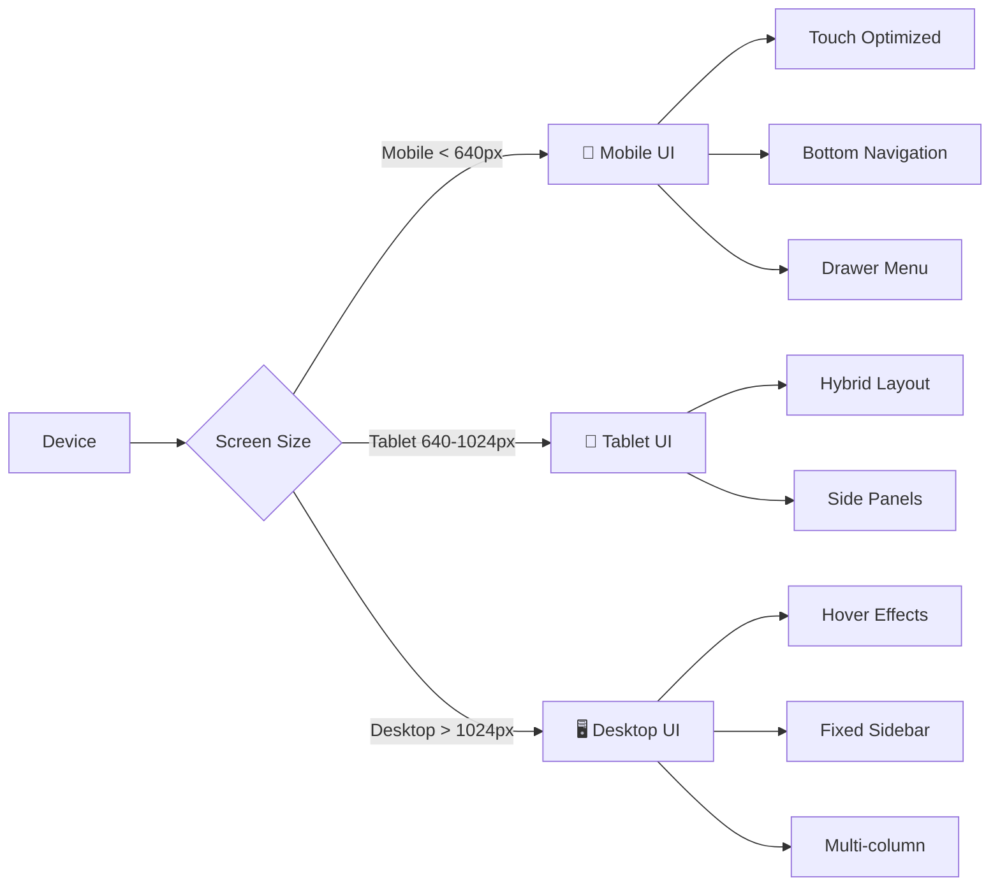

---

## 🔄 Real-time Updates Architecture

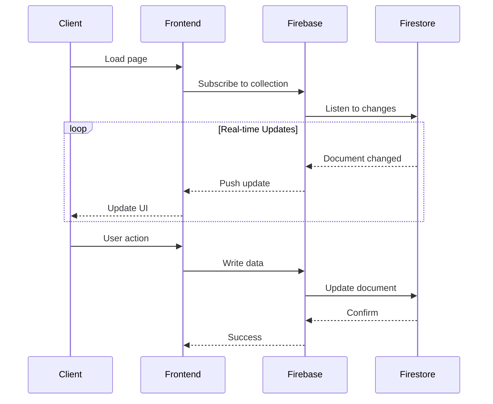

---

## 📦 Deployment Architecture

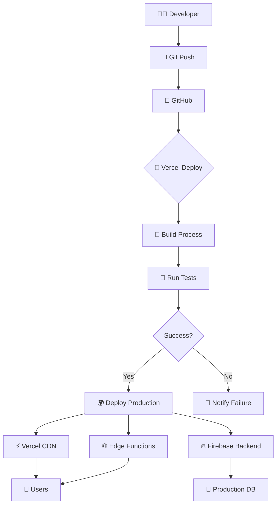

---

## 🎯 Load Balancing & Scalability

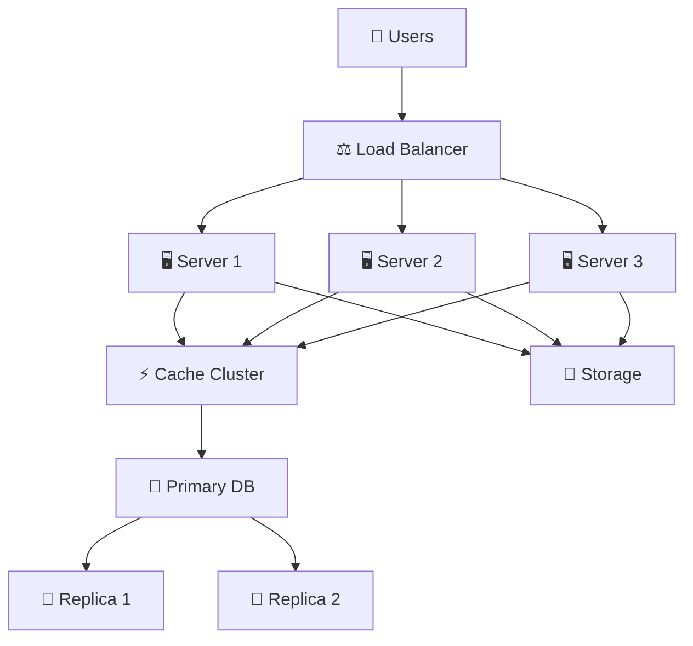

---

## 🔗 Related Documentation

- **[Routes Diagram](APPLICATION_ROUTES_DIAGRAM.md)** - All application routes
- **[UI Files Documentation](UI_FILES_DOCUMENTATION.md)** - Component details
- **[API Services Guide](API_SERVICES_COMPLETE_GUIDE.md)** - API reference
- **[Documentation Index](../DOCUMENTATION_INDEX.md)** - All docs

---

**Last Updated:** November 4, 2025  
**Maintained by:** Development Team  
**Diagram Format:** Mermaid (GitHub/VS Code compatible)
