# 🎯 User Journey & Use Case Diagrams

**Last Updated:** November 4, 2025  
**Purpose:** Visual representation of user flows and use cases

---

## 👥 User Personas

### 1. Guest User (Visitor)

- Can browse products
- Can search and filter
- Can view product details
- Cannot checkout or save items

### 2. Registered Customer

- All guest features +
- Can place orders
- Can save to wishlist
- Can write reviews
- Can manage profile

### 3. Seller

- All customer features +
- Can add/edit products
- Can manage orders
- Can view analytics
- Can manage store

### 4. Admin

- All features +
- Can manage all users
- Can approve products
- Can manage categories
- Full system access

---

## 🛒 Customer Journey Map

### Journey 1: First-Time Purchase

---

### Journey 2: Returning Customer

---

### Journey 3: Seller Onboarding

---

## 🎬 Use Case Diagrams

### Customer Use Cases

---

### Seller Use Cases

---

### Admin Use Cases

---

## 🔄 Detailed User Flows

### Flow 1: Product Purchase Flow

---

### Flow 2: Seller Product Upload Flow

---

### Flow 3: Admin Approval Flow

---

## 📱 Mobile vs Desktop Flow Differences

### Mobile User Flow

```mermaid
flowchart LR
    MOBILE_USER[📱 Mobile User]

    MOBILE_USER --> HAMBURGER[☰ Hamburger Menu]
    HAMBURGER --> MENU[Side Drawer]

    MENU --> CATEGORIES_M[Categories]
    MENU --> PROFILE_M[Profile]
    MENU --> CART_M[Cart]
    MENU --> ORDERS_M[Orders]

    MOBILE_USER --> BOTTOM_NAV[Bottom Navigation]
    BOTTOM_NAV --> HOME_M[Home]
    BOTTOM_NAV --> SEARCH_M[Search]
    BOTTOM_NAV --> CART_MB[Cart]
    BOTTOM_NAV --> PROFILE_MB[Profile]
```

### Desktop User Flow

```mermaid
flowchart LR
    DESKTOP_USER[🖥️ Desktop User]

    DESKTOP_USER --> TOP_NAV[Top Navigation Bar]

    TOP_NAV --> HOME_D[Home]
    TOP_NAV --> PRODUCTS_D[Products]
    TOP_NAV --> CATEGORIES_D[Categories Dropdown]
    TOP_NAV --> SEARCH_D[Search Bar]
    TOP_NAV --> CART_D[Cart Icon]
    TOP_NAV --> USER_D[User Menu]

    USER_D --> PROFILE_D[Profile]
    USER_D --> ORDERS_D[Orders]
    USER_D --> WISHLIST_D[Wishlist]
    USER_D --> SETTINGS_D[Settings]
    USER_D --> LOGOUT_D[Logout]
```

---

## 🎯 Critical User Paths

### Path 1: Guest to Customer Conversion

---

### Path 2: Product Discovery to Purchase

---

### Path 3: Order Tracking Journey

---

## 🔍 Search & Discovery Flow

---

## 📊 Analytics & Tracking Points

---

## 🔗 Related Documentation

- **[Application Routes Diagram](APPLICATION_ROUTES_DIAGRAM.md)** - All routes
- **[Architecture Diagram](ARCHITECTURE_DIAGRAM.md)** - Technical architecture
- **[UI Files Documentation](UI_FILES_DOCUMENTATION.md)** - Component details
- **[Documentation Index](../DOCUMENTATION_INDEX.md)** - All documentation

---

**Last Updated:** November 4, 2025  
**Maintained by:** Development Team  
**Diagram Format:** Mermaid (GitHub/VS Code compatible)

---

## 💡 How to Use These Diagrams

### For Product Planning

- Use journey maps to identify pain points
- Review flows to optimize conversion
- Analyze drop-off points

### For Development

- Follow use cases to implement features
- Use flows for testing scenarios
- Reference for state management

### For UX Design

- Journey maps for user research
- Flows for wireframe creation
- Paths for usability testing

### For Training

- Show to new team members
- Explain system capabilities
- Document user stories
