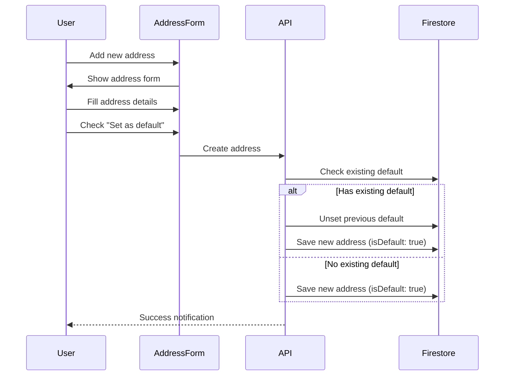
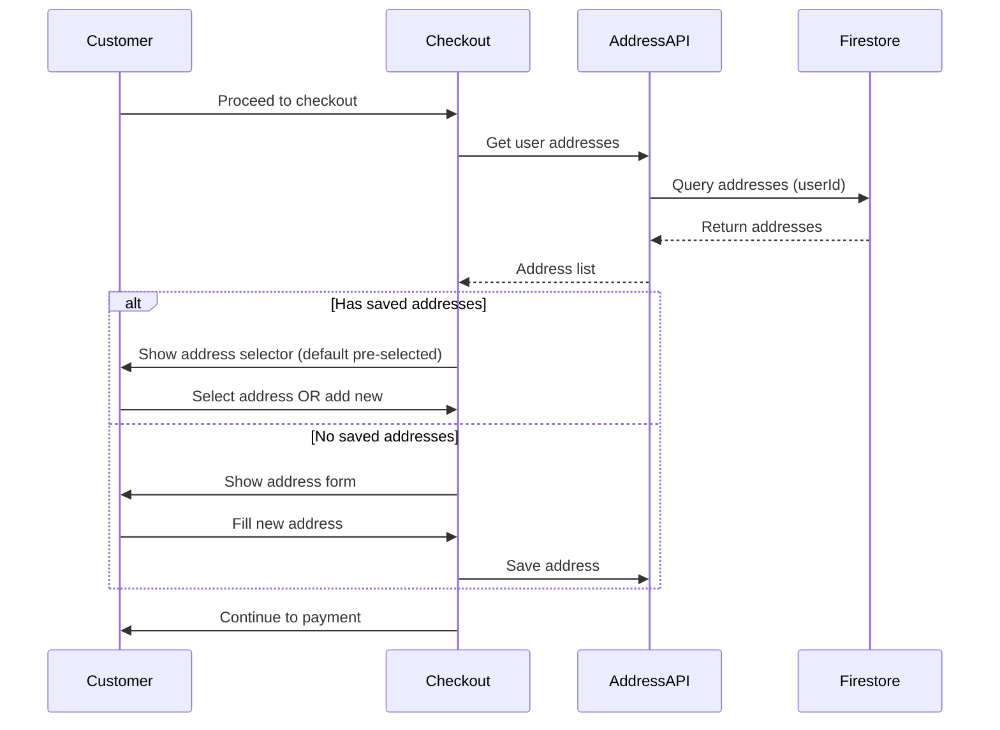

# Addresses Resource Documentation

**Resource Type**: User Data Entity  
**Collection**: `addresses`  
**Primary Use**: Shipping and billing address management for users

---

## Table of Contents

1. [Overview](#overview)
2. [Schema & Fields](#schema--fields)
3. [Related Resources](#related-resources)
4. [Filters & Search](#filters--search)
5. [Inline Logic & Quick Create](#inline-logic--quick-create)
6. [Wizards & Forms](#wizards--forms)
7. [Card Displays](#card-displays)
8. [Bulk Actions](#bulk-actions)
9. [Diagrams](#diagrams)
10. [Why We Need This](#why-we-need-this)
11. [Quick Reference](#quick-reference)

---

## Overview

**Addresses** store user shipping and billing addresses for quick checkout. Each user can have multiple addresses with one marked as default.

### Key Characteristics

- **Multi-Address**: Users can save multiple addresses
- **Default Selection**: One address can be marked as default
- **Quick Checkout**: Pre-filled addresses at checkout
- **Reusable**: Same address for multiple orders
- **Validation**: Address format and pincode validation

---

## Schema & Fields

### Firestore Collection: `addresses`

```typescript
interface Address {
  // ==================== IDENTIFICATION ====================
  id: string; // Auto-generated document ID
  userId: string; // User ID (REQUIRED)

  // ==================== RECIPIENT ====================
  name: string; // Recipient name (REQUIRED, 2-100 chars)
  phone: string; // Phone number (REQUIRED, 10-15 digits)

  // ==================== ADDRESS ====================
  line1: string; // Address line 1 (REQUIRED, max 200 chars)
  line2?: string; // Address line 2 (optional, max 200 chars)
  city: string; // City (REQUIRED, max 100 chars)
  state: string; // State/Province (REQUIRED, max 100 chars)
  pincode: string; // Postal code (REQUIRED, 4-10 chars)
  country: string; // Country (REQUIRED, max 100 chars)

  // ==================== TYPE ====================
  type?: "home" | "work" | "other"; // Address type (default: 'home')
  label?: string; // Custom label (e.g., "Office", "Parents' Home")

  // ==================== FLAGS ====================
  isDefault: boolean; // Default address (default: false)

  // ==================== TIMESTAMPS ====================
  createdAt: Date | Timestamp; // Creation timestamp (auto)
  updatedAt: Date | Timestamp; // Last update timestamp (auto)
}
```

### Required Fields

**Minimum Required for Creation:**

```typescript
{
  userId: string,            // User ID
  name: string,              // Recipient name
  phone: string,             // Phone number
  line1: string,             // Address line 1
  city: string,              // City
  state: string,             // State
  pincode: string,           // Postal code
  country: string,           // Country
  isDefault: boolean         // Default flag (default: false)
}
```

### Field Validation Rules

| Field     | Type   | Min | Max | Required | Pattern      | Default |
| --------- | ------ | --- | --- | -------- | ------------ | ------- |
| `name`    | string | 2   | 100 | ✅       | -            | -       |
| `phone`   | string | 10  | 15  | ✅       | digits only  | -       |
| `line1`   | string | 5   | 200 | ✅       | -            | -       |
| `line2`   | string | 0   | 200 | ❌       | -            | -       |
| `city`    | string | 2   | 100 | ✅       | -            | -       |
| `state`   | string | 2   | 100 | ✅       | -            | -       |
| `pincode` | string | 4   | 10  | ✅       | alphanumeric | -       |
| `country` | string | 2   | 100 | ✅       | -            | 'India' |

---

## Related Resources

### Direct Relationships

1. **Users** (Many-to-One)

   - Each address belongs to ONE user
   - Field: `userId`
   - Relationship: `addresses.userId → users.uid`
   - Use: User's address book

2. **Orders** (Indirect)
   - Orders copy address data (not reference)
   - Use: Shipping/billing address for orders

---

## Filters & Search

### Search Implementation

**API Endpoint**: `GET /api/user/addresses`

**No filters needed** - Addresses are user-specific and typically small datasets.

**Query Parameters**:

```typescript
{
  type?: 'home' | 'work' | 'other',  // Filter by type
  is_default?: boolean               // Get default address
}
```

**Sort Options**:

- `is_default_desc` - Default address first
- `created_at_desc` - Newest first (default)

---

## Inline Logic & Quick Create

### Inline Edit Component

**Not typically used** - Addresses use full forms for data entry.

---

## Wizards & Forms

### Address Creation/Edit Form

**Location**: `/user/addresses/create`, `/user/addresses/[id]/edit`, Checkout page

**Single-Step Form**:

```typescript
{
  name: string,              // Recipient name
  phone: string,             // Phone number
  line1: string,             // Address line 1
  line2?: string,            // Address line 2 (optional)
  city: string,              // City
  state: string,             // State (dropdown or autocomplete)
  pincode: string,           // Postal code
  country: string,           // Country (dropdown, default: India)
  type: 'home' | 'work' | 'other', // Address type
  label?: string,            // Custom label (if type = 'other')
  isDefault: boolean         // Set as default checkbox
}
```

**Validation**:

- Name: 2-100 characters
- Phone: Valid phone number format
- Pincode: Valid postal code format
- All required fields must be filled
- If setting as default, unset previous default

**Auto-Fill Features**:

- Pincode lookup → Auto-fill city/state
- Google Maps integration (optional)
- Previously used addresses suggestion

---

## Card Displays

### For Users (Address Book)

**Component**: `src/components/user/AddressCard.tsx`

```typescript
<AddressCard
  address={address}
  onEdit={() => router.push(`/user/addresses/${address.id}/edit`)}
  onDelete={() => handleDelete(address.id)}
  onSetDefault={() => handleSetDefault(address.id)}
  onSelect={() => handleSelectForCheckout(address.id)} // At checkout
/>
```

**Displays**:

- Recipient name (large)
- Address type badge (Home/Work/Other)
- Full address (formatted)
- Phone number
- "Default" badge if `isDefault === true`
- Quick actions:
  - Edit button
  - Delete button (if not default)
  - "Set as Default" button (if not default)
  - "Use this address" button (at checkout)

**Layout**:

- Card with border
- Radio button (at checkout for selection)
- Default address highlighted with accent color

---

## Bulk Actions

**Not applicable** - Addresses are managed individually by users.

**Available Actions**:

- Set as default (single action)
- Delete (single action, with confirmation)

---

## Diagrams

### Address Management Flow



### Checkout Address Selection



---

## Why We Need This

### Business Requirements

1. **Quick Checkout**

   - Reduce checkout friction
   - Improve conversion rates
   - Save customer time

2. **Multiple Locations**

   - Support home and work addresses
   - Gift shipping to different addresses
   - Flexible delivery options

3. **Repeat Orders**

   - Reuse saved addresses
   - One-click address selection
   - Address history

4. **Data Quality**

   - Validated address formats
   - Consistent address data
   - Accurate shipping information

5. **User Experience**
   - No re-typing addresses
   - Mobile-friendly forms
   - Auto-complete features

### Technical Requirements

1. **Performance**

   - Fast address loading
   - Minimal form validation lag
   - Quick pincode lookup

2. **Data Validation**

   - Valid phone numbers
   - Valid postal codes
   - Proper address formatting

3. **Security**

   - User addresses are private
   - No cross-user access
   - Secure data storage

---

## Quick Reference

### API Routes

| Endpoint                               | Method | Purpose             | Auth |
| -------------------------------------- | ------ | ------------------- | ---- |
| `/api/user/addresses`                  | GET    | List user addresses | User |
| `/api/user/addresses`                  | POST   | Create address      | User |
| `/api/user/addresses/[id]`             | GET    | Get address         | User |
| `/api/user/addresses/[id]`             | PATCH  | Update address      | User |
| `/api/user/addresses/[id]`             | DELETE | Delete address      | User |
| `/api/user/addresses/default`          | GET    | Get default address | User |
| `/api/user/addresses/[id]/set-default` | POST   | Set as default      | User |

### Service Methods

```typescript
// address.service.ts
addressService.getAddresses(userId); // Get all user addresses
addressService.getDefaultAddress(userId); // Get default address
addressService.getAddress(id); // Get by ID
addressService.createAddress(data); // Create new
addressService.updateAddress(id, data); // Update existing
addressService.deleteAddress(id); // Delete
addressService.setDefault(id); // Set as default
```

### Common Queries

```typescript
// Get user's default address
const defaultAddress = await addressService.getDefaultAddress(userId);

// Get all user addresses
const addresses = await addressService.getAddresses(userId);

// Create new address and set as default
const newAddress = await addressService.createAddress({
  ...addressData,
  isDefault: true,
});

// Set address as default
await addressService.setDefault(addressId);
// This automatically unsets previous default
```

### Firestore Indexes Required

```json
{
  "collectionGroup": "addresses",
  "queryScope": "COLLECTION",
  "fields": [
    { "fieldPath": "userId", "order": "ASCENDING" },
    { "fieldPath": "isDefault", "order": "DESCENDING" }
  ]
},
{
  "collectionGroup": "addresses",
  "queryScope": "COLLECTION",
  "fields": [
    { "fieldPath": "userId", "order": "ASCENDING" },
    { "fieldPath": "createdAt", "order": "DESCENDING" }
  ]
}
```

---

**Last Updated**: November 10, 2025  
**Version**: 1.0  
**Related Docs**:

- [Orders Resource](./orders.md)
- [Users (in types)](../ai/AI-AGENT-GUIDE.md)
