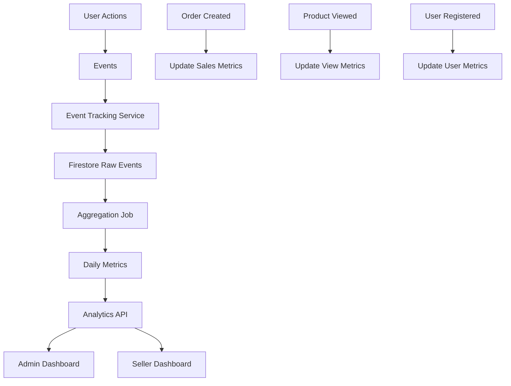

# Analytics Resource Documentation

**Resource Type**: Reporting & Metrics  
**Collections**: Various (`product_views`, `analytics_events`, aggregated metrics)  
**Primary Use**: Business intelligence and performance tracking

---

## Table of Contents

1. [Overview](#overview)
2. [Schema & Fields](#schema--fields)
3. [Related Resources](#related-resources)
4. [Filters & Search](#filters--search)
5. [Dashboards](#dashboards)
6. [Reports](#reports)
7. [Diagrams](#diagrams)
8. [Why We Need This](#why-we-need-this)
9. [Quick Reference](#quick-reference)

---

## Overview

**Analytics** provide insights into platform performance, user behavior, sales trends, and business metrics across admin, seller, and user dashboards.

### Key Characteristics

- **Multi-Dimensional**: Track metrics across time, products, shops, categories
- **Real-Time**: Live updates for critical metrics
- **Aggregated**: Pre-calculated summaries for performance
- **Filterable**: Date ranges, segments, comparisons
- **Exportable**: CSV/PDF reports
- **Visualized**: Charts, graphs, tables

---

## Schema & Fields

### Product Views (Event Tracking)

```typescript
interface ProductView {
  id: string;
  productId: string;
  userId?: string; // null for anonymous
  sessionId: string;
  timestamp: Date;
  referrer?: string;
  device: "mobile" | "tablet" | "desktop";
  browser?: string;
}
```

### Analytics Event (Generic Tracking)

```typescript
interface AnalyticsEvent {
  id: string;
  eventType: string; // 'page_view', 'product_click', 'add_to_cart', etc.
  userId?: string;
  sessionId: string;
  metadata: Record<string, any>;
  timestamp: Date;
}
```

### Daily Metrics (Aggregated)

```typescript
interface DailyMetrics {
  id: string; // Format: YYYY-MM-DD
  date: Date;

  // Sales
  orders: number;
  revenue: number;
  avgOrderValue: number;

  // Products
  products_sold: number;
  products_viewed: number;

  // Users
  new_users: number;
  active_users: number;

  // Shops
  active_shops: number;

  // Traffic
  pageviews: number;
  sessions: number;
  bounceRate: number;
}
```

---

## Related Resources

All resources can have analytics:

- **Products** → Views, sales, revenue
- **Shops** → Sales, orders, ratings
- **Categories** → Performance by category
- **Orders** → Order metrics, conversion
- **Users** → User activity, retention

---

## Filters & Search

### Common Filters

```typescript
{
  date_range: 'today' | 'yesterday' | 'last_7_days' | 'last_30_days' | 'this_month' | 'last_month' | 'custom',
  start_date?: string,
  end_date?: string,
  shop_id?: string,        // Filter by shop
  category_id?: string,    // Filter by category
  product_id?: string,     // Filter by product
  metric?: string,         // Specific metric
  compare_to?: string      // Comparison period
}
```

---

## Dashboards

### Admin Dashboard

**Location**: `/admin/dashboard`

**Key Metrics**:

- Total revenue (today, this month, all-time)
- Orders count (pending, processing, completed)
- Active products
- Active shops
- Active users
- Top selling products
- Top performing shops
- Revenue trend chart (last 30 days)
- Orders by status (pie chart)
- Traffic analytics

### Seller Dashboard

**Location**: `/seller/dashboard`

**Key Metrics**:

- Shop revenue (today, this month, all-time)
- Orders (pending, processing, completed)
- Products sold
- Average order value
- Top selling products
- Low stock alerts
- Recent orders
- Revenue trend chart
- Product views chart

### User Dashboard (Optional)

**Location**: `/user/dashboard`

**Key Metrics**:

- Orders count
- Total spent
- Favorite products
- Viewing history
- Recommendations

---

## Reports

### Sales Report

**Metrics**:

- Total revenue
- Orders count
- Average order value
- Revenue by category
- Revenue by shop
- Revenue trend over time

**Exportable**: CSV, PDF

### Product Performance Report

**Metrics**:

- Total views
- Total sales
- Conversion rate
- Revenue generated
- Average rating
- Stock levels

**Groupable By**: Category, Shop, Date

### Shop Performance Report

**Metrics**:

- Total orders
- Total revenue
- Average rating
- Product count
- Top products
- Customer reviews

---

## Diagrams

### Analytics Data Flow



---

## Why We Need This

### Business Requirements

1. **Performance Monitoring**: Track business health
2. **Decision Making**: Data-driven strategies
3. **Seller Insights**: Help sellers optimize
4. **Trend Analysis**: Identify patterns
5. **ROI Tracking**: Measure marketing effectiveness

---

## Quick Reference

### API Routes

| Endpoint                  | Method | Purpose                 | Auth         |
| ------------------------- | ------ | ----------------------- | ------------ |
| `/api/analytics/overview` | GET    | Platform overview       | Admin        |
| `/api/analytics/sales`    | GET    | Sales metrics           | Admin/Seller |
| `/api/analytics/products` | GET    | Product performance     | Admin/Seller |
| `/api/analytics/shops`    | GET    | Shop performance        | Admin        |
| `/api/analytics/traffic`  | GET    | Traffic metrics         | Admin        |
| `/api/analytics/export`   | POST   | Export report           | Admin/Seller |
| `/api/seller/analytics`   | GET    | Seller-specific metrics | Seller       |

---

**Last Updated**: November 10, 2025  
**Version**: 1.0  
**Related Docs**:

- [Orders Resource](./orders.md)
- [Products Resource](./products.md)
- [Shops Resource](./shops.md)
