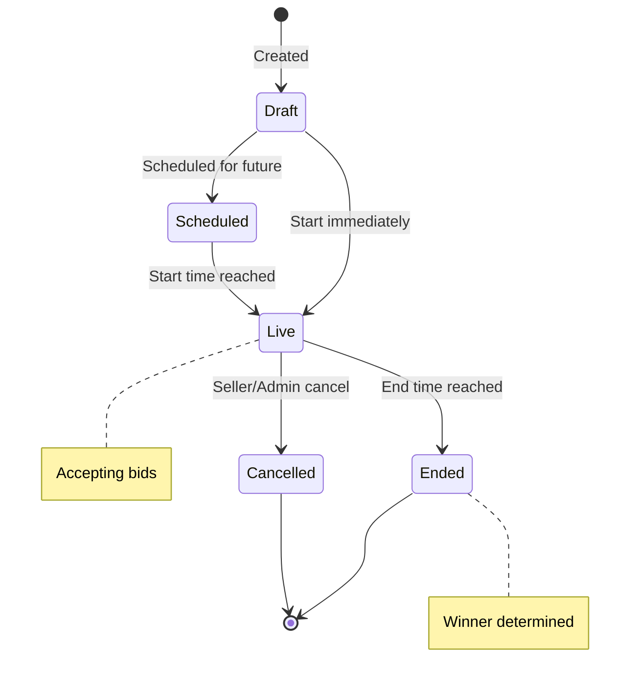
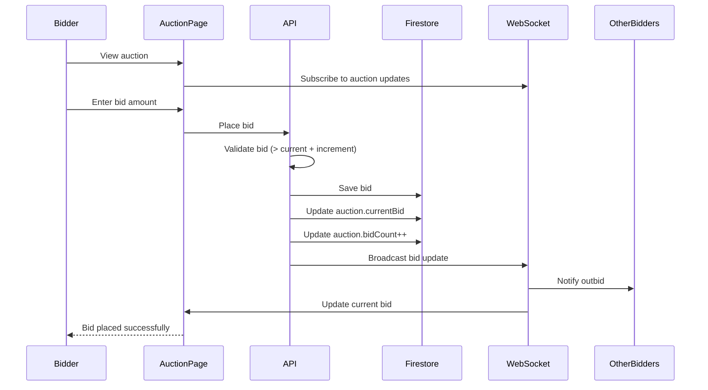

# Auctions Resource Documentation

**Resource Type**: Transactional Entity  
**Collection**: `auctions`  
**Primary Use**: Auction-style selling across seller and public pages

---

## Table of Contents

1. [Overview](#overview)
2. [Schema & Fields](#schema--fields)
3. [Related Resources](#related-resources)
4. [Filters & Search](#filters--search)
5. [Inline Logic & Quick Create](#inline-logic--quick-create)
6. [Wizards & Forms](#wizards--forms)
7. [Card Displays](#card-displays)
8. [Bulk Actions](#bulk-actions)
9. [Diagrams](#diagrams)
10. [Why We Need This](#why-we-need-this)
11. [Quick Reference](#quick-reference)

---

## Overview

**Auctions** enable sellers to list products for time-bound competitive bidding. Buyers place bids, and the highest bidder wins when the auction ends.

### Key Characteristics

- **Time-Bound**: Auctions have specific start and end times
- **Competitive Bidding**: Multiple users can bid, highest wins
- **Reserve Price**: Optional minimum acceptable price
- **Auto-Bidding**: Users can set maximum auto-bid amounts
- **Real-Time Updates**: Live bid updates via WebSocket
- **Winner Selection**: Automatic winner determination at end time

---

## Schema & Fields

### Firestore Collection: `auctions`

```typescript
interface Auction {
  // ==================== IDENTIFICATION ====================
  id: string; // Auto-generated document ID
  shopId: string; // Seller shop ID (REQUIRED)
  sellerId: string; // Seller user ID (REQUIRED)

  // ==================== BASIC INFO ====================
  name: string; // Auction title (REQUIRED, 5-200 chars)
  slug: string; // URL-friendly identifier (REQUIRED, unique)
  description: string; // Auction description (REQUIRED, 20-5000 chars)

  // ==================== MEDIA ====================
  images: string[]; // Auction images (REQUIRED, 1-10)
  videos?: string[]; // Optional videos (0-3)

  // ==================== BIDDING ====================
  startingBid: number; // Starting bid amount (REQUIRED, positive)
  reservePrice?: number; // Minimum acceptable price (optional)
  currentBid: number; // Current highest bid (auto-updated)
  bidCount: number; // Total number of bids (auto-updated)
  bidIncrement: number; // Minimum bid increase (default: 10)

  // ==================== TIMING ====================
  startTime: Date | Timestamp; // Auction start time (REQUIRED)
  endTime: Date | Timestamp; // Auction end time (REQUIRED)
  autoExtend: boolean; // Extend if bid in last 5 mins (default: true)
  extensionMinutes: number; // Extension duration (default: 5)

  // ==================== WINNER ====================
  winnerId?: string; // Winning bidder user ID (set at end)
  finalBid?: number; // Final winning bid amount (set at end)
  winnerNotified: boolean; // Winner notification sent (default: false)

  // ==================== STATUS ====================
  status: AuctionStatus; // 'draft' | 'scheduled' | 'live' | 'ended' | 'cancelled'

  // ==================== FLAGS ====================
  isFeatured: boolean; // Featured on homepage (default: false)
  showOnHomepage: boolean; // Show on homepage (default: false)
  featuredPriority?: number; // Featured display order

  // ==================== SETTINGS ====================
  allowAutoBid: boolean; // Enable auto-bidding (default: true)
  requireVerifiedBidders: boolean; // Only verified users (default: false)
  maxBidsPerUser?: number; // Limit bids per user (optional)

  // ==================== TIMESTAMPS ====================
  createdAt: Date | Timestamp; // Creation timestamp (auto)
  updatedAt: Date | Timestamp; // Last update timestamp (auto)
}
```

### Bid Schema

```typescript
interface Bid {
  id: string; // Bid ID
  auctionId: string; // Parent auction ID (REQUIRED)
  userId: string; // Bidder user ID (REQUIRED)
  userName: string; // Bidder name (cached)

  bidAmount: number; // Bid amount (REQUIRED, positive)
  bidTime: Date | Timestamp; // Bid timestamp (auto)

  isWinning: boolean; // Currently winning bid (auto-updated)
  isAutoBid: boolean; // Auto-generated bid (default: false)
  maxAutoBid?: number; // Maximum auto-bid amount (if auto-bid)

  status: "active" | "outbid" | "won" | "lost"; // Bid status
}
```

### Required Fields

**Minimum Required for Creation:**

```typescript
{
  shopId: string,            // Shop ID
  sellerId: string,          // Seller ID
  name: string,              // Auction title
  slug: string,              // URL slug
  description: string,       // Description
  images: string[],          // At least 1 image
  startingBid: number,       // Starting price
  currentBid: number,        // Initial = startingBid
  bidCount: number,          // Initial = 0
  bidIncrement: number,      // Min increase
  startTime: Date,           // Start time
  endTime: Date,             // End time
  status: 'draft' | 'scheduled',
  isFeatured: boolean,
  showOnHomepage: boolean,
  allowAutoBid: boolean,
  autoExtend: boolean,
  extensionMinutes: number,
  winnerNotified: boolean
}
```

---

## Related Resources

### Direct Relationships

1. **Shops** (Many-to-One)

   - Each auction belongs to ONE shop
   - Field: `shopId`
   - Relationship: `auctions.shopId → shops.id`
   - Use: Display seller info, filter by shop

2. **Users** (Seller, Many-to-One)

   - Each auction created by ONE seller
   - Field: `sellerId`
   - Relationship: `auctions.sellerId → users.uid`
   - Use: Permission checks, seller profile

3. **Bids** (One-to-Many)

   - Each auction has multiple bids
   - Collection: `bids`
   - Relationship: `bids.auctionId → auctions.id`
   - Use: Bid history, winner determination

4. **Users** (Bidders, Many-to-Many through Bids)

   - Multiple users can bid on auctions
   - Collection: `bids`
   - Use: Bidder tracking, notifications

5. **Orders** (One-to-One, after win)
   - Won auction creates order
   - Collection: `orders`
   - Use: Purchase fulfillment

---

## Filters & Search

### Filter Configuration

**Location**: `src/constants/filters.ts → AUCTION_FILTERS`

```typescript
export const AUCTION_FILTERS: FilterSection[] = [
  {
    title: "Auction Status",
    fields: [
      {
        key: "status",
        label: "Status",
        type: "multiselect",
        options: [
          { label: "Live", value: "live" },
          { label: "Upcoming", value: "scheduled" },
          { label: "Ended", value: "ended" },
          { label: "Cancelled", value: "cancelled" },
        ],
      },
    ],
  },
  {
    title: "Time Left",
    fields: [
      {
        key: "time_left",
        label: "Ending Soon",
        type: "select",
        options: [
          { label: "Ending in 1 hour", value: "1h" },
          { label: "Ending in 6 hours", value: "6h" },
          { label: "Ending in 24 hours", value: "24h" },
          { label: "Ending in 7 days", value: "7d" },
        ],
      },
    ],
  },
  {
    title: "Bid Range",
    fields: [
      {
        key: "current_bid",
        label: "Current Bid",
        type: "range",
        min: 0,
        max: 1000000,
        step: 1000,
      },
    ],
    collapsible: true,
    defaultCollapsed: true,
  },
];
```

### Search Implementation

**API Endpoint**: `GET /api/auctions`

**Query Parameters**:

```typescript
{
  search?: string,          // Text search
  status?: string[],        // Filter by status
  shop_id?: string,         // Filter by shop
  min_bid?: number,         // Minimum current bid
  max_bid?: number,         // Maximum current bid
  time_left?: string,       // Ending soon filter
  is_featured?: boolean,    // Featured auctions
  sort?: string,            // Sort order
  page?: number,
  limit?: number
}
```

**Sort Options**:

- `ending_soon` - Ending soonest first (default)
- `created_at_desc` - Newest first
- `bid_count_desc` - Most popular
- `current_bid_desc` - Highest bid first
- `current_bid_asc` - Lowest bid first

---

## Wizards & Forms

### Auction Creation Wizard

**Location**: `/seller/auctions/create`

#### Step 1: Product Details

```typescript
{
  name: string,
  slug: string,             // Auto-generated
  description: string,
  images: File[],           // 1-10 images
  videos?: File[]           // 0-3 videos
}
```

#### Step 2: Bidding Configuration

```typescript
{
  startingBid: number,
  reservePrice?: number,    // Optional minimum
  bidIncrement: number,     // Min bid increase
  allowAutoBid: boolean,
  requireVerifiedBidders: boolean,
  maxBidsPerUser?: number
}
```

#### Step 3: Schedule

```typescript
{
  startTime: Date,          // Start date/time
  endTime: Date,            // End date/time
  autoExtend: boolean,      // Auto-extend option
  extensionMinutes: number  // Extension duration
}
```

#### Step 4: Review & Publish

- Review all details
- Choose status: draft or scheduled
- Set featured flags

---

## Card Displays

### For Public (Auction Listings)

**Component**: `src/components/auction/AuctionCard.tsx`

```typescript
<AuctionCard
  auction={auction}
  onBid={() => handleBidModal(auction.id)}
  onWatch={() => handleWatch(auction.id)}
/>
```

**Displays**:

- Auction image
- Title
- Current bid (large, prominent)
- Bid count
- Time remaining (live countdown)
- "Bid Now" button (disabled if ended)
- Watch/Favorite icon

### For Sellers

**Component**: `src/components/seller/AuctionCard.tsx`

```typescript
<AuctionCard
  auction={auction}
  showStats={true}
  onEdit={() => router.push(`/seller/auctions/${auction.id}/edit`)}
  onCancel={() => handleCancel(auction.id)}
/>
```

**Additional Info**:

- Status badge
- Total bids
- Current highest bid
- Quick actions: Edit, View Bids, End Early, Cancel

---

## Bulk Actions

**Location**: `src/constants/bulk-actions.ts → getAuctionBulkActions()`

```typescript
export function getAuctionBulkActions(selectedCount: number): BulkAction[] {
  return [
    {
      id: "start",
      label: "Start Auctions",
      variant: "success",
      confirm: false,
    },
    {
      id: "end",
      label: "End Auctions",
      variant: "default",
      confirm: true,
      confirmTitle: "End Auctions",
      confirmMessage: `Are you sure you want to end ${selectedCount} auction${
        selectedCount === 1 ? "" : "s"
      }? This will close bidding immediately.`,
    },
    {
      id: "cancel",
      label: "Cancel Auctions",
      variant: "danger",
      confirm: true,
      confirmTitle: "Cancel Auctions",
      confirmMessage: `Are you sure you want to cancel ${selectedCount} auction${
        selectedCount === 1 ? "" : "s"
      }? All bids will be refunded.`,
    },
  ];
}
```

---

## Diagrams

### Auction Lifecycle



### Bidding Flow



---

## Why We Need This

### Business Requirements

1. **Competitive Pricing**: Market-driven pricing through bidding
2. **User Engagement**: Interactive, exciting shopping experience
3. **Inventory Clearance**: Move slow-moving inventory
4. **Price Discovery**: Find market value for unique items
5. **Community Building**: Social, competitive element

---

## Quick Reference

### API Routes

| Endpoint                  | Method | Purpose           | Auth         |
| ------------------------- | ------ | ----------------- | ------------ |
| `/api/auctions`           | GET    | List auctions     | Public       |
| `/api/auctions`           | POST   | Create auction    | Seller/Admin |
| `/api/auctions/[id]`      | GET    | Get details       | Public       |
| `/api/auctions/[id]`      | PATCH  | Update auction    | Owner/Admin  |
| `/api/auctions/[id]/bid`  | POST   | Place bid         | User         |
| `/api/auctions/[id]/bids` | GET    | Get bid history   | Public       |
| `/api/seller/auctions`    | GET    | Seller's auctions | Seller       |
| `/api/user/auctions/bids` | GET    | User's bids       | User         |
| `/api/user/auctions/won`  | GET    | Won auctions      | User         |

---

**Last Updated**: November 10, 2025  
**Version**: 1.0  
**Related Docs**:

- [Products Resource](./products.md)
- [Orders Resource](./orders.md)
