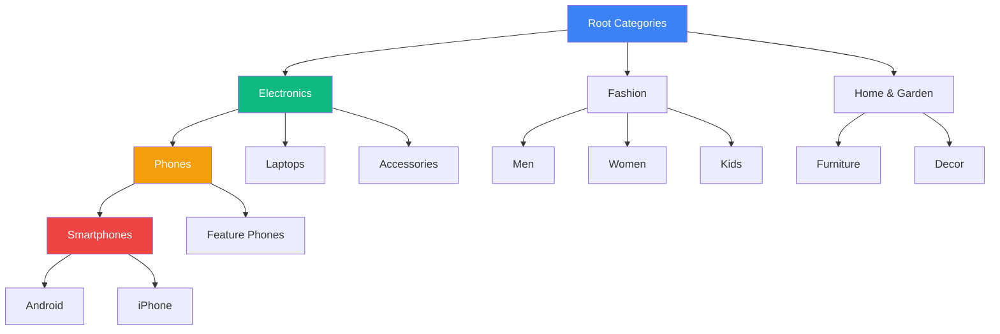
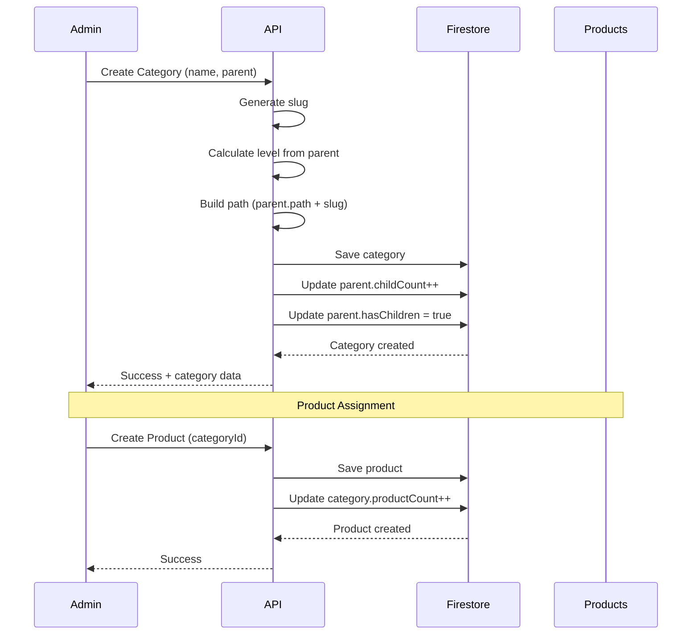
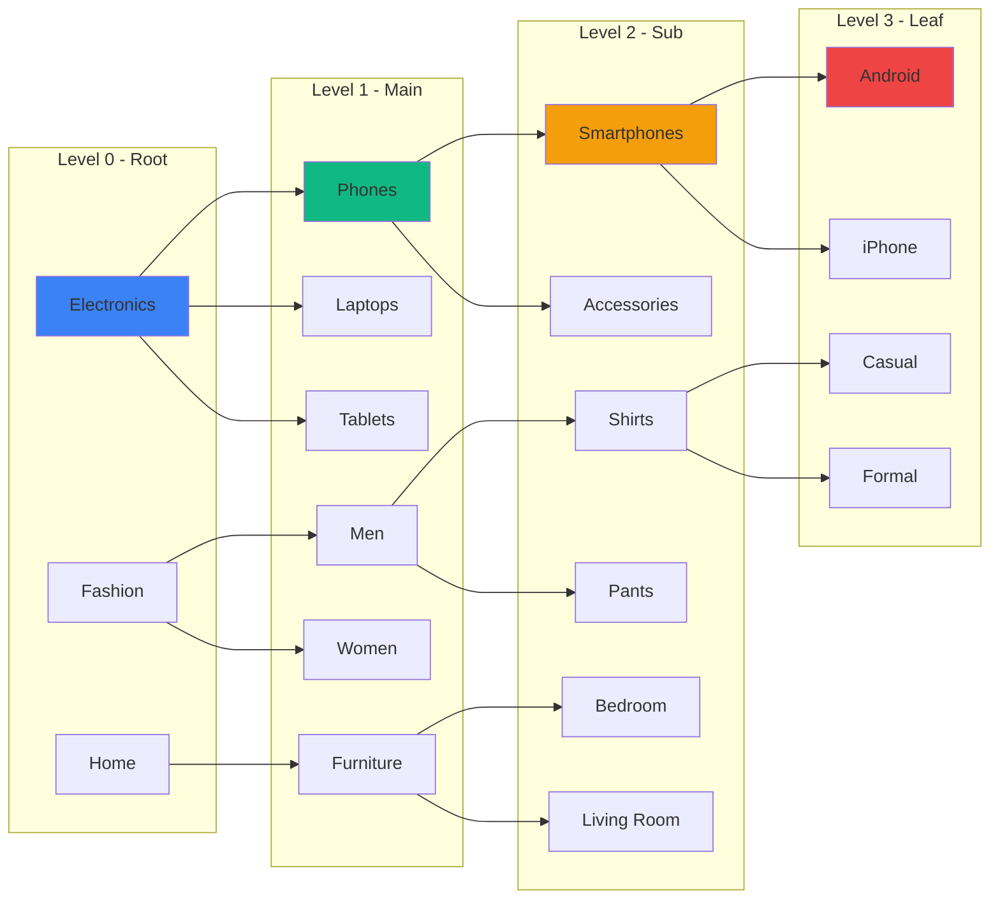

# Categories Resource Documentation

**Resource Type**: Core Business Entity  
**Collection**: `categories`  
**Primary Use**: Hierarchical product classification across admin and public pages

---

## Table of Contents

1. [Overview](#overview)
2. [Schema & Fields](#schema--fields)
3. [Related Resources](#related-resources)
4. [Filters & Search](#filters--search)
5. [Inline Logic & Quick Create](#inline-logic--quick-create)
6. [Wizards & Forms](#wizards--forms)
7. [Card Displays](#card-displays)
8. [Bulk Actions](#bulk-actions)
9. [Diagrams](#diagrams)
10. [Why We Need This](#why-we-need-this)
11. [Quick Reference](#quick-reference)

---

## Overview

**Categories** provide hierarchical classification for products, enabling organized browsing and discovery. They form a tree structure where each category can have a parent and multiple children, creating a multi-level taxonomy for the marketplace.

### Key Characteristics

- **Hierarchical Structure**: Parent-child relationships with unlimited depth
- **Path-based**: Full path stored for efficient breadcrumb generation
- **Commission Management**: Per-category commission rates for revenue sharing
- **SEO Optimized**: Built-in meta fields for better search visibility
- **Visual Identity**: Icons, images, and colors for brand consistency
- **Product Count**: Automatically tracked product counts per category

---

## Schema & Fields

### Firestore Collection: `categories`

```typescript
interface Category {
  // ==================== IDENTIFICATION ====================
  id: string; // Auto-generated document ID
  name: string; // Category name (REQUIRED, 2-100 chars)
  slug: string; // URL-friendly identifier (REQUIRED, unique)
  description?: string; // Category description (max 500 chars)

  // ==================== HIERARCHY ====================
  parentId?: string | null; // Parent category ID (null for root)
  path: string; // Full path: "electronics/phones/smartphones"
  level: number; // Depth level (0 = root, 1 = first child, etc.)
  hasChildren: boolean; // Whether has subcategories
  childCount: number; // Number of direct children

  // ==================== VISUAL IDENTITY ====================
  icon?: string; // Icon name/path (e.g., "Smartphone", "Laptop")
  image?: string; // Category card image URL
  banner?: string; // Category page banner image URL
  color?: string; // Brand color (hex code, e.g., "#3B82F6")
  sortOrder: number; // Display order within same level (default: 0)

  // ==================== STATISTICS ====================
  productCount: number; // Total products in this category (auto-calculated)

  // ==================== FLAGS ====================
  isFeatured: boolean; // Show in featured sections (default: false)
  showOnHomepage: boolean; // Display on homepage (default: false)
  isActive: boolean; // Category is active/visible (default: true)

  // ==================== SEO ====================
  metaTitle?: string; // SEO title (max 60 chars)
  metaDescription?: string; // SEO description (max 160 chars)

  // ==================== BUSINESS ====================
  commissionRate: number; // Platform commission % (0-100, default: 10)

  // ==================== TIMESTAMPS ====================
  createdAt: Date | Timestamp; // Creation timestamp (auto)
  updatedAt: Date | Timestamp; // Last update timestamp (auto)
}
```

### Required Fields

**Minimum Required for Creation:**

```typescript
{
  name: string,              // Category name
  slug: string,              // URL slug
  path: string,              // Full hierarchical path
  level: number,             // Depth level
  hasChildren: boolean,      // Has subcategories
  childCount: number,        // Number of children
  productCount: number,      // Product count (starts at 0)
  sortOrder: number,         // Display order
  isFeatured: boolean,       // Featured flag
  showOnHomepage: boolean,   // Homepage flag
  isActive: boolean,         // Active flag
  commissionRate: number,    // Commission percentage
  parentId?: string | null   // Parent ID (null for root)
}
```

### Field Validation Rules

| Field            | Type    | Min | Max  | Required | Pattern        | Default |
| ---------------- | ------- | --- | ---- | -------- | -------------- | ------- |
| `name`           | string  | 2   | 100  | ✅       | -              | -       |
| `slug`           | string  | 2   | 100  | ✅       | `^[a-z0-9-]+$` | -       |
| `description`    | string  | 0   | 500  | ❌       | -              | -       |
| `level`          | number  | 0   | 10   | ✅       | non-negative   | 0       |
| `commissionRate` | number  | 0   | 100  | ✅       | 0-100          | 10      |
| `productCount`   | number  | 0   | -    | ✅       | non-negative   | 0       |
| `childCount`     | number  | 0   | -    | ✅       | non-negative   | 0       |
| `sortOrder`      | number  | 0   | 9999 | ✅       | non-negative   | 0       |
| `color`          | string  | 0   | 7    | ❌       | hex color      | -       |
| `isActive`       | boolean | -   | -    | ✅       | -              | true    |

---

## Related Resources

### Direct Relationships

1. **Products** (One-to-Many)

   - Each category contains multiple products
   - Field: Products have `categoryId`
   - Relationship: `products.categoryId → categories.id`
   - Use: Filter products by category, breadcrumbs

2. **Parent Category** (Self-Referencing)

   - Each category can have ONE parent
   - Field: `parentId`
   - Relationship: `categories.parentId → categories.id`
   - Use: Build category tree, navigation menus

3. **Child Categories** (Self-Referencing, One-to-Many)

   - Each category can have multiple children
   - Query: `categories.where('parentId', '==', categoryId)`
   - Use: Subcategory listings, drill-down navigation

4. **Shops** (Indirect through Products)

   - Shops sell products in specific categories
   - Field: Shops have `categories[]` array
   - Use: Filter shops by category specialty

5. **Coupons** (Many-to-Many)
   - Coupons can be restricted to categories
   - Field: Coupons have `applicableCategories[]`
   - Use: Category-specific promotions

### Indirect Relationships

- **Orders** → Through order items and products
- **Reviews** → Can be category-specific aggregations
- **Analytics** → Category performance metrics
- **Search** → Category-based filtering

---

## Filters & Search

### Filter Configuration

**Location**: `src/constants/filters.ts → CATEGORY_FILTERS`

```typescript
export const CATEGORY_FILTERS: FilterSection[] = [
  {
    title: "Category Features",
    fields: [
      {
        key: "is_featured",
        label: "Featured",
        type: "checkbox",
        options: [{ label: "Featured categories only", value: "true" }],
      },
      {
        key: "is_homepage",
        label: "Homepage",
        type: "checkbox",
        options: [{ label: "Homepage categories only", value: "true" }],
      },
    ],
  },
  {
    title: "Category Level",
    fields: [
      {
        key: "parent_id",
        label: "Parent Category",
        type: "select",
        options: [], // Loaded dynamically from categories API
      },
      {
        key: "is_leaf",
        label: "Leaf Categories",
        type: "checkbox",
        options: [{ label: "Leaf categories only", value: "true" }],
      },
    ],
    collapsible: true,
  },
];
```

### Available Filter Types

| Filter Type  | Field Type                   | Use Case                | Example                    |
| ------------ | ---------------------------- | ----------------------- | -------------------------- |
| **checkbox** | `is_featured`, `is_homepage` | Boolean flags           | ✓ Featured only            |
| **select**   | `parent_id`                  | Parent filter           | Electronics                |
| **checkbox** | `is_leaf`                    | Leaf categories         | ✓ No subcategories         |
| **text**     | `search`                     | Name search             | "Electronics"              |
| **number**   | `min_product_count`          | Product count threshold | Min 10 products            |
| **boolean**  | `is_active`                  | Active status           | Active categories          |
| **select**   | `level`                      | Hierarchy level         | Level 0 (root), Level 1... |
| **range**    | `commission_rate`            | Commission range        | 5% - 15%                   |

### Search Implementation

**API Endpoint**: `GET /api/categories`

**Searchable Fields**:

- `name` - Category name (full text)
- `description` - Category description
- `slug` - URL slug
- `path` - Full hierarchical path

**Query Parameters**:

```typescript
{
  search?: string,          // Text search across name, description
  parent_id?: string | null, // Filter by parent (null for root)
  level?: number,           // Filter by hierarchy level
  is_featured?: boolean,    // Featured categories
  is_homepage?: boolean,    // Homepage categories
  is_active?: boolean,      // Active status (default: true)
  is_leaf?: boolean,        // Categories without children
  min_product_count?: number, // Minimum product count
  sort?: string,            // Sort order
  page?: number,            // Pagination page
  limit?: number            // Items per page
}
```

**Sort Options**:

- `sort_order_asc` - Sort order ascending (default for same level)
- `name_asc` - Name: A to Z
- `name_desc` - Name: Z to A
- `product_count_desc` - Most products first
- `created_at_desc` - Newest first
- `level_asc` - Shallowest first

---

## Inline Logic & Quick Create

### Inline Edit Component

**Location**: Uses `InlineEditRow` from `src/components/common/inline-edit.ts`

**Fields Configuration**:

```typescript
const categoryInlineFields: InlineField[] = [
  { key: "name", type: "text", label: "Name", required: true },
  { key: "slug", type: "text", label: "Slug", required: true },
  {
    key: "parent_id",
    type: "select",
    label: "Parent",
    options: [], // Loaded from categories API
  },
  {
    key: "icon",
    type: "text",
    label: "Icon",
    placeholder: "Icon name (Lucide React)",
  },
  { key: "color", type: "color", label: "Color" },
  { key: "sort_order", type: "number", label: "Order", min: 0 },
  {
    key: "commission_rate",
    type: "number",
    label: "Commission %",
    min: 0,
    max: 100,
  },
  { key: "is_featured", type: "checkbox", label: "Featured" },
  { key: "is_active", type: "checkbox", label: "Active" },
  { key: "image", type: "image", label: "Image", placeholder: "category" },
];
```

### Quick Create Row

**Usage**: At top of categories table

```typescript
<QuickCreateRow
  fields={categoryInlineFields}
  onSave={handleQuickCreate}
  loading={creating}
/>
```

**Behavior**:

- Shows inline form at top of table
- Enter to save, Escape to cancel
- Auto-generates slug from name
- Auto-calculates level from parent
- Auto-builds path from parent path + slug
- Creates category with default values
- Sets `hasChildren: false`, `childCount: 0`, `productCount: 0`

### Double-Click Inline Edit

**Usage**: In table rows

```typescript
{
  categories.map((category) =>
    editingId === category.id ? (
      <InlineEditRow
        fields={categoryInlineFields}
        initialValues={category}
        onSave={(data) => handleSave(category.id, data)}
        onCancel={() => setEditingId(null)}
      />
    ) : (
      <tr onDoubleClick={() => setEditingId(category.id)}>
        {/* Display cells */}
      </tr>
    )
  );
}
```

**Auto-Calculations on Save**:

- If parent changes → recalculate `level`, `path`
- If name/slug changes → update children's `path`
- Validate no circular parent references

---

## Wizards & Forms

### Full Category Creation Wizard

**Location**: `/admin/categories/create`

**Multi-Step Process**:

#### Step 1: Basic Information

```typescript
{
  name: string,           // Category name
  slug: string,           // Auto-generated, editable
  description: string,    // Brief description (optional)
  parentId?: string | null, // Parent category selector (hierarchical dropdown)
}
```

**Parent Selector UI**:

- Hierarchical dropdown showing tree structure
- Indentation shows depth level
- Option to create as root category (parentId = null)
- Shows product count next to each option

#### Step 2: Visual Identity

```typescript
{
  icon: string,           // Icon name (Lucide React library)
  color: string,          // Brand color picker
  image: File,            // Category card image upload
  banner?: File,          // Category page banner upload
  sortOrder: number       // Display order
}
```

**Icon Picker**:

- Search through Lucide React icons
- Preview selected icon
- Common category icons pre-suggested

#### Step 3: Business Settings

```typescript
{
  commissionRate: number, // Platform commission % (0-100)
  isActive: boolean,      // Active on creation
  isFeatured: boolean,    // Featured category
  showOnHomepage: boolean // Show on homepage
}
```

#### Step 4: SEO & Review

```typescript
{
  metaTitle: string,      // SEO title (optional)
  metaDescription: string, // SEO description (optional)
  // Review all entered data
  // Show calculated: level, path
}
```

### Form Validation

**Validation Schema**: `src/lib/validations/comprehensive-schemas.ts → createCategorySchema`

**Key Validations**:

- Name: 2-100 characters, unique within parent
- Slug: Valid URL format, globally unique
- Description: Max 500 characters
- Commission Rate: 0-100
- Level: Max depth 10 (prevent too deep hierarchies)
- Parent: Cannot be self or own descendant
- Color: Valid hex color code

---

## Card Displays

### For Admin (Admin Panel)

**Component**: `src/components/admin/CategoryCard.tsx`

```typescript
<CategoryCard
  category={category}
  showHierarchy={true}
  showStats={true}
  onEdit={() => router.push(`/admin/categories/${category.id}/edit`)}
  onDelete={() => handleDelete(category.id)}
  onViewProducts={() => router.push(`/admin/products?category=${category.id}`)}
/>
```

**Displays**:

- Category icon with brand color background
- Category name with hierarchy breadcrumb
- Product count badge
- Child count badge
- Commission rate
- Active/Inactive status badge
- Featured star if `isFeatured === true`
- Homepage badge if `showOnHomepage === true`
- Quick actions: Edit, View Products, Add Subcategory, Delete

**Hierarchy Visualization**:

- Indentation shows depth level
- Parent path shown above name
- Expandable to show children
- Drag-and-drop to reorder within level

### For Public (Homepage/Browse)

**Component**: `src/components/category/CategoryCard.tsx`

```typescript
<CategoryCard
  category={category}
  onClick={() => router.push(`/categories/${category.slug}`)}
/>
```

**Displays**:

- Category image (or icon if no image)
- Category name
- Product count (e.g., "1,234 products")
- Brand color border/background accent
- Hover effect with slight scale
- Click navigates to category page

**Layout Variations**:

1. **Grid Layout** (Homepage):
   - Square cards
   - Large icons
   - Minimal text
   - 4-6 columns on desktop
2. **List Layout** (Browse Page):

   - Horizontal cards
   - Icon + name + count
   - Full width
   - Hierarchical indentation

3. **Mega Menu**:
   - Three-column layout
   - Parent categories as headers
   - Child categories as links
   - Icons next to each category

### For Category Page

**Component**: `src/app/categories/[slug]/page.tsx`

**Displays**:

- Banner image (full width)
- Category name (H1)
- Description
- Breadcrumb navigation (path)
- Product count
- Subcategory chips (if any)
- Filter sidebar (category-specific filters)
- Product grid

---

## Bulk Actions

**Location**: `src/constants/bulk-actions.ts → getCategoryBulkActions()`

```typescript
export function getCategoryBulkActions(selectedCount: number): BulkAction[] {
  return [
    {
      id: "activate",
      label: "Activate",
      variant: "success",
      confirm: false,
    },
    {
      id: "deactivate",
      label: "Deactivate",
      variant: "default",
      confirm: false,
    },
    {
      id: "feature",
      label: "Set Featured",
      variant: "success",
      confirm: false,
    },
    {
      id: "unfeature",
      label: "Remove Featured",
      variant: "default",
      confirm: false,
    },
    {
      id: "delete",
      label: "Delete",
      variant: "danger",
      confirm: true,
      confirmTitle: "Delete Categories",
      confirmMessage: `⚠️ Are you sure you want to delete ${selectedCount} categor${
        selectedCount === 1 ? "y" : "ies"
      }? This will affect ${totalProducts} products. Products will be moved to "Uncategorized".`,
    },
  ];
}
```

### Bulk Action Handlers

```typescript
const handleBulkAction = async (actionId: string, selectedIds: string[]) => {
  switch (actionId) {
    case "activate":
      await categoryService.bulkUpdate(selectedIds, { isActive: true });
      break;
    case "deactivate":
      await categoryService.bulkUpdate(selectedIds, { isActive: false });
      break;
    case "feature":
      await categoryService.bulkUpdate(selectedIds, { isFeatured: true });
      break;
    case "unfeature":
      await categoryService.bulkUpdate(selectedIds, { isFeatured: false });
      break;
    case "delete":
      await categoryService.bulkDelete(selectedIds);
      // Moves products to "Uncategorized" category
      break;
  }
};
```

---

## Diagrams

### Category Hierarchy Flow



### Category Data Flow



### Category Navigation Tree



---

## Why We Need This

### Business Requirements

1. **Organized Product Discovery**

   - Buyers need intuitive navigation
   - Hierarchical browsing from broad to specific
   - Clear product organization

2. **Multi-Level Taxonomy**

   - Support complex product classifications
   - Unlimited depth for detailed categorization
   - Flexible hierarchy for diverse marketplace

3. **Commission Management**

   - Different commission rates per category
   - Revenue optimization by product type
   - Fair pricing for sellers

4. **SEO & Discoverability**

   - Category pages rank in search engines
   - Targeted content for specific product groups
   - Improved organic traffic

5. **Analytics & Insights**
   - Track performance by category
   - Identify trending product groups
   - Data-driven inventory decisions

### Technical Requirements

1. **Performance**

   - Fast category tree loading
   - Efficient path-based queries
   - Minimal database reads for breadcrumbs

2. **Data Integrity**

   - Prevent circular parent references
   - Maintain consistent product counts
   - Ensure unique slugs

3. **Scalability**

   - Support thousands of categories
   - Handle deep hierarchies efficiently
   - Optimized tree traversal

4. **User Experience**
   - Intuitive category navigation
   - Visual hierarchy indicators
   - Fast category switching

---

## Quick Reference

### API Routes

| Endpoint                        | Method | Purpose               | Auth   |
| ------------------------------- | ------ | --------------------- | ------ |
| `/api/categories`               | GET    | List all active       | Public |
| `/api/categories`               | POST   | Create category       | Admin  |
| `/api/categories/[id]`          | GET    | Get by ID             | Public |
| `/api/categories/[id]`          | PATCH  | Update category       | Admin  |
| `/api/categories/[id]`          | DELETE | Delete category       | Admin  |
| `/api/categories/slug/[slug]`   | GET    | Get by slug           | Public |
| `/api/categories/tree`          | GET    | Get full tree         | Public |
| `/api/categories/[id]/children` | GET    | Get child categories  | Public |
| `/admin/categories`             | GET    | List all (admin view) | Admin  |
| `/admin/categories/bulk`        | POST   | Bulk update           | Admin  |

### Service Methods

```typescript
// category.service.ts
categoryService.getCategories(filters); // List with filters
categoryService.getCategory(id); // Get by ID
categoryService.getCategoryBySlug(slug); // Get by slug
categoryService.getCategoryTree(); // Get full hierarchy
categoryService.getChildren(parentId); // Get child categories
categoryService.getPath(categoryId); // Get breadcrumb path
categoryService.createCategory(data); // Create new
categoryService.updateCategory(id, data); // Update existing
categoryService.deleteCategory(id); // Delete (moves products)
categoryService.bulkUpdate(ids, updates); // Bulk update
categoryService.bulkDelete(ids); // Bulk delete
```

### Common Queries

```typescript
// Get root categories
const rootCategories = await categoryService.getCategories({
  parent_id: null,
  is_active: true,
  sort: "sort_order_asc",
});

// Get featured categories for homepage
const featured = await categoryService.getCategories({
  is_featured: true,
  is_active: true,
  limit: 8,
});

// Get category with children
const category = await categoryService.getCategory(id);
const children = await categoryService.getChildren(id);

// Get breadcrumb path
const path = await categoryService.getPath(categoryId);
// Returns: [{ id, name, slug }, { id, name, slug }, ...]

// Build mega menu
const tree = await categoryService.getCategoryTree({
  max_depth: 3,
  is_active: true,
});
```

### Firestore Indexes Required

```json
{
  "collectionGroup": "categories",
  "queryScope": "COLLECTION",
  "fields": [
    { "fieldPath": "parentId", "order": "ASCENDING" },
    { "fieldPath": "sortOrder", "order": "ASCENDING" }
  ]
},
{
  "collectionGroup": "categories",
  "queryScope": "COLLECTION",
  "fields": [
    { "fieldPath": "isActive", "order": "ASCENDING" },
    { "fieldPath": "isFeatured", "order": "DESCENDING" },
    { "fieldPath": "sortOrder", "order": "ASCENDING" }
  ]
},
{
  "collectionGroup": "categories",
  "queryScope": "COLLECTION",
  "fields": [
    { "fieldPath": "level", "order": "ASCENDING" },
    { "fieldPath": "sortOrder", "order": "ASCENDING" }
  ]
}
```

### Path Building Algorithm

```typescript
// Build category path
function buildPath(category: Category, parentPath?: string): string {
  if (!parentPath) {
    return category.slug; // Root category
  }
  return `${parentPath}/${category.slug}`; // Child category
}

// Parse path to breadcrumbs
async function parsePath(path: string): Promise<Category[]> {
  const slugs = path.split("/");
  const breadcrumbs: Category[] = [];

  for (const slug of slugs) {
    const category = await categoryService.getCategoryBySlug(slug);
    if (category) breadcrumbs.push(category);
  }

  return breadcrumbs;
}
```

---

**Last Updated**: November 10, 2025  
**Version**: 1.0  
**Related Docs**:

- [Products Resource](./products.md)
- [Shops Resource](./shops.md)
- [Coupons Resource](./coupons.md)
