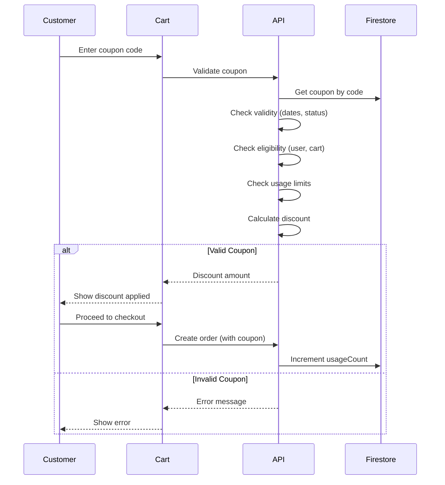

# Coupons Resource Documentation

**Resource Type**: Promotional Entity  
**Collection**: `coupons`  
**Primary Use**: Discount code management across seller and admin interfaces

---

## Table of Contents

1. [Overview](#overview)
2. [Schema & Fields](#schema--fields)
3. [Related Resources](#related-resources)
4. [Filters & Search](#filters--search)
5. [Inline Logic & Quick Create](#inline-logic--quick-create)
6. [Wizards & Forms](#wizards--forms)
7. [Card Displays](#card-displays)
8. [Bulk Actions](#bulk-actions)
9. [Diagrams](#diagrams)
10. [Why We Need This](#why-we-need-this)
11. [Quick Reference](#quick-reference)

---

## Overview

**Coupons** are promotional discount codes that customers can apply at checkout. They support multiple discount types, usage restrictions, and applicability rules.

### Key Characteristics

- **Multiple Types**: Percentage, flat amount, BOGO, tiered discounts, free shipping
- **Flexible Applicability**: All products, specific categories, or specific products
- **Usage Limits**: Per-coupon and per-user limits
- **Time-Bound**: Start and end dates
- **Restrictions**: Minimum purchase, first order only, new users only
- **Shop-Specific**: Each shop creates their own coupons

---

## Schema & Fields

### Firestore Collection: `coupons`

```typescript
interface Coupon {
  // ==================== IDENTIFICATION ====================
  id: string; // Auto-generated document ID
  shopId: string; // Shop ID (REQUIRED)
  sellerId: string; // Seller user ID (REQUIRED)

  // ==================== BASIC INFO ====================
  code: string; // Coupon code (REQUIRED, 3-50 chars, uppercase)
  name: string; // Internal name (REQUIRED, 3-100 chars)
  description?: string; // Public description (max 500 chars)

  // ==================== DISCOUNT TYPE ====================
  type: CouponType; // 'percentage' | 'flat' | 'bogo' | 'tiered' | 'free-shipping'
  discountValue?: number; // Discount amount/percentage
  maxDiscountAmount?: number; // Maximum discount cap (for percentage)

  // ==================== SPECIAL CONFIGS ====================
  tiers?: TieredDiscount[]; // For tiered discounts
  bogoConfig?: BogoConfig; // For BOGO deals

  // ==================== REQUIREMENTS ====================
  minPurchaseAmount: number; // Minimum cart value (default: 0)
  minQuantity: number; // Minimum items (default: 1)

  // ==================== APPLICABILITY ====================
  applicability: CouponApplicability; // 'all' | 'category' | 'product'
  applicableCategories?: string[]; // Category IDs (if applicable)
  applicableProducts?: string[]; // Product IDs (if applicable)
  excludedCategories?: string[]; // Excluded category IDs
  excludedProducts?: string[]; // Excluded product IDs

  // ==================== USAGE ====================
  usageLimit?: number; // Total usage limit (optional, unlimited if null)
  usageLimitPerUser: number; // Per-user limit (default: 1)
  usageCount: number; // Current usage count (auto-incremented)

  // ==================== VALIDITY ====================
  startDate: Date | Timestamp; // Start date (REQUIRED)
  endDate: Date | Timestamp; // End date (REQUIRED)
  status: CouponStatus; // 'active' | 'inactive' | 'expired' | 'used-up'

  // ==================== RESTRICTIONS ====================
  firstOrderOnly: boolean; // Only for first-time buyers (default: false)
  newUsersOnly: boolean; // Only for new users (default: false)
  canCombineWithOtherCoupons: boolean; // Stackable (default: false)

  // ==================== DISPLAY ====================
  autoApply: boolean; // Auto-apply if eligible (default: false)
  isPublic: boolean; // Show in coupon listings (default: true)
  isFeatured: boolean; // Featured coupon (default: false)

  // ==================== TIMESTAMPS ====================
  createdAt: Date | Timestamp; // Creation timestamp (auto)
  updatedAt: Date | Timestamp; // Last update timestamp (auto)
}
```

### Tiered Discount Schema

```typescript
interface TieredDiscount {
  minAmount: number; // Minimum cart value for this tier
  discountPercentage: number; // Discount % for this tier
}
```

### BOGO Config Schema

```typescript
interface BogoConfig {
  buyQuantity: number; // Number to buy
  getQuantity: number; // Number free
  discountPercentage: number; // Discount on free items (usually 100%)
  applicableProducts?: string[]; // Specific products for BOGO
}
```

### Required Fields

**Minimum Required for Creation:**

```typescript
{
  shopId: string,
  sellerId: string,
  code: string,              // Unique coupon code
  name: string,
  type: CouponType,
  minPurchaseAmount: number, // Default: 0
  minQuantity: number,       // Default: 1
  applicability: CouponApplicability,
  usageLimitPerUser: number, // Default: 1
  usageCount: number,        // Initial: 0
  startDate: Date,
  endDate: Date,
  status: 'active',
  firstOrderOnly: boolean,   // Default: false
  newUsersOnly: boolean,     // Default: false
  canCombineWithOtherCoupons: boolean, // Default: false
  autoApply: boolean,        // Default: false
  isPublic: boolean,         // Default: true
  isFeatured: boolean        // Default: false
}
```

---

## Related Resources

### Direct Relationships

1. **Shops** (Many-to-One)

   - Each coupon belongs to ONE shop
   - Field: `shopId`
   - Relationship: `coupons.shopId → shops.id`
   - Use: Shop-specific promotions

2. **Orders** (Many-to-Many)

   - Orders can use coupons
   - Field: `orders.couponCode`
   - Use: Discount tracking, usage counting

3. **Products** (Many-to-Many, Optional)

   - Coupons can apply to specific products
   - Field: `applicableProducts[]`
   - Use: Product-specific promotions

4. **Categories** (Many-to-Many, Optional)
   - Coupons can apply to categories
   - Field: `applicableCategories[]`
   - Use: Category sales

---

## Filters & Search

### Filter Configuration

**Location**: `src/constants/filters.ts → COUPON_FILTERS`

```typescript
export const COUPON_FILTERS: FilterSection[] = [
  {
    title: "Coupon Type",
    fields: [
      {
        key: "discount_type",
        label: "Type",
        type: "multiselect",
        options: [
          { label: "Percentage", value: "percentage" },
          { label: "Fixed Amount", value: "flat" },
          { label: "BOGO", value: "bogo" },
          { label: "Tiered", value: "tiered" },
          { label: "Free Shipping", value: "free-shipping" },
        ],
      },
    ],
  },
  {
    title: "Status",
    fields: [
      {
        key: "status",
        label: "Status",
        type: "radio",
        options: [
          { label: "Active", value: "active" },
          { label: "Inactive", value: "inactive" },
          { label: "Expired", value: "expired" },
        ],
      },
    ],
  },
  {
    title: "Expiry Date",
    fields: [
      {
        key: "expiry_date",
        label: "Expires",
        type: "daterange",
      },
    ],
    collapsible: true,
    defaultCollapsed: true,
  },
];
```

### Search Implementation

**API Endpoint**: `GET /api/coupons`

**Query Parameters**:

```typescript
{
  search?: string,          // Text search (code, name)
  shop_id?: string,         // Filter by shop
  type?: string[],          // Filter by type
  status?: string,          // Filter by status
  is_public?: boolean,      // Public coupons
  is_featured?: boolean,    // Featured coupons
  start_date?: string,      // Active from date
  end_date?: string,        // Active until date
  sort?: string,
  page?: number,
  limit?: number
}
```

**Sort Options**:

- `created_at_desc` - Newest first (default)
- `end_date_asc` - Expiring soon first
- `usage_count_desc` - Most used first
- `discount_value_desc` - Highest discount first

---

## Wizards & Forms

### Coupon Creation Wizard

**Location**: `/seller/coupons/create`, `/admin/coupons/create`

#### Step 1: Basic Information

```typescript
{
  code: string,             // Coupon code (auto-suggest)
  name: string,             // Internal name
  description: string,      // Public description
  type: CouponType          // Discount type selector
}
```

#### Step 2: Discount Configuration

**For Percentage**:

```typescript
{
  discountValue: number,    // Percentage (0-100)
  maxDiscountAmount?: number // Cap amount
}
```

**For Flat**:

```typescript
{
  discountValue: number; // Fixed amount
}
```

**For BOGO**:

```typescript
{
  bogoConfig: {
    buyQuantity: number,
    getQuantity: number,
    discountPercentage: number,
    applicableProducts?: string[]
  };
}
```

**For Tiered**:

```typescript
{
  tiers: [
    {
      minAmount: number,
      discountPercentage: number,
    },
    // ... more tiers
  ];
}
```

#### Step 3: Applicability & Restrictions

```typescript
{
  applicability: 'all' | 'category' | 'product',
  applicableCategories?: string[],
  applicableProducts?: string[],
  excludedCategories?: string[],
  excludedProducts?: string[],
  minPurchaseAmount: number,
  minQuantity: number
}
```

#### Step 4: Usage & Validity

```typescript
{
  usageLimit?: number,      // Total limit (optional)
  usageLimitPerUser: number,
  startDate: Date,
  endDate: Date,
  firstOrderOnly: boolean,
  newUsersOnly: boolean,
  canCombineWithOtherCoupons: boolean
}
```

#### Step 5: Display Settings

```typescript
{
  isPublic: boolean,
  isFeatured: boolean,
  autoApply: boolean
}
```

---

## Card Displays

### For Public (Coupon Listings)

**Component**: `src/components/coupon/CouponCard.tsx`

```typescript
<CouponCard
  coupon={coupon}
  onCopy={() => handleCopyCode(coupon.code)}
  onApply={() => handleApplyAtCheckout(coupon.code)}
/>
```

**Displays**:

- Discount badge (e.g., "20% OFF", "₹100 OFF")
- Coupon code (large, prominent)
- Description
- Valid until date
- "Copy Code" button
- Terms & conditions link

### For Sellers

**Component**: `src/components/seller/CouponCard.tsx`

```typescript
<CouponCard
  coupon={coupon}
  showStats={true}
  onEdit={() => router.push(`/seller/coupons/${coupon.id}/edit`)}
  onToggle={() => handleToggleStatus(coupon.id)}
/>
```

**Additional Info**:

- Status badge
- Usage count / limit
- Start/end dates
- Quick actions: Edit, Toggle Active, Delete

---

## Bulk Actions

**Location**: `src/constants/bulk-actions.ts → getCouponBulkActions()`

```typescript
export function getCouponBulkActions(selectedCount: number): BulkAction[] {
  return [
    {
      id: "activate",
      label: "Activate",
      variant: "success",
      confirm: false,
    },
    {
      id: "deactivate",
      label: "Deactivate",
      variant: "default",
      confirm: false,
    },
    {
      id: "delete",
      label: "Delete",
      variant: "danger",
      confirm: true,
      confirmTitle: "Delete Coupons",
      confirmMessage: `Are you sure you want to delete ${selectedCount} coupon${
        selectedCount === 1 ? "" : "s"
      }? This action cannot be undone.`,
    },
  ];
}
```

---

## Diagrams

### Coupon Application Flow



---

## Why We Need This

### Business Requirements

1. **Sales Promotion**: Drive sales through discounts
2. **Customer Acquisition**: Attract new customers
3. **Customer Retention**: Reward loyal customers
4. **Inventory Clearance**: Move slow-moving products
5. **Competitive Pricing**: Match competitor promotions

---

## Quick Reference

### API Routes

| Endpoint                   | Method | Purpose             | Auth         |
| -------------------------- | ------ | ------------------- | ------------ |
| `/api/coupons`             | GET    | List public coupons | Public       |
| `/api/coupons/validate`    | POST   | Validate coupon     | User         |
| `/api/coupons/[code]`      | GET    | Get coupon by code  | Public       |
| `/api/seller/coupons`      | GET    | Seller's coupons    | Seller       |
| `/api/seller/coupons`      | POST   | Create coupon       | Seller/Admin |
| `/api/seller/coupons/[id]` | PATCH  | Update coupon       | Seller/Admin |
| `/api/seller/coupons/[id]` | DELETE | Delete coupon       | Seller/Admin |
| `/admin/coupons`           | GET    | All coupons (admin) | Admin        |

---

**Last Updated**: November 10, 2025  
**Version**: 1.0  
**Related Docs**:

- [Orders Resource](./orders.md)
- [Products Resource](./products.md)
- [Categories Resource](./categories.md)
