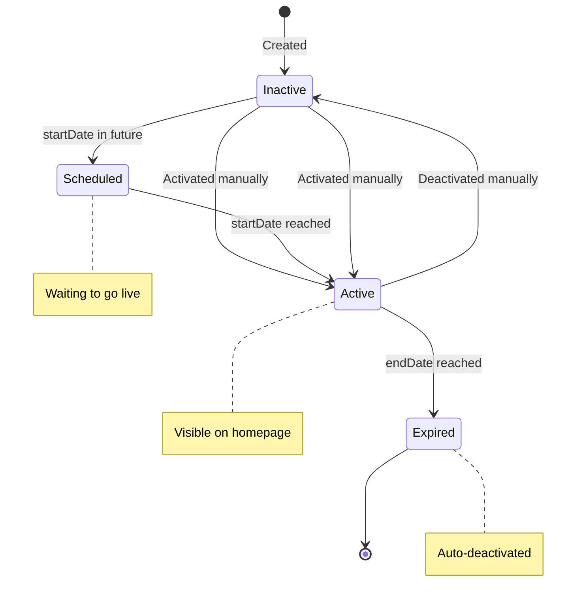
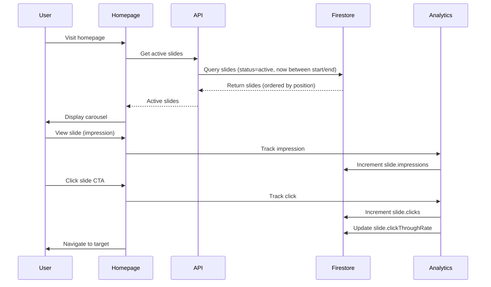

# Homepage & Slides Resource Documentation

**Resource Type**: Content Management Entity  
**Collection**: `hero_slides`  
**Primary Use**: Homepage carousel and promotional banners

---

## Table of Contents

1. [Overview](#overview)
2. [Schema & Fields](#schema--fields)
3. [Related Resources](#related-resources)
4. [Filters & Search](#filters--search)
5. [Inline Logic & Quick Create](#inline-logic--quick-create)
6. [Wizards & Forms](#wizards--forms)
7. [Card Displays](#card-displays)
8. [Bulk Actions](#bulk-actions)
9. [Diagrams](#diagrams)
10. [Why We Need This](#why-we-need-this)
11. [Quick Reference](#quick-reference)

---

## Overview

**Hero Slides** are promotional banners displayed in the homepage carousel. They showcase featured products, sales, events, and special promotions.

### Key Characteristics

- **Visual Impact**: Large, eye-catching banners
- **Call-to-Action**: Links to products, categories, or pages
- **Scheduling**: Time-bound display with start/end dates
- **Ordering**: Manual sort order control
- **Media Support**: Images and videos
- **Responsive**: Mobile and desktop versions
- **Click Tracking**: Analytics integration

---

## Schema & Fields

### Firestore Collection: `hero_slides`

```typescript
interface HeroSlide {
  // ==================== IDENTIFICATION ====================
  id: string; // Auto-generated document ID
  title: string; // Slide title (REQUIRED, 3-100 chars)
  subtitle?: string; // Subtitle/description (max 200 chars)

  // ==================== MEDIA ====================
  imageUrl: string; // Desktop image URL (REQUIRED, 1920x600 recommended)
  mobileImageUrl?: string; // Mobile image URL (750x1000 recommended)
  videoUrl?: string; // Background video URL (optional)
  altText: string; // Image alt text for accessibility (REQUIRED)

  // ==================== CALL TO ACTION ====================
  ctaText?: string; // Button text (e.g., "Shop Now", "Learn More")
  ctaLink?: string; // Button link URL
  ctaType?: "internal" | "external"; // Link type
  linkTarget?: "_self" | "_blank"; // Link target

  // ==================== TARGETING ====================
  targetType?: "product" | "category" | "shop" | "page" | "url"; // Link destination type
  targetId?: string; // Target entity ID (if internal)

  // ==================== DISPLAY ====================
  position: number; // Sort order (0-based, REQUIRED)
  backgroundColor?: string; // Background color (hex)
  textColor?: string; // Text color (hex, default: #FFFFFF)
  alignment?: "left" | "center" | "right"; // Content alignment (default: 'center')

  // ==================== SCHEDULING ====================
  startDate: Date | Timestamp; // Display start date (REQUIRED)
  endDate: Date | Timestamp; // Display end date (REQUIRED)

  // ==================== STATUS ====================
  status: "active" | "inactive" | "scheduled" | "expired"; // Slide status
  isActive: boolean; // Active flag (default: false)

  // ==================== ANALYTICS ====================
  impressions: number; // View count (auto-incremented)
  clicks: number; // Click count (auto-incremented)
  clickThroughRate: number; // CTR % (auto-calculated)

  // ==================== METADATA ====================
  createdBy: string; // Admin user ID
  createdAt: Date | Timestamp; // Creation timestamp (auto)
  updatedAt: Date | Timestamp; // Last update timestamp (auto)
}
```

### Required Fields

**Minimum Required for Creation:**

```typescript
{
  title: string,
  imageUrl: string,
  altText: string,
  position: number,
  startDate: Date,
  endDate: Date,
  status: 'scheduled',
  isActive: boolean,
  impressions: number,       // Initial: 0
  clicks: number,            // Initial: 0
  clickThroughRate: number,  // Initial: 0
  createdBy: string
}
```

### Field Validation Rules

| Field       | Type   | Min | Max | Required | Pattern      | Default |
| ----------- | ------ | --- | --- | -------- | ------------ | ------- |
| `title`     | string | 3   | 100 | ✅       | -            | -       |
| `subtitle`  | string | 0   | 200 | ❌       | -            | -       |
| `imageUrl`  | string | 10  | 500 | ✅       | valid URL    | -       |
| `altText`   | string | 5   | 200 | ✅       | -            | -       |
| `position`  | number | 0   | 99  | ✅       | non-negative | 0       |
| `startDate` | date   | -   | -   | ✅       | future/now   | now     |
| `endDate`   | date   | -   | -   | ✅       | after start  | -       |
| `ctaText`   | string | 2   | 50  | ❌       | -            | -       |

---

## Related Resources

### Direct Relationships

1. **Products** (Optional, Many-to-One)

   - Slide can link to a product
   - Field: `targetId` (if `targetType === 'product'`)
   - Use: Product promotion slides

2. **Categories** (Optional, Many-to-One)

   - Slide can link to a category
   - Field: `targetId` (if `targetType === 'category'`)
   - Use: Category sale slides

3. **Shops** (Optional, Many-to-One)

   - Slide can link to a shop
   - Field: `targetId` (if `targetType === 'shop'`)
   - Use: Shop spotlight slides

4. **Users** (Creator, Many-to-One)
   - Slide created by admin
   - Field: `createdBy`
   - Use: Audit trail

---

## Filters & Search

### Filter Configuration

**Admin Only Filters**:

- Status (active, inactive, scheduled, expired)
- Date range (start/end dates)
- Position
- Has CTA

**API Endpoint**: `GET /api/hero-slides`

**Query Parameters**:

```typescript
{
  status?: string,           // Filter by status
  is_active?: boolean,       // Active slides only
  start_date?: string,       // Active from date
  end_date?: string,         // Active until date
  sort?: string,             // Sort order
  page?: number,
  limit?: number
}
```

**Sort Options**:

- `position_asc` - By position (default)
- `created_at_desc` - Newest first
- `clicks_desc` - Most clicked
- `impressions_desc` - Most viewed

---

## Inline Logic & Quick Create

### Quick Create Row

**Usage**: At top of hero slides table (Admin only)

```typescript
const heroSlideInlineFields: InlineField[] = [
  { key: "title", type: "text", label: "Title", required: true },
  { key: "subtitle", type: "text", label: "Subtitle" },
  { key: "image", type: "image", label: "Image", placeholder: "hero-slide" },
  { key: "cta_text", type: "text", label: "Button Text" },
  { key: "cta_link", type: "text", label: "Button Link" },
  { key: "position", type: "number", label: "Position", min: 0 },
  { key: "is_active", type: "checkbox", label: "Active" },
];
```

---

## Wizards & Forms

### Hero Slide Creation Wizard

**Location**: `/admin/hero-slides/create`

#### Step 1: Content

```typescript
{
  title: string,
  subtitle?: string,
  altText: string,
  alignment: 'left' | 'center' | 'right'
}
```

#### Step 2: Media

```typescript
{
  imageUrl: File,           // Desktop image (1920x600)
  mobileImageUrl?: File,    // Mobile image (750x1000)
  videoUrl?: string,        // Background video URL
  backgroundColor?: string, // Hex color
  textColor?: string        // Hex color
}
```

#### Step 3: Call to Action

```typescript
{
  ctaText?: string,
  ctaLink?: string,
  ctaType: 'internal' | 'external',
  linkTarget: '_self' | '_blank',
  targetType?: 'product' | 'category' | 'shop' | 'page' | 'url',
  targetId?: string         // If internal link
}
```

#### Step 4: Schedule & Position

```typescript
{
  position: number,
  startDate: Date,
  endDate: Date,
  status: 'active' | 'scheduled'
}
```

**Auto-Calculations**:

- If `startDate > now`: status = 'scheduled'
- If `startDate <= now` and `endDate > now`: status = 'active'
- If `endDate < now`: status = 'expired'

---

## Card Displays

### For Admin (Slide Management)

**Component**: `src/components/admin/HeroSlideCard.tsx`

```typescript
<HeroSlideCard
  slide={slide}
  onEdit={() => router.push(`/admin/hero-slides/${slide.id}/edit`)}
  onToggle={() => handleToggleActive(slide.id)}
  onDelete={() => handleDelete(slide.id)}
  onPreview={() => handlePreview(slide.id)}
/>
```

**Displays**:

- Slide thumbnail
- Title and subtitle
- Position badge
- Status badge (Active/Inactive/Scheduled/Expired)
- Date range
- Impressions and clicks count
- CTR percentage
- Quick actions: Edit, Toggle Active, Preview, Delete, Reorder

**Drag-and-Drop**:

- Reorder slides by dragging
- Auto-updates position values

### For Public (Homepage Carousel)

**Component**: `src/components/layout/HeroCarousel.tsx`

```typescript
<HeroCarousel slides={activeSlides} autoplay={true} interval={5000} />
```

**Features**:

- Auto-play with configurable interval
- Swipe support (mobile)
- Navigation dots
- Previous/Next arrows
- Pause on hover
- Click tracking
- Responsive images (desktop/mobile)
- Smooth transitions

---

## Bulk Actions

**Location**: `src/constants/bulk-actions.ts → getHeroSlideBulkActions()`

```typescript
export function getHeroSlideBulkActions(selectedCount: number): BulkAction[] {
  return [
    {
      id: "activate",
      label: "Activate",
      variant: "success",
      confirm: false,
    },
    {
      id: "deactivate",
      label: "Deactivate",
      variant: "default",
      confirm: false,
    },
    {
      id: "delete",
      label: "Delete",
      variant: "danger",
      confirm: true,
      confirmTitle: "Delete Slides",
      confirmMessage: `Are you sure you want to delete ${selectedCount} slide${
        selectedCount === 1 ? "" : "s"
      }? This action cannot be undone.`,
    },
  ];
}
```

---

## Diagrams

### Slide Lifecycle



### Homepage Carousel Data Flow



---

## Why We Need This

### Business Requirements

1. **Promotions**: Highlight sales, new arrivals, featured products
2. **User Engagement**: Eye-catching visuals drive interaction
3. **Navigation**: Direct users to key sections
4. **Branding**: Showcase brand identity and values
5. **Flexibility**: Easy content updates without code changes

### Technical Requirements

1. **Performance**: Fast-loading, optimized images
2. **Responsive**: Works on all device sizes
3. **Analytics**: Track performance metrics
4. **Scheduling**: Automated activation/deactivation
5. **Management**: Easy admin interface

---

## Quick Reference

### API Routes

| Endpoint                      | Method | Purpose            | Auth   |
| ----------------------------- | ------ | ------------------ | ------ |
| `/api/hero-slides`            | GET    | List active slides | Public |
| `/api/hero-slides`            | POST   | Create slide       | Admin  |
| `/api/hero-slides/[id]`       | GET    | Get slide          | Admin  |
| `/api/hero-slides/[id]`       | PATCH  | Update slide       | Admin  |
| `/api/hero-slides/[id]`       | DELETE | Delete slide       | Admin  |
| `/api/admin/hero-slides`      | GET    | All slides (admin) | Admin  |
| `/api/hero-slides/[id]/click` | POST   | Track click        | Public |

### Service Methods

```typescript
// hero-slide.service.ts
heroSlideService.getActiveSlides(); // Get active slides
heroSlideService.getAllSlides(filters); // Get all (admin)
heroSlideService.getSlide(id); // Get by ID
heroSlideService.createSlide(data); // Create new
heroSlideService.updateSlide(id, data); // Update existing
heroSlideService.deleteSlide(id); // Delete
heroSlideService.reorderSlides(ids); // Update positions
heroSlideService.trackImpression(id); // Track view
heroSlideService.trackClick(id); // Track click
```

### Common Queries

```typescript
// Get active slides for homepage
const activeSlides = await heroSlideService.getActiveSlides();
// Returns slides where:
// - status = 'active'
// - now >= startDate
// - now <= endDate
// - Ordered by position ASC

// Track slide impression
await heroSlideService.trackImpression(slideId);
// Increments impressions count

// Track slide click
await heroSlideService.trackClick(slideId);
// Increments clicks count
// Recalculates CTR
```

### Firestore Indexes Required

```json
{
  "collectionGroup": "hero_slides",
  "queryScope": "COLLECTION",
  "fields": [
    { "fieldPath": "status", "order": "ASCENDING" },
    { "fieldPath": "startDate", "order": "ASCENDING" },
    { "fieldPath": "position", "order": "ASCENDING" }
  ]
},
{
  "collectionGroup": "hero_slides",
  "queryScope": "COLLECTION",
  "fields": [
    { "fieldPath": "isActive", "order": "ASCENDING" },
    { "fieldPath": "position", "order": "ASCENDING" }
  ]
}
```

---

**Last Updated**: November 10, 2025  
**Version**: 1.0  
**Related Docs**:

- [Products Resource](./products.md)
- [Categories Resource](./categories.md)
- [Shops Resource](./shops.md)
