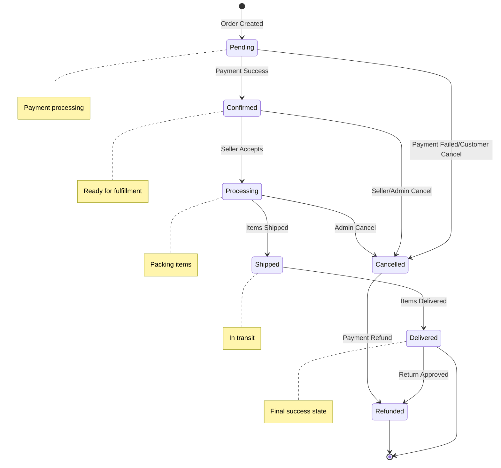
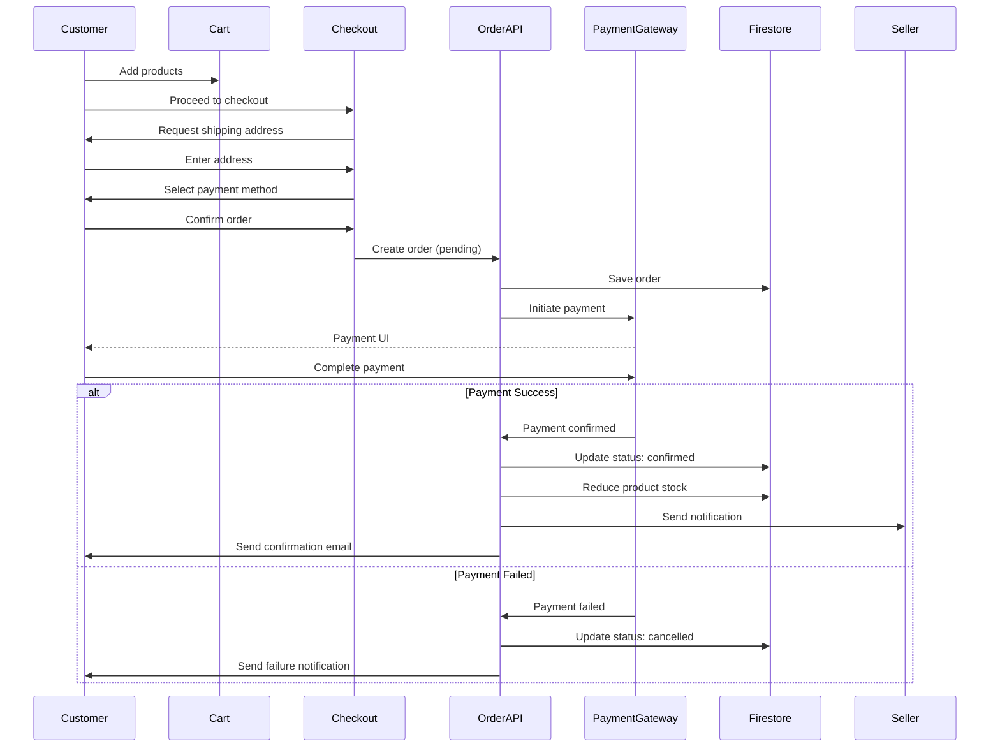

# Orders Resource Documentation

**Resource Type**: Transactional Entity  
**Collection**: `orders`  
**Primary Use**: Order management across buyer, seller, and admin interfaces

---

## Table of Contents

1. [Overview](#overview)
2. [Schema & Fields](#schema--fields)
3. [Related Resources](#related-resources)
4. [Filters & Search](#filters--search)
5. [Inline Logic & Quick Create](#inline-logic--quick-create)
6. [Wizards & Forms](#wizards--forms)
7. [Card Displays](#card-displays)
8. [Bulk Actions](#bulk-actions)
9. [Diagrams](#diagrams)
10. [Why We Need This](#why-we-need-this)
11. [Quick Reference](#quick-reference)

---

## Overview

**Orders** represent completed purchases on the platform. Each order contains line items (products), shipping/billing addresses, payment information, and status tracking through the fulfillment lifecycle.

### Key Characteristics

- **Multi-Item**: Orders can contain multiple products from multiple shops
- **Status Workflow**: Tracks order through pending → confirmed → shipped → delivered
- **Payment Tracking**: Integrated with payment gateways (Razorpay, PayPal, COD)
- **Address Management**: Separate shipping and billing addresses
- **Auto-Generated**: Unique order numbers for easy reference
- **Coupon Support**: Discount tracking and validation

---

## Schema & Fields

### Firestore Collection: `orders`

```typescript
interface Order {
  // ==================== IDENTIFICATION ====================
  id: string; // Auto-generated document ID
  orderNumber: string; // Human-readable order number (e.g., "ORD-2025-001234")
  customerId: string; // Buyer user ID (REQUIRED)

  // ==================== LINE ITEMS ====================
  items: OrderItem[]; // Array of order items (REQUIRED, min: 1)

  // ==================== PRICING ====================
  subtotal: number; // Sum of item totals (REQUIRED)
  shipping: number; // Shipping charges (REQUIRED, default: 0)
  tax: number; // Tax amount (REQUIRED, default: 0)
  discount: number; // Discount amount (default: 0)
  total: number; // Final total amount (REQUIRED)

  // ==================== COUPON ====================
  couponCode?: string; // Applied coupon code
  couponDiscount?: number; // Discount from coupon

  // ==================== SHIPPING ADDRESS ====================
  shippingAddress: {
    name: string; // Recipient name (REQUIRED)
    phone: string; // Recipient phone (REQUIRED)
    line1: string; // Address line 1 (REQUIRED)
    line2?: string; // Address line 2
    city: string; // City (REQUIRED)
    state: string; // State (REQUIRED)
    pincode: string; // Postal code (REQUIRED)
    country: string; // Country (REQUIRED)
  };

  // ==================== BILLING ADDRESS ====================
  billingAddress?: {
    // Optional, defaults to shipping address
    name: string;
    phone: string;
    line1: string;
    line2?: string;
    city: string;
    state: string;
    pincode: string;
    country: string;
  };

  // ==================== STATUS ====================
  status: OrderStatus; // 'pending' | 'confirmed' | 'processing' | 'shipped' | 'delivered' | 'cancelled' | 'refunded'
  paymentStatus: PaymentStatus; // 'pending' | 'paid' | 'failed' | 'refunded'

  // ==================== PAYMENT ====================
  paymentMethod: "razorpay" | "paypal" | "cod"; // Payment gateway
  paymentId?: string; // Gateway payment ID
  paymentDetails?: Record<string, any>; // Additional payment metadata

  // ==================== SHIPPING ====================
  trackingNumber?: string; // Shipment tracking number
  shippingProvider?: string; // Courier service name
  estimatedDelivery?: Date | Timestamp; // Estimated delivery date
  shippedAt?: Date | Timestamp; // Shipping timestamp
  deliveredAt?: Date | Timestamp; // Delivery timestamp

  // ==================== NOTES ====================
  customerNotes?: string; // Customer notes/instructions
  internalNotes?: string; // Admin/seller notes (not visible to customer)

  // ==================== TIMESTAMPS ====================
  createdAt: Date | Timestamp; // Order creation timestamp (auto)
  updatedAt: Date | Timestamp; // Last update timestamp (auto)
}
```

### Order Item Schema

```typescript
interface OrderItem {
  id: string; // Order item ID
  orderId: string; // Parent order ID
  productId: string; // Product ID (REQUIRED)

  // Product snapshot (at time of order)
  productName: string; // Product name (REQUIRED)
  productImage: string; // Product image URL (REQUIRED)
  sku?: string; // Product SKU

  // Pricing
  price: number; // Unit price (REQUIRED)
  quantity: number; // Quantity ordered (REQUIRED, min: 1)
  total: number; // Item total (price * quantity)

  // Variant
  variant?: string; // Selected variant (e.g., "Red, XL")

  // Shop
  shopId: string; // Seller shop ID (REQUIRED)
  shopName: string; // Shop name (REQUIRED)

  createdAt: Date | Timestamp; // Creation timestamp
}
```

### Required Fields

**Minimum Required for Creation:**

```typescript
{
  orderNumber: string,       // Auto-generated
  customerId: string,        // Buyer user ID
  items: OrderItem[],        // At least 1 item
  subtotal: number,          // Sum of items
  shipping: number,          // Shipping cost
  tax: number,               // Tax amount
  total: number,             // Final total
  shippingAddress: { /* address fields */ },
  status: 'pending',         // Initial status
  paymentStatus: 'pending',  // Initial payment status
  paymentMethod: string      // Payment method
}
```

### Field Validation Rules

| Field         | Type   | Min  | Max      | Required | Pattern  | Default    |
| ------------- | ------ | ---- | -------- | -------- | -------- | ---------- |
| `orderNumber` | string | 10   | 50       | ✅       | -        | Auto-gen   |
| `customerId`  | string | 20   | 50       | ✅       | UID      | -          |
| `items`       | array  | 1    | 100      | ✅       | -        | []         |
| `subtotal`    | number | 0.01 | 10000000 | ✅       | positive | -          |
| `shipping`    | number | 0    | 100000   | ✅       | non-neg  | 0          |
| `tax`         | number | 0    | 100000   | ✅       | non-neg  | 0          |
| `discount`    | number | 0    | subtotal | ❌       | non-neg  | 0          |
| `total`       | number | 0.01 | 10000000 | ✅       | positive | Calculated |

---

## Related Resources

### Direct Relationships

1. **Users** (Customer, Many-to-One)

   - Each order belongs to ONE customer
   - Field: `customerId`
   - Relationship: `orders.customerId → users.uid`
   - Use: Customer order history, profile

2. **Order Items** (One-to-Many)

   - Each order contains multiple items
   - Collection: `order_items`
   - Relationship: `order_items.orderId → orders.id`
   - Use: Line item details, product references

3. **Products** (Through Order Items)

   - Order items reference products
   - Field: `order_items.productId`
   - Relationship: `order_items.productId → products.id`
   - Use: Product sales tracking, inventory updates

4. **Shops** (Through Order Items)

   - Order items belong to shops
   - Field: `order_items.shopId`
   - Relationship: `order_items.shopId → shops.id`
   - Use: Seller order management, revenue

5. **Addresses** (Indirect)

   - Shipping/billing addresses from user addresses
   - Use: Quick address selection at checkout

6. **Coupons** (Optional)

   - Order may use a coupon
   - Field: `couponCode`
   - Use: Discount application, coupon analytics

7. **Payments** (One-to-One)

   - Each order has payment record
   - Collection: `payments`
   - Relationship: `payments.orderId → orders.id`
   - Use: Payment verification, reconciliation

8. **Returns** (One-to-Many)
   - Orders can have return requests
   - Collection: `returns`
   - Relationship: `returns.orderId → orders.id`
   - Use: Return management, refunds

---

## Filters & Search

### Filter Configuration

**Location**: `src/constants/filters.ts → ORDER_FILTERS`

```typescript
export const ORDER_FILTERS: FilterSection[] = [
  {
    title: "Order Status",
    fields: [
      {
        key: "status",
        label: "Status",
        type: "multiselect",
        options: [
          { label: "Pending", value: "pending" },
          { label: "Confirmed", value: "confirmed" },
          { label: "Processing", value: "processing" },
          { label: "Shipped", value: "shipped" },
          { label: "Delivered", value: "delivered" },
          { label: "Cancelled", value: "cancelled" },
        ],
      },
    ],
  },
  {
    title: "Date Range",
    fields: [
      {
        key: "date_range",
        label: "Order Date",
        type: "daterange",
      },
    ],
  },
  {
    title: "Order Amount",
    fields: [
      {
        key: "amount",
        label: "Total Amount",
        type: "range",
        min: 0,
        max: 100000,
        step: 500,
      },
    ],
    collapsible: true,
    defaultCollapsed: true,
  },
];
```

### Search Implementation

**API Endpoint**: `GET /api/orders`

**Searchable Fields**:

- `orderNumber` - Order number
- `customerId` - Customer ID
- `items.productName` - Product names
- `shippingAddress.name` - Recipient name

**Query Parameters**:

```typescript
{
  search?: string,          // Text search
  customer_id?: string,     // Filter by customer
  shop_id?: string,         // Filter by shop (seller view)
  status?: string[],        // Filter by status
  payment_status?: string,  // Filter by payment status
  payment_method?: string,  // Filter by payment method
  min_amount?: number,      // Minimum order value
  max_amount?: number,      // Maximum order value
  start_date?: string,      // Start date (ISO)
  end_date?: string,        // End date (ISO)
  sort?: string,            // Sort order
  page?: number,            // Pagination page
  limit?: number            // Items per page
}
```

**Sort Options**:

- `created_at_desc` - Newest first (default)
- `created_at_asc` - Oldest first
- `total_desc` - Highest value first
- `total_asc` - Lowest value first
- `status_asc` - By status

---

## Inline Logic & Quick Create

### Inline Edit Component

**Not applicable for orders** - Orders are created through checkout process, not inline forms.

### Quick Status Update

**Usage**: In order list table

```typescript
<OrderRow order={order}>
  <StatusDropdown
    currentStatus={order.status}
    onChange={(newStatus) => handleStatusUpdate(order.id, newStatus)}
    options={allowedTransitions[order.status]}
  />
</OrderRow>
```

**Status Transitions** (State Machine):

```typescript
const allowedTransitions = {
  pending: ["confirmed", "cancelled"],
  confirmed: ["processing", "cancelled"],
  processing: ["shipped", "cancelled"],
  shipped: ["delivered"],
  delivered: [], // Final state
  cancelled: [], // Final state
  refunded: [], // Final state
};
```

---

## Wizards & Forms

### Checkout Flow (Customer)

**Location**: `/checkout`

**Multi-Step Process**:

#### Step 1: Review Cart

```typescript
{
  cartItems: CartItem[]; // Review cart items
  // Allow quantity changes
  // Remove items
  // Apply coupon
}
```

#### Step 2: Shipping Address

```typescript
{
  shippingAddress: {
    // Select from saved addresses
    // Or enter new address
    name: string,
    phone: string,
    line1: string,
    line2?: string,
    city: string,
    state: string,
    pincode: string,
    country: string
  },
  saveAddress: boolean    // Save for future
}
```

#### Step 3: Payment Method

```typescript
{
  paymentMethod: 'razorpay' | 'paypal' | 'cod',
  billingAddress?: Address // Optional, different from shipping
}
```

#### Step 4: Review & Place Order

```typescript
{
  // Review all details
  // Show order summary
  // Show total breakdown
  customerNotes?: string  // Optional notes
}
```

**On Submission**:

1. Create order with `status: 'pending'`
2. Generate unique `orderNumber`
3. Create order items
4. Reduce product stock
5. Initiate payment (if online)
6. Update order status based on payment
7. Send confirmation emails

### Order Management Form (Seller/Admin)

**Location**: `/admin/orders/[id]`, `/seller/orders/[id]`

**Actions Available**:

- Update order status
- Add tracking number
- Add internal notes
- Issue refund
- Cancel order
- Print invoice
- Print shipping label

---

## Card Displays

### For Customers (Order History)

**Component**: `src/components/order/OrderCard.tsx`

```typescript
<OrderCard
  order={order}
  onViewDetails={() => router.push(`/user/orders/${order.id}`)}
  onTrackShipment={() => window.open(trackingUrl)}
  onRequestReturn={() => router.push(`/user/returns/create?order=${order.id}`)}
/>
```

**Displays**:

- Order number
- Order date
- Status badge with color coding:
  - Blue: Pending, Confirmed
  - Orange: Processing, Shipped
  - Green: Delivered
  - Red: Cancelled, Refunded
- Product images (first 3 items + count)
- Total amount
- Quick actions: View Details, Track, Return

### For Sellers (Seller Dashboard)

**Component**: `src/components/seller/OrderCard.tsx`

```typescript
<OrderCard
  order={order}
  showCustomer={true}
  onViewDetails={() => router.push(`/seller/orders/${order.id}`)}
  onUpdateStatus={() => handleStatusUpdate(order.id)}
  onPrintInvoice={() => handlePrintInvoice(order.id)}
/>
```

**Displays**:

- Order number
- Order date
- Customer name
- Product count for this shop
- Total amount (shop's portion)
- Status with update dropdown
- Quick actions: View, Update Status, Print Invoice, Add Tracking

### For Admin (Admin Panel)

**Component**: `src/components/admin/OrderCard.tsx`

```typescript
<OrderCard
  order={order}
  showCustomer={true}
  showShops={true}
  showPayment={true}
  onViewDetails={() => router.push(`/admin/orders/${order.id}`)}
/>
```

**Additional Info**:

- Customer details
- All shops involved
- Payment method and status
- More actions: Edit, Cancel, Refund, View Logs

---

## Bulk Actions

**Location**: `src/constants/bulk-actions.ts → getOrderBulkActions()`

```typescript
export function getOrderBulkActions(selectedCount: number): BulkAction[] {
  return [
    {
      id: "confirm",
      label: "Confirm Orders",
      variant: "success",
      confirm: false,
    },
    {
      id: "ship",
      label: "Mark as Shipped",
      variant: "success",
      confirm: false,
    },
    {
      id: "deliver",
      label: "Mark as Delivered",
      variant: "success",
      confirm: false,
    },
    {
      id: "cancel",
      label: "Cancel Orders",
      variant: "danger",
      confirm: true,
      confirmTitle: "Cancel Orders",
      confirmMessage: `Are you sure you want to cancel ${selectedCount} order${
        selectedCount === 1 ? "" : "s"
      }? Customers will be notified and refunds processed if applicable.`,
    },
    {
      id: "export",
      label: "Export CSV",
      variant: "default",
      confirm: false,
    },
  ];
}
```

---

## Diagrams

### Order Lifecycle



### Order Creation Flow



---

## Why We Need This

### Business Requirements

1. **Sales Tracking**

   - Record all transactions
   - Track revenue by period
   - Generate sales reports

2. **Fulfillment Management**

   - Track order status
   - Manage shipping
   - Handle delivery

3. **Customer Service**

   - Order history for customers
   - Support ticket context
   - Return/refund processing

4. **Inventory Management**

   - Reduce stock on order
   - Restore stock on cancellation
   - Track product sales

5. **Financial Reconciliation**
   - Payment verification
   - Commission calculation
   - Payout processing

---

## Quick Reference

### API Routes

| Endpoint                  | Method | Purpose            | Auth               |
| ------------------------- | ------ | ------------------ | ------------------ |
| `/api/orders`             | GET    | List orders        | User               |
| `/api/orders`             | POST   | Create order       | User               |
| `/api/orders/[id]`        | GET    | Get order details  | Owner/Seller/Admin |
| `/api/orders/[id]`        | PATCH  | Update order       | Seller/Admin       |
| `/api/orders/[id]/cancel` | POST   | Cancel order       | Owner/Admin        |
| `/api/user/orders`        | GET    | Customer orders    | User               |
| `/api/seller/orders`      | GET    | Seller orders      | Seller             |
| `/admin/orders`           | GET    | All orders (admin) | Admin              |
| `/admin/orders/bulk`      | POST   | Bulk update        | Admin              |

---

**Last Updated**: November 10, 2025  
**Version**: 1.0  
**Related Docs**:

- [Products Resource](./products.md)
- [Payments Resource](./payments.md)
- [Returns Resource](./returns.md)
