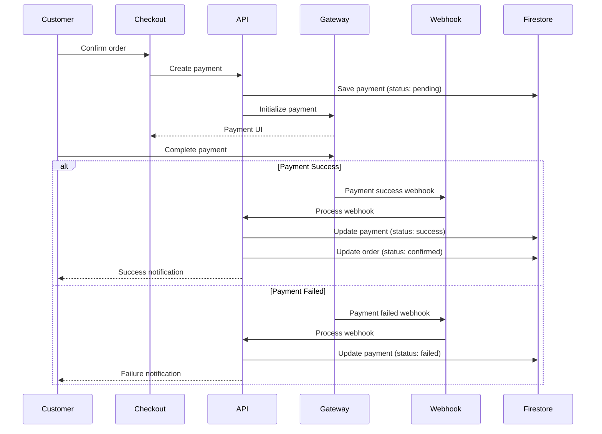

# Payments Resource Documentation

**Resource Type**: Financial Transaction Entity  
**Collection**: `payments`  
**Primary Use**: Payment tracking and reconciliation across all user roles

---

## Table of Contents

1. [Overview](#overview)
2. [Schema & Fields](#schema--fields)
3. [Related Resources](#related-resources)
4. [Filters & Search](#filters--search)
5. [Card Displays](#card-displays)
6. [Bulk Actions](#bulk-actions)
7. [Diagrams](#diagrams)
8. [Why We Need This](#why-we-need-this)
9. [Quick Reference](#quick-reference)

---

## Overview

**Payments** track all financial transactions including order payments, refunds, and payouts. Integrated with Razorpay, PayPal, and COD.

### Key Characteristics

- **Multi-Gateway**: Razorpay, PayPal, Cash on Delivery
- **Status Tracking**: Pending → Processing → Success/Failed
- **Refund Support**: Full and partial refunds
- **Reconciliation**: Match payments with orders
- **Audit Trail**: Complete transaction history
- **Webhook Integration**: Real-time payment updates

---

## Schema & Fields

### Firestore Collection: `payments`

```typescript
interface Payment {
  // ==================== IDENTIFICATION ====================
  id: string; // Auto-generated document ID
  orderId: string; // Related order ID (REQUIRED)
  userId: string; // Customer user ID (REQUIRED)

  // ==================== PAYMENT DETAILS ====================
  amount: number; // Payment amount (REQUIRED, positive)
  currency: string; // Currency code (default: 'INR')

  // ==================== GATEWAY ====================
  gateway: "razorpay" | "paypal" | "cod"; // Payment gateway (REQUIRED)
  gatewayPaymentId?: string; // Gateway's payment ID
  gatewayOrderId?: string; // Gateway's order ID
  gatewaySignature?: string; // Payment signature (Razorpay)

  // ==================== STATUS ====================
  status: PaymentStatus; // 'pending' | 'processing' | 'success' | 'failed' | 'refunded'

  // ==================== METHOD ====================
  method?: string; // Payment method (e.g., 'card', 'upi', 'netbanking', 'wallet', 'cod')
  cardType?: string; // Card type if method = 'card' (e.g., 'Visa', 'Mastercard')
  last4?: string; // Last 4 digits of card

  // ==================== METADATA ====================
  metadata?: {
    email?: string;
    phone?: string;
    bank?: string;
    wallet?: string;
    upiId?: string;
    [key: string]: any;
  };

  // ==================== REFUND ====================
  refundAmount?: number; // Refunded amount (if applicable)
  refundReason?: string; // Refund reason
  refundedAt?: Date | Timestamp; // Refund timestamp
  refundTransactionId?: string; // Refund transaction ID

  // ==================== FAILURE ====================
  failureReason?: string; // Failure reason (if failed)
  failureCode?: string; // Gateway error code

  // ==================== TIMESTAMPS ====================
  createdAt: Date | Timestamp; // Creation timestamp (auto)
  updatedAt: Date | Timestamp; // Last update timestamp (auto)
  capturedAt?: Date | Timestamp; // Payment capture timestamp
}
```

### Required Fields

```typescript
{
  orderId: string,
  userId: string,
  amount: number,
  currency: string,          // Default: 'INR'
  gateway: 'razorpay' | 'paypal' | 'cod',
  status: 'pending'          // Initial status
}
```

---

## Related Resources

### Direct Relationships

1. **Orders** (One-to-One)

   - Each payment for ONE order
   - Field: `orderId`
   - Relationship: `payments.orderId → orders.id`
   - Use: Payment verification, order fulfillment

2. **Users** (Customer, Many-to-One)

   - Each payment by ONE user
   - Field: `userId`
   - Relationship: `payments.userId → users.uid`
   - Use: Customer payment history

---

## Filters & Search

### Filter Configuration

**Available Filters**:

- Payment status
- Payment gateway
- Payment method
- Date range
- Amount range
- Refund status

**API Endpoint**: `GET /api/payments`

**Query Parameters**:

```typescript
{
  order_id?: string,
  user_id?: string,
  gateway?: string,
  status?: string,
  method?: string,
  start_date?: string,
  end_date?: string,
  min_amount?: number,
  max_amount?: number,
  has_refund?: boolean,
  sort?: string,
  page?: number,
  limit?: number
}
```

---

## Card Displays

### For Customers

**Component**: `src/components/payment/PaymentCard.tsx`

**Displays**:

- Payment date
- Amount
- Gateway logo
- Payment method
- Status badge
- Order number (link)
- Download receipt button

### For Admin

**Component**: `src/components/admin/PaymentCard.tsx`

**Additional Info**:

- Customer name
- Gateway payment ID
- Refund information
- Actions: View Details, Issue Refund, Export

---

## Bulk Actions

**Admin Only**:

- Export payments (CSV)
- Reconcile payments
- Mark as verified

---

## Diagrams

### Payment Flow



---

## Why We Need This

### Business Requirements

1. **Transaction Tracking**: Record all financial transactions
2. **Reconciliation**: Match payments with orders and payouts
3. **Refund Management**: Process customer refunds
4. **Financial Reporting**: Revenue and payment analytics
5. **Audit Trail**: Complete payment history for compliance

---

## Quick Reference

### API Routes

| Endpoint                    | Method | Purpose          | Auth        |
| --------------------------- | ------ | ---------------- | ----------- |
| `/api/payments`             | POST   | Create payment   | User        |
| `/api/payments/[id]`        | GET    | Get payment      | Owner/Admin |
| `/api/payments/verify`      | POST   | Verify payment   | System      |
| `/api/payments/[id]/refund` | POST   | Issue refund     | Admin       |
| `/api/user/payments`        | GET    | User's payments  | User        |
| `/admin/payments`           | GET    | All payments     | Admin       |
| `/api/webhooks/razorpay`    | POST   | Razorpay webhook | Gateway     |
| `/api/webhooks/paypal`      | POST   | PayPal webhook   | Gateway     |

---

**Last Updated**: November 10, 2025  
**Version**: 1.0  
**Related Docs**:

- [Orders Resource](./orders.md)
