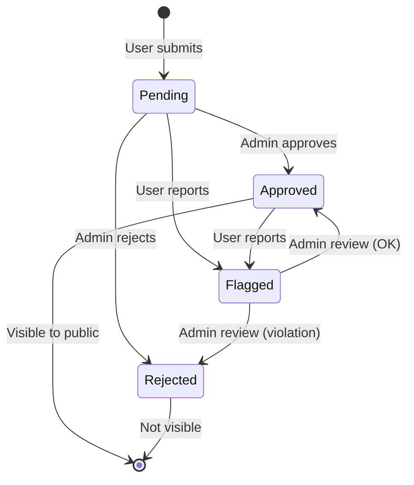
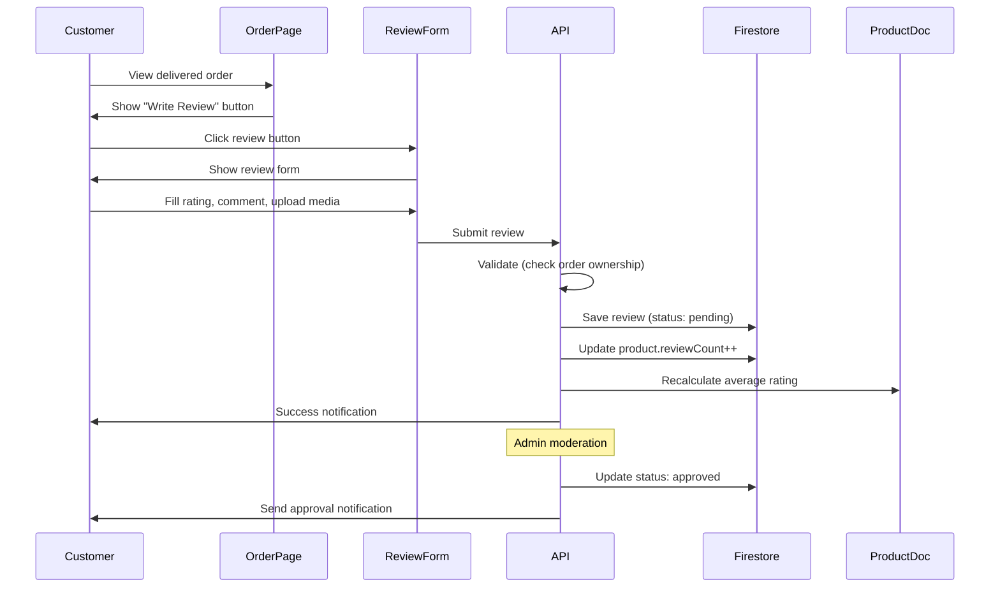

# Reviews Resource Documentation

**Resource Type**: User-Generated Content  
**Collection**: `reviews`  
**Primary Use**: Product and shop ratings across all interfaces

---

## Table of Contents

1. [Overview](#overview)
2. [Schema & Fields](#schema--fields)
3. [Related Resources](#related-resources)
4. [Filters & Search](#filters--search)
5. [Inline Logic & Quick Create](#inline-logic--quick-create)
6. [Wizards & Forms](#wizards--forms)
7. [Card Displays](#card-displays)
8. [Bulk Actions](#bulk-actions)
9. [Diagrams](#diagrams)
10. [Why We Need This](#why-we-need-this)
11. [Quick Reference](#quick-reference)

---

## Overview

**Reviews** are customer feedback on products, shops, or auctions. They include ratings (1-5 stars), text comments, and optional media (images/videos).

### Key Characteristics

- **Multi-Target**: Can review products, shops, auctions, or categories
- **Star Ratings**: 1-5 star scale
- **Media Support**: Upload images/videos with reviews
- **Verification**: Mark verified purchases
- **Moderation**: Admin approval workflow
- **Helpful Votes**: Community helpfulness voting
- **Auto-Aggregation**: Automatically updates product/shop ratings

---

## Schema & Fields

### Firestore Collection: `reviews`

```typescript
interface Review {
  // ==================== IDENTIFICATION ====================
  id: string; // Auto-generated document ID
  userId: string; // Reviewer user ID (REQUIRED)
  userName: string; // Reviewer name (cached)
  userAvatar?: string; // Reviewer avatar (cached)

  // ==================== TARGET ====================
  productId?: string; // Product being reviewed
  shopId?: string; // Shop being reviewed
  auctionId?: string; // Auction being reviewed
  categoryId?: string; // Category being reviewed
  orderItemId?: string; // Order item (for verification)

  // ==================== CONTENT ====================
  rating: number; // Star rating (REQUIRED, 1-5)
  title?: string; // Review title/headline (max 100 chars)
  comment: string; // Review text (REQUIRED, 10-2000 chars)
  media?: string[]; // Images/videos (max 5)

  // ==================== VERIFICATION ====================
  verifiedPurchase: boolean; // Verified buyer (default: false)
  verificationDate?: Date | Timestamp; // Purchase verification date

  // ==================== ENGAGEMENT ====================
  helpfulCount: number; // "Helpful" votes (auto-calculated)
  unhelpfulCount: number; // "Not helpful" votes (auto-calculated)
  reportCount: number; // Number of reports (admin use)

  // ==================== FLAGS ====================
  isFeatured: boolean; // Featured review (admin selection)
  showOnHomepage: boolean; // Show on homepage (default: false)

  // ==================== MODERATION ====================
  isApproved: boolean; // Admin approved (default: false)
  status: "pending" | "approved" | "rejected" | "flagged";
  moderatedAt?: Date | Timestamp; // Moderation timestamp
  moderatedBy?: string; // Admin/mod user ID
  moderationNotes?: string; // Internal moderation notes
  rejectionReason?: string; // Reason for rejection

  // ==================== TIMESTAMPS ====================
  createdAt: Date | Timestamp; // Creation timestamp (auto)
  updatedAt: Date | Timestamp; // Last update timestamp (auto)
}
```

### Required Fields

**Minimum Required for Creation:**

```typescript
{
  userId: string,            // Reviewer ID
  userName: string,          // Reviewer name
  rating: number,            // 1-5 stars
  comment: string,           // Review text
  productId?: string,        // At least one target
  shopId?: string,           // Or shop
  auctionId?: string,        // Or auction
  categoryId?: string,       // Or category
  verifiedPurchase: boolean,
  helpfulCount: number,      // Initial: 0
  unhelpfulCount: number,    // Initial: 0
  reportCount: number,       // Initial: 0
  isFeatured: boolean,       // Default: false
  showOnHomepage: boolean,   // Default: false
  isApproved: boolean,       // Default: false (pending)
  status: 'pending'          // Initial status
}
```

### Field Validation Rules

| Field              | Type    | Min | Max  | Required | Pattern      | Default |
| ------------------ | ------- | --- | ---- | -------- | ------------ | ------- |
| `rating`           | number  | 1   | 5    | ✅       | integer      | -       |
| `title`            | string  | 0   | 100  | ❌       | -            | -       |
| `comment`          | string  | 10  | 2000 | ✅       | -            | -       |
| `media`            | array   | 0   | 5    | ❌       | valid URLs   | []      |
| `helpfulCount`     | number  | 0   | -    | ✅       | non-negative | 0       |
| `verifiedPurchase` | boolean | -   | -    | ✅       | -            | false   |
| `isApproved`       | boolean | -   | -    | ✅       | -            | false   |

---

## Related Resources

### Direct Relationships

1. **Users** (Reviewer, Many-to-One)

   - Each review by ONE user
   - Field: `userId`
   - Relationship: `reviews.userId → users.uid`
   - Use: Reviewer profile, history

2. **Products** (Optional, Many-to-One)

   - Product review
   - Field: `productId`
   - Relationship: `reviews.productId → products.id`
   - Use: Product page reviews, rating calculation

3. **Shops** (Optional, Many-to-One)

   - Shop review
   - Field: `shopId`
   - Relationship: `reviews.shopId → shops.id`
   - Use: Shop profile reviews, seller reputation

4. **Orders** (Optional, for verification)

   - Order item verification
   - Field: `orderItemId`
   - Relationship: `reviews.orderItemId → order_items.id`
   - Use: Verified purchase badge

5. **Auctions** (Optional, Many-to-One)
   - Auction review
   - Field: `auctionId`
   - Relationship: `reviews.auctionId → auctions.id`
   - Use: Auction feedback

---

## Filters & Search

### Filter Configuration

**Location**: `src/constants/filters.ts → REVIEW_FILTERS`

```typescript
export const REVIEW_FILTERS: FilterSection[] = [
  {
    title: "Rating",
    fields: [
      {
        key: "rating",
        label: "Rating",
        type: "multiselect",
        options: [
          { label: "5 Stars", value: "5" },
          { label: "4 Stars", value: "4" },
          { label: "3 Stars", value: "3" },
          { label: "2 Stars", value: "2" },
          { label: "1 Star", value: "1" },
        ],
      },
    ],
  },
  {
    title: "Review Type",
    fields: [
      {
        key: "verified_purchase",
        label: "Verified Purchase",
        type: "checkbox",
        options: [{ label: "Verified purchases only", value: "true" }],
      },
      {
        key: "has_media",
        label: "With Media",
        type: "checkbox",
        options: [{ label: "Reviews with images/videos", value: "true" }],
      },
    ],
  },
  {
    title: "Review Status",
    fields: [
      {
        key: "status",
        label: "Status",
        type: "radio",
        options: [
          { label: "Approved", value: "approved" },
          { label: "Pending", value: "pending" },
          { label: "Rejected", value: "rejected" },
        ],
      },
    ],
    collapsible: true,
    defaultCollapsed: true,
  },
];
```

### Search Implementation

**API Endpoint**: `GET /api/reviews`

**Query Parameters**:

```typescript
{
  search?: string,          // Text search
  product_id?: string,      // Filter by product
  shop_id?: string,         // Filter by shop
  user_id?: string,         // Filter by user
  rating?: number[],        // Filter by ratings
  verified_purchase?: boolean,
  has_media?: boolean,
  status?: string,          // Moderation status
  is_featured?: boolean,
  sort?: string,
  page?: number,
  limit?: number
}
```

**Sort Options**:

- `created_at_desc` - Newest first (default)
- `helpful_desc` - Most helpful first
- `rating_desc` - Highest rated first
- `rating_asc` - Lowest rated first

---

## Wizards & Forms

### Review Creation Form

**Location**: `/user/orders/[id]/review`, `/products/[slug]?review=true`

**Single-Step Form**:

```typescript
{
  rating: number,           // Star selector (1-5)
  title?: string,           // Optional headline
  comment: string,          // Review text (textarea)
  media?: File[],           // Image/video upload (max 5)
  pros?: string[],          // Optional pros list
  cons?: string[]           // Optional cons list
}
```

**Validation**:

- Rating: Required, 1-5
- Comment: Required, 10-2000 chars
- Media: Max 5 files, 5MB each
- Can only review after delivery (for products)

---

## Card Displays

### For Public (Product/Shop Pages)

**Component**: `src/components/review/ReviewCard.tsx`

```typescript
<ReviewCard
  review={review}
  onHelpful={() => handleHelpful(review.id)}
  onReport={() => handleReport(review.id)}
/>
```

**Displays**:

- Reviewer name and avatar
- Star rating (visual stars)
- Verified purchase badge
- Review date
- Review title (if present)
- Review comment
- Media gallery (if present)
- Helpful count (👍 123 found this helpful)
- Helpful/Report buttons

### For Admin (Moderation)

**Component**: `src/components/admin/ReviewCard.tsx`

```typescript
<ReviewCard
  review={review}
  showModeration={true}
  onApprove={() => handleApprove(review.id)}
  onReject={() => handleReject(review.id)}
  onFeature={() => handleFeature(review.id)}
/>
```

**Additional Info**:

- Moderation status badge
- Report count (if any)
- Target (product/shop name)
- Quick actions: Approve, Reject, Feature, Delete

---

## Bulk Actions

**Location**: `src/constants/bulk-actions.ts → getReviewBulkActions()`

```typescript
export function getReviewBulkActions(selectedCount: number): BulkAction[] {
  return [
    {
      id: "approve",
      label: "Approve",
      variant: "success",
      confirm: false,
    },
    {
      id: "reject",
      label: "Reject",
      variant: "danger",
      confirm: false,
    },
    {
      id: "feature",
      label: "Set Featured",
      variant: "success",
      confirm: false,
    },
    {
      id: "delete",
      label: "Delete",
      variant: "danger",
      confirm: true,
      confirmTitle: "Delete Reviews",
      confirmMessage: `Are you sure you want to delete ${selectedCount} review${
        selectedCount === 1 ? "" : "s"
      }? This action cannot be undone.`,
    },
  ];
}
```

---

## Diagrams

### Review Lifecycle



### Review Creation Flow



---

## Why We Need This

### Business Requirements

1. **Social Proof**: Build trust through customer testimonials
2. **Quality Feedback**: Improve products based on reviews
3. **SEO Value**: User-generated content for search rankings
4. **Buyer Confidence**: Help buyers make informed decisions
5. **Seller Accountability**: Maintain quality standards

---

## Quick Reference

### API Routes

| Endpoint                    | Method | Purpose             | Auth        |
| --------------------------- | ------ | ------------------- | ----------- |
| `/api/reviews`              | GET    | List reviews        | Public      |
| `/api/reviews`              | POST   | Create review       | User        |
| `/api/reviews/[id]`         | GET    | Get review          | Public      |
| `/api/reviews/[id]`         | PATCH  | Update review       | Owner/Admin |
| `/api/reviews/[id]`         | DELETE | Delete review       | Owner/Admin |
| `/api/reviews/[id]/helpful` | POST   | Mark helpful        | User        |
| `/api/reviews/[id]/report`  | POST   | Report review       | User        |
| `/api/user/reviews`         | GET    | User's reviews      | User        |
| `/api/admin/reviews`        | GET    | All reviews (admin) | Admin       |
| `/api/admin/reviews/bulk`   | POST   | Bulk approve/reject | Admin       |

---

**Last Updated**: November 10, 2025  
**Version**: 1.0  
**Related Docs**:

- [Products Resource](./products.md)
- [Shops Resource](./shops.md)
- [Orders Resource](./orders.md)
