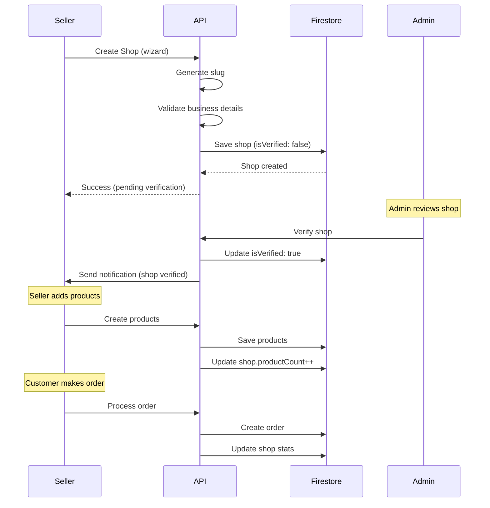
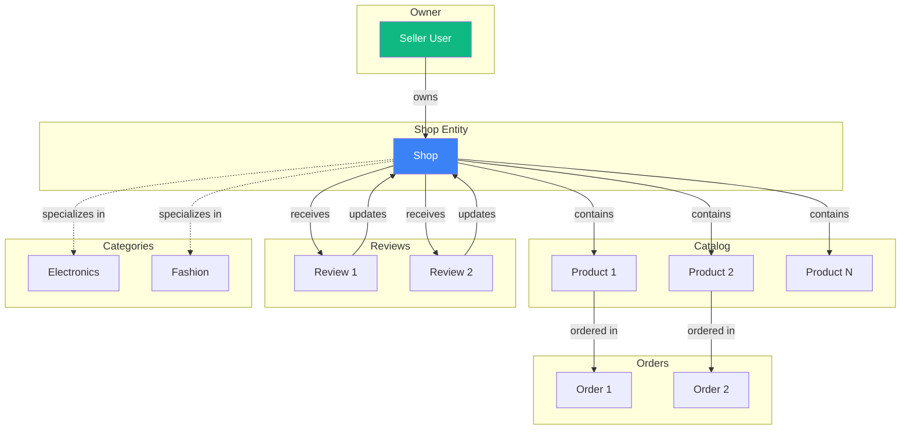

# Shops Resource Documentation

**Resource Type**: Core Business Entity  
**Collection**: `shops`  
**Primary Use**: Seller storefronts across admin, seller, and public pages

---

## Table of Contents

1. [Overview](#overview)
2. [Schema & Fields](#schema--fields)
3. [Related Resources](#related-resources)
4. [Filters & Search](#filters--search)
5. [Inline Logic & Quick Create](#inline-logic--quick-create)
6. [Wizards & Forms](#wizards--forms)
7. [Card Displays](#card-displays)
8. [Bulk Actions](#bulk-actions)
9. [Diagrams](#diagrams)
10. [Why We Need This](#why-we-need-this)
11. [Quick Reference](#quick-reference)

---

## Overview

**Shops** are seller storefronts where vendors manage their products, orders, and customer relationships. Each shop is owned by a seller user and serves as their brand identity on the platform.

### Key Characteristics

- **Single Owner**: Each shop belongs to one seller user
- **Multi-Product**: Shops can have unlimited products
- **Verification System**: Shops can be verified by admins for trust
- **Rich Profiles**: Logo, banner, social links, business details
- **Bank Integration**: Payment and payout configurations
- **Policy Management**: Custom return and shipping policies
- **Analytics Tracked**: Rating, reviews, sales, followers

---

## Schema & Fields

### Firestore Collection: `shops`

```typescript
interface Shop {
  // ==================== IDENTIFICATION ====================
  id: string; // Auto-generated document ID
  ownerId: string; // Seller user ID (REQUIRED)
  name: string; // Shop name (REQUIRED, 2-100 chars)
  slug: string; // URL-friendly identifier (REQUIRED, unique)
  description?: string; // Shop description (max 1000 chars)

  // ==================== BRANDING ====================
  logo?: string; // Shop logo URL
  banner?: string; // Shop banner image URL

  // ==================== CONTACT ====================
  email?: string; // Shop email (for customer inquiries)
  phone?: string; // Shop phone number
  location?: string; // Shop location/city

  // ==================== ADDRESS ====================
  address?: {
    line1: string; // Address line 1
    line2?: string; // Address line 2
    city: string; // City
    state: string; // State/Province
    pincode: string; // Postal code
    country: string; // Country
  };

  // ==================== CATEGORIZATION ====================
  categories?: string[]; // Category IDs shop sells in

  // ==================== SOCIAL MEDIA ====================
  website?: string; // Shop website URL
  facebook?: string; // Facebook page URL
  instagram?: string; // Instagram handle
  twitter?: string; // Twitter handle

  // ==================== BUSINESS DETAILS ====================
  gst?: string; // GST number (India)
  pan?: string; // PAN number (India)

  // ==================== BANK DETAILS ====================
  bankDetails?: {
    accountHolderName: string; // Account holder name
    accountNumber: string; // Bank account number
    ifscCode: string; // IFSC code (India)
    bankName: string; // Bank name
    branchName?: string; // Branch name
  };
  upiId?: string; // UPI ID for payments

  // ==================== POLICIES ====================
  returnPolicy?: string; // Return policy text (max 2000 chars)
  shippingPolicy?: string; // Shipping policy text (max 2000 chars)

  // ==================== STATISTICS ====================
  rating: number; // Average rating (0-5, auto-calculated)
  reviewCount: number; // Total reviews (auto-calculated)
  productCount: number; // Total products (auto-calculated)
  follower_count?: number; // Total followers (auto-calculated)

  // ==================== FLAGS ====================
  isVerified: boolean; // Admin-verified shop (default: false)
  isFeatured: boolean; // Featured on homepage (default: false)
  showOnHomepage: boolean; // Show on homepage (default: false)
  isBanned: boolean; // Shop is banned/suspended (default: false)

  // ==================== TIMESTAMPS ====================
  createdAt: Date | Timestamp; // Creation timestamp (auto)
  updatedAt: Date | Timestamp; // Last update timestamp (auto)
}
```

### Required Fields

**Minimum Required for Creation:**

```typescript
{
  ownerId: string,           // Seller user ID
  name: string,              // Shop name
  slug: string,              // URL slug
  rating: number,            // Initial rating (default: 0)
  reviewCount: number,       // Initial review count (default: 0)
  productCount: number,      // Initial product count (default: 0)
  isVerified: boolean,       // Verification status (default: false)
  isFeatured: boolean,       // Featured flag (default: false)
  showOnHomepage: boolean,   // Homepage flag (default: false)
  isBanned: boolean          // Banned flag (default: false)
}
```

### Field Validation Rules

| Field            | Type   | Min | Max  | Required | Pattern        | Default |
| ---------------- | ------ | --- | ---- | -------- | -------------- | ------- |
| `name`           | string | 2   | 100  | ✅       | -              | -       |
| `slug`           | string | 2   | 100  | ✅       | `^[a-z0-9-]+$` | -       |
| `description`    | string | 0   | 1000 | ❌       | -              | -       |
| `email`          | string | 5   | 100  | ❌       | valid email    | -       |
| `phone`          | string | 10  | 15   | ❌       | valid phone    | -       |
| `gst`            | string | 15  | 15   | ❌       | GST format     | -       |
| `pan`            | string | 10  | 10   | ❌       | PAN format     | -       |
| `rating`         | number | 0   | 5    | ✅       | -              | 0       |
| `productCount`   | number | 0   | -    | ✅       | non-negative   | 0       |
| `reviewCount`    | number | 0   | -    | ✅       | non-negative   | 0       |
| `follower_count` | number | 0   | -    | ❌       | non-negative   | 0       |

---

## Related Resources

### Direct Relationships

1. **Users** (Owner, One-to-One)

   - Each shop belongs to ONE seller user
   - Field: `ownerId`
   - Relationship: `shops.ownerId → users.uid`
   - Use: Permission checks, seller profile

2. **Products** (One-to-Many)

   - Each shop contains multiple products
   - Collection: `products`
   - Relationship: `products.shopId → shops.id`
   - Use: Shop product catalog, inventory management

3. **Orders** (Through Order Items)

   - Shop receives orders for their products
   - Collection: `orders`, `order_items`
   - Relationship: `order_items.shopId → shops.id`
   - Use: Sales tracking, revenue calculation

4. **Reviews** (One-to-Many)

   - Multiple reviews per shop
   - Collection: `reviews`
   - Relationship: `reviews.shopId → shops.id`
   - Use: Shop ratings, seller reputation

5. **Categories** (Many-to-Many)

   - Shops specialize in categories
   - Field: `categories[]`
   - Use: Filter shops by category, discovery

6. **Returns** (One-to-Many)
   - Returns associated with shop products
   - Collection: `returns`
   - Relationship: `returns.shopId → shops.id`
   - Use: Return management, seller metrics

### Indirect Relationships

- **Coupons** → Shop-specific coupons
- **Followers** → User-shop follow relationships
- **Support Tickets** → Shop-specific support requests
- **Analytics** → Shop performance metrics
- **Payouts** → Payment disbursements to shops

---

## Filters & Search

### Filter Configuration

**Location**: `src/constants/filters.ts → SHOP_FILTERS`

```typescript
export const SHOP_FILTERS: FilterSection[] = [
  {
    title: "Verification Status",
    fields: [
      {
        key: "is_verified",
        label: "Verified Shops Only",
        type: "checkbox",
        options: [{ label: "Show only verified shops", value: "true" }],
      },
    ],
  },
  {
    title: "Rating",
    fields: [
      {
        key: "min_rating",
        label: "Minimum Rating",
        type: "select",
        options: [
          { label: "4 stars & up", value: "4" },
          { label: "3 stars & up", value: "3" },
          { label: "2 stars & up", value: "2" },
          { label: "Any rating", value: "0" },
        ],
      },
    ],
  },
  {
    title: "Shop Features",
    fields: [
      {
        key: "is_featured",
        label: "Featured",
        type: "checkbox",
        options: [{ label: "Featured shops only", value: "true" }],
      },
      {
        key: "is_homepage",
        label: "Homepage",
        type: "checkbox",
        options: [{ label: "Homepage shops only", value: "true" }],
      },
    ],
    collapsible: true,
    defaultCollapsed: true,
  },
];
```

### Available Filter Types

| Filter Type  | Field Type          | Use Case         | Example           |
| ------------ | ------------------- | ---------------- | ----------------- |
| **checkbox** | `is_verified`       | Verified shops   | ✓ Verified only   |
| **select**   | `min_rating`        | Rating threshold | 4+ stars          |
| **checkbox** | `is_featured`       | Featured shops   | ✓ Featured only   |
| **checkbox** | `is_homepage`       | Homepage shops   | ✓ Homepage only   |
| **text**     | `search`            | Name search      | "Electronics Hub" |
| **select**   | `category`          | Category filter  | Electronics       |
| **select**   | `location`          | Location filter  | Mumbai            |
| **boolean**  | `is_banned`         | Banned status    | Not banned        |
| **number**   | `min_product_count` | Product count    | Min 10 products   |

### Search Implementation

**API Endpoint**: `GET /api/shops`

**Searchable Fields**:

- `name` - Shop name (full text)
- `description` - Shop description
- `location` - Shop location
- `categories` - Category array

**Query Parameters**:

```typescript
{
  search?: string,          // Text search across name, description
  category?: string,        // Filter by category specialty
  location?: string,        // Filter by location
  is_verified?: boolean,    // Verified shops only
  min_rating?: number,      // Minimum rating threshold
  is_featured?: boolean,    // Featured shops
  is_homepage?: boolean,    // Homepage shops
  is_banned?: boolean,      // Filter banned shops (admin)
  owner_id?: string,        // Filter by owner (admin)
  min_product_count?: number, // Minimum products
  sort?: string,            // Sort order
  page?: number,            // Pagination page
  limit?: number            // Items per page
}
```

**Sort Options**:

- `created_at_desc` - Newest first
- `created_at_asc` - Oldest first
- `name_asc` - Name: A to Z
- `name_desc` - Name: Z to A
- `rating_desc` - Highest rated (default)
- `product_count_desc` - Most products first
- `review_count_desc` - Most reviewed first

---

## Inline Logic & Quick Create

### Inline Edit Component

**Location**: Uses `InlineEditRow` from `src/components/common/inline-edit.ts`

**Fields Configuration**:

```typescript
const shopInlineFields: InlineField[] = [
  { key: "name", type: "text", label: "Name", required: true },
  { key: "slug", type: "text", label: "Slug", required: true },
  {
    key: "location",
    type: "text",
    label: "Location",
    placeholder: "City, Country",
  },
  { key: "email", type: "email", label: "Email" },
  { key: "phone", type: "tel", label: "Phone" },
  { key: "is_verified", type: "checkbox", label: "Verified" },
  { key: "is_featured", type: "checkbox", label: "Featured" },
  { key: "logo", type: "image", label: "Logo", placeholder: "shop-logo" },
];
```

### Quick Create Row

**Usage**: At top of shops table (Admin only)

```typescript
<QuickCreateRow
  fields={shopInlineFields}
  onSave={handleQuickCreate}
  loading={creating}
/>
```

**Behavior**:

- Admin can quickly create shop for a seller
- Auto-generates slug from name
- Requires seller selection (ownerId)
- Creates shop with default values
- Sets initial stats to 0

---

## Wizards & Forms

### Full Shop Creation Wizard

**Location**: `/seller/shops/create` (Sellers), `/admin/shops/create` (Admin)

**Multi-Step Process**:

#### Step 1: Basic Information

```typescript
{
  name: string,           // Shop name
  slug: string,           // Auto-generated, editable
  description: string,    // Shop description
  location: string,       // City/location
  categories: string[]    // Category specializations
}
```

#### Step 2: Branding & Media

```typescript
{
  logo: File,             // Shop logo upload (square, 500x500)
  banner: File,           // Shop banner upload (wide, 1920x400)
  website?: string,       // Shop website URL
  facebook?: string,      // Facebook page URL
  instagram?: string,     // Instagram handle (@username)
  twitter?: string        // Twitter handle (@username)
}
```

#### Step 3: Contact & Address

```typescript
{
  email: string,          // Shop email
  phone: string,          // Shop phone
  address: {
    line1: string,        // Address line 1
    line2?: string,       // Address line 2
    city: string,         // City
    state: string,        // State
    pincode: string,      // Postal code
    country: string       // Country
  }
}
```

#### Step 4: Business Details

```typescript
{
  gst?: string,           // GST number (India)
  pan?: string,           // PAN number (India)
  bankDetails: {
    accountHolderName: string,
    accountNumber: string,
    ifscCode: string,
    bankName: string,
    branchName?: string
  },
  upiId?: string          // UPI ID
}
```

#### Step 5: Policies

```typescript
{
  returnPolicy: string,   // Return policy (rich text)
  shippingPolicy: string  // Shipping policy (rich text)
}
```

#### Step 6: Review & Submit

- Review all entered information
- Preview shop page
- Submit for admin approval (if required)

### Form Validation

**Validation Schema**: `src/lib/validations/comprehensive-schemas.ts → createShopSchema`

**Key Validations**:

- Name: 2-100 characters, unique slug
- Slug: Valid URL format, globally unique
- Email: Valid email format
- Phone: Valid phone number (10-15 digits)
- GST: 15 characters (if provided)
- PAN: 10 characters (if provided)
- Bank account: Valid account number format
- IFSC: Valid IFSC code format

---

## Card Displays

### For Sellers (Seller Dashboard)

**Component**: `src/components/seller/ShopCard.tsx`

```typescript
<ShopCard
  shop={shop}
  showStats={true}
  onEdit={() => router.push(`/seller/shops/${shop.id}/edit`)}
  onViewProducts={() => router.push(`/seller/products?shop=${shop.id}`)}
/>
```

**Displays**:

- Shop logo
- Shop name
- Verification badge if `isVerified === true`
- Product count
- Rating with star display
- Review count
- Quick actions: Edit, View Products, Settings

### For Admin (Admin Panel)

**Component**: `src/components/admin/ShopCard.tsx`

```typescript
<ShopCard
  shop={shop}
  showOwner={true}
  showStats={true}
  onEdit={() => router.push(`/admin/shops/${shop.id}/edit`)}
  onVerify={() => handleVerify(shop.id)}
  onBan={() => handleBan(shop.id)}
/>
```

**Additional Info (vs Seller Card)**:

- Owner name and email
- Creation date
- Total orders
- Total revenue
- More actions: Verify, Ban, Delete, View Orders

### For Buyers (Public Pages)

**Component**: `src/components/shop/ShopCard.tsx`

```typescript
<ShopCard
  shop={shop}
  onFollow={() => handleFollow(shop.id)}
  onClick={() => router.push(`/shops/${shop.slug}`)}
/>
```

**Displays**:

- Shop logo with hover effect
- Shop name
- Location
- Verification badge
- Rating stars (⭐) with review count
- Product count (e.g., "234 products")
- Follow button
- "Featured" ribbon if `isFeatured`
- Click navigates to shop page

---

## Bulk Actions

**Location**: `src/constants/bulk-actions.ts → getShopBulkActions()`

```typescript
export function getShopBulkActions(selectedCount: number): BulkAction[] {
  return [
    {
      id: "verify",
      label: "Verify Shops",
      variant: "success",
      confirm: false,
    },
    {
      id: "unverify",
      label: "Remove Verification",
      variant: "default",
      confirm: false,
    },
    {
      id: "feature",
      label: "Set Featured",
      variant: "success",
      confirm: false,
    },
    {
      id: "unfeature",
      label: "Remove Featured",
      variant: "default",
      confirm: false,
    },
    {
      id: "ban",
      label: "Suspend/Ban",
      variant: "danger",
      confirm: true,
      confirmTitle: "Ban Shops",
      confirmMessage: `Are you sure you want to ban ${selectedCount} shop${
        selectedCount === 1 ? "" : "s"
      }? They will not be able to sell products.`,
    },
    {
      id: "delete",
      label: "Delete",
      variant: "danger",
      confirm: true,
      confirmTitle: "Delete Shops",
      confirmMessage: `⚠️ Are you sure you want to delete ${selectedCount} shop${
        selectedCount === 1 ? "" : "s"
      }? This will remove all associated products.`,
    },
  ];
}
```

---

## Diagrams

### Shop Lifecycle



### Shop Relationships



---

## Why We Need This

### Business Requirements

1. **Multi-Vendor Marketplace**

   - Platform supports multiple independent sellers
   - Each seller needs their own storefront
   - Brand identity for sellers

2. **Trust & Verification**

   - Verify legitimate businesses
   - Build buyer confidence
   - Reduce fraud and scams

3. **Seller Management**

   - Organize products by seller
   - Track seller performance
   - Enable seller-specific policies

4. **Payment Processing**

   - Store bank details for payouts
   - Calculate commissions per shop
   - Automate seller payments

5. **Analytics & Insights**
   - Track shop performance
   - Identify top-selling shops
   - Monitor shop health metrics

### Technical Requirements

1. **Performance**

   - Fast shop listing queries
   - Efficient product filtering by shop
   - Optimized shop page loading

2. **Data Integrity**

   - One owner per shop
   - Accurate product counts
   - Consistent rating calculations

3. **Scalability**

   - Support thousands of shops
   - Handle concurrent shop updates
   - Efficient shop search

4. **Security**
   - Protect sensitive business data
   - Secure payment information
   - Role-based shop access

---

## Quick Reference

### API Routes

| Endpoint                 | Method | Purpose            | Auth         |
| ------------------------ | ------ | ------------------ | ------------ |
| `/api/shops`             | GET    | List all active    | Public       |
| `/api/shops`             | POST   | Create shop        | Seller/Admin |
| `/api/shops/[id]`        | GET    | Get by ID          | Public       |
| `/api/shops/[id]`        | PATCH  | Update shop        | Owner/Admin  |
| `/api/shops/[id]`        | DELETE | Delete shop        | Owner/Admin  |
| `/api/shops/slug/[slug]` | GET    | Get by slug        | Public       |
| `/api/seller/shops`      | GET    | Get seller's shops | Seller       |
| `/admin/shops`           | GET    | List all (admin)   | Admin        |
| `/admin/shops/bulk`      | POST   | Bulk update        | Admin        |

### Service Methods

```typescript
// shop.service.ts
shopService.getShops(filters); // List with filters
shopService.getShop(id); // Get by ID
shopService.getShopBySlug(slug); // Get by slug
shopService.createShop(data); // Create new
shopService.updateShop(id, data); // Update existing
shopService.deleteShop(id); // Delete
shopService.verifyShop(id); // Verify shop
shopService.banShop(id); // Ban shop
shopService.bulkUpdate(ids, updates); // Bulk update
shopService.bulkDelete(ids); // Bulk delete
```

---

**Last Updated**: November 10, 2025  
**Version**: 1.0  
**Related Docs**:

- [Products Resource](./products.md)
- [Categories Resource](./categories.md)
- [Orders Resource](./orders.md)
- [Reviews Resource](./reviews.md)
